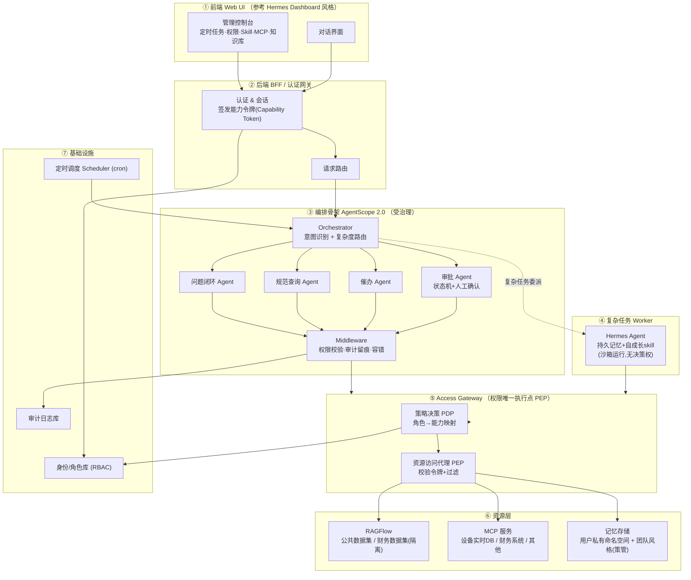
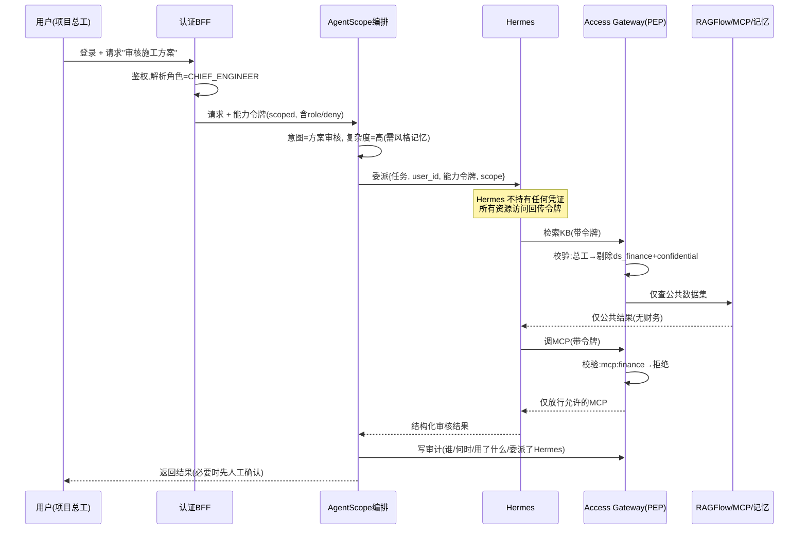
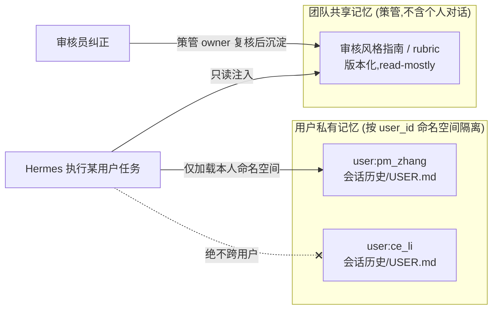
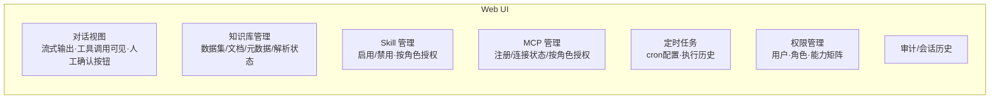
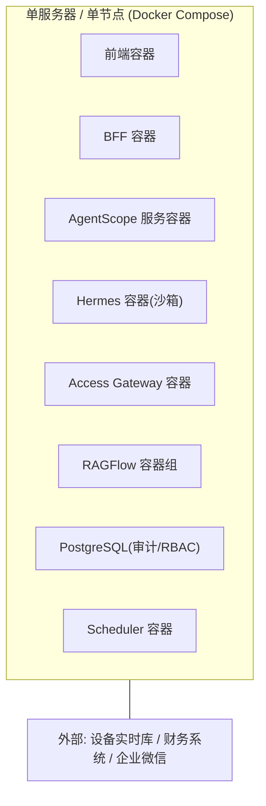

# 工程项目管理智能体 — 系统设计方案 (MVP)

> 骨架：AgentScope 2.0（受治理编排） · 复杂任务专项 worker：Hermes Agent（持久记忆 + 自成长 skill） · 检索：RAGFlow
> 适用规模：10–20 人工程建设管理团队 · 部署形态：单机/单节点轻量部署

---

## 1. 设计原则（先立规矩）

整个系统围绕四条原则展开，后面所有设计都可回溯到这里：

1. **治理与自主分离**：确定性、需留痕的流程（审批、催办、状态闭环）由 AgentScope 编排，决策权和审计权留在这里；开放式、需要"越用越懂团队"的任务（方案审核风格）才委派给 Hermes，且 Hermes **无决策权、无 system-of-record 地位**。
2. **权限在一处强制**：权限不写在提示词里，也不分散在各 agent 内。所有对知识库、MCP、skill 的访问，**统一经过一个权限网关（Access Gateway）**按调用者身份校验。这是唯一的执行点（PEP）。
3. **学习层与事实层分离**：客观规范（强制条文、必查项）放权威知识库，agent 去"读"；主观风格（团队偏好、批注口吻、风险尺度）才进 Hermes 记忆去"学"。审计永远以事实层为准。
4. **记忆双轨**：团队共享的"风格/技能"记忆是**有意策管、不含个人对话**的；用户私有的会话记忆**按用户隔离、永不互窜**。这同时满足"风格沉淀"和需求(7)"不泄露不同用户记忆"。

---

## 2. 总体架构



**一句话读图**：前端 → 认证拿到带角色的"能力令牌" → AgentScope 编排判断任务类型与复杂度 → 简单任务自己处理、复杂任务委派 Hermes → **无论哪条路，所有资源访问都收敛到 Access Gateway 按令牌校验** → 命中资源层。审计贯穿全程。

---

## 3. 核心架构决策（为什么这么分）

| 决策 | 选择 | 理由 |
|---|---|---|
| 谁做骨架 | AgentScope 2.0 | 审批/催办/闭环是受治理流程，需要它的人工确认事件、审计 middleware、权限、会话恢复 |
| 复杂任务谁做 | Hermes（仅方案审核等需"学风格"的任务） | 它的 MEMORY.md + 自成长 skill 是现成的"会成长助理"形态 |
| 权限在哪强制 | 独立 Access Gateway（不在 agent 内） | 单一执行点，AgentScope 和 Hermes 共用同一道闸，避免重复实现、避免 Hermes 绕过 |
| 财务信息怎么挡 | RAGFlow **独立数据集** + 元数据过滤（双层） | 数据集级物理隔离做硬边界；元数据做细粒度，纵深防御 |
| 设备实时数据 | **走 MCP 工具查实时库，不进 RAG** | 实时结构化数据放向量库会过期、检索不准；按需查询才正确 |
| 记忆怎么不互窜 | 用户私有命名空间 + 团队风格策管库分离 | 同时满足"学团队风格"和"用户间不泄露" |

> ⚠️ 一处对你原始需求的修正：**"设备参数实时数据库"不应作为 RAG 知识库的一部分**。RAG 适合非结构化文档（规范、资料、聊天记录），实时数值数据应通过一个 MCP 工具按需查询活库。否则数据会过期且检索不可靠。下文按此修正设计。

---

## 4. 权限模型设计（RBAC，MVP 两角色两级）

### 4.1 角色与能力矩阵

```
角色定义（MVP，可扩展）:
  PROJECT_MANAGER  项目经理   —— 最高权限
  CHIEF_ENGINEER   项目总工   —— 受限权限
```

| 资源 | 项目经理 | 项目总工 |
|---|:---:|:---:|
| 公共知识库：项目资料 | ✅ | ✅ |
| 公共知识库：施工规范 | ✅ | ✅ |
| 公共知识库：微信聊天记录 | ✅ | ✅ |
| **财务知识库（敏感）** | ✅ | ❌ |
| MCP：设备实时数据查询 | ✅ | ✅ |
| MCP：财务系统 | ✅ | ❌ |
| MCP：其他（通用工具） | ✅ | ✅（子集） |
| Skill：方案审核 / 规范查询 / 催办 | ✅ | ✅ |
| Skill：财务相关 / 高危操作 | ✅ | ❌ |
| 管理控制台：权限/定时任务配置 | ✅ | 只读 |

### 4.2 设计成可扩展（避免日后重写）

不要把"经理/总工"硬编码进逻辑。用 **角色 → 能力集（capabilities）** 的间接层：

```jsonc
// 能力定义（数据驱动，存 IDP/配置）
{
  "roles": {
    "PROJECT_MANAGER": { "level": 100, "inherits": [], "capabilities": ["*"] },
    "CHIEF_ENGINEER":  { "level": 50,  "inherits": [],
      "capabilities": [
        "kb:public:read", "mcp:equipment:read", "mcp:common:*",
        "skill:review", "skill:spec_query", "skill:reminder"
      ],
      "deny": ["kb:finance:*", "mcp:finance:*", "skill:finance:*"]
    }
  },
  // 资源用统一能力标识，新增角色只需配能力，不动代码
  "capability_format": "<resource_type>:<resource_id>:<action>"
}
```

日后扩展（如新增"造价工程师""安全员"）只是新增一条角色配置 + 能力清单，**代码零改动**。

---

## 5. 知识库设计（RAGFlow）

### 5.1 数据集划分（隔离的物理边界）

```
RAGFlow Datasets:
  ds_public_docs      项目资料、图纸说明等          → 标签 sensitivity=public
  ds_specs            施工规范、强制条文            → 标签 sensitivity=public, authoritative=true
  ds_wechat           微信聊天记录                  → 标签 sensitivity=public
  ds_finance          财务信息（合同金额、成本、付款）→ 标签 sensitivity=confidential   ★独立数据集
```

- **财务单独成集（ds_finance）**：这是硬边界。检索时是否把 `ds_finance` 纳入 `dataset_ids`，由 Access Gateway 按角色决定。项目总工的检索请求里**根本不包含这个数据集 ID**——即使提示词被诱导，也取不到。
- **元数据过滤做细粒度纵深**：每个 chunk 打 `sensitivity` 等元数据，RAGFlow 检索阶段再按 `sensitivity IN [允许等级]` 过滤一次。即使将来某份财务文件误传进公共集，元数据这层仍能兜住。
- **施工规范打 `authoritative=true`**：方案审核时强制优先召回权威条文（对应"事实层"）。

### 5.2 检索调用（权限感知）

```python
# 伪代码：Access Gateway 内的权限感知检索
def retrieve(query, user_ctx):
    allowed_datasets = policy.datasets_for(user_ctx.role)   # 经理=全部; 总工=排除 ds_finance
    meta_filter = policy.sensitivity_filter(user_ctx.role)  # 总工: sensitivity != confidential
    return ragflow.retrieve(
        question=query,
        dataset_ids=allowed_datasets,
        metadata_condition=meta_filter,   # 双层防御
        similarity_threshold=0.2,
        top_k=8,
    )
```

### 5.3 设备实时数据（不走 RAG）

`设备参数实时数据库` 封装成一个 MCP server：`mcp:equipment`，提供如 `query_equipment(device_id, metric, time_range)` 的工具。agent 需要实时值时调它，按需查活库、返回当前数据。权限同样过 Gateway。

---

## 6. 权限如何端到端贯穿（系统的"承重墙"）

这是整套设计最关键的部分——**权限必须穿透到 Hermes**，否则委派给 Hermes 的总工任务会绕过财务隔离。

### 6.1 机制：能力令牌 + 单一执行点



### 6.2 三条铁律

1. **Hermes 不持有原始凭证**。它对 KB/MCP/记忆的每一次访问都带着委派任务时传入的"能力令牌"，回传到 Access Gateway 校验。Hermes 自己无法决定能看什么。
2. **令牌是收窄的（scoped）**。令牌里带 `role`、`deny` 清单、`task_scope`、`ttl`，且只对本次任务有效。即使令牌泄露，作用范围也受限。
3. **Gateway 是唯一闸门**。AgentScope 的 agent 和 Hermes 走的是**同一个** Access Gateway。财务过滤逻辑只实现一次，不在两处维护、不会出现一处放行一处拦截的裂缝。

---

## 7. AgentScope 编排骨架设计

### 7.1 编排图（Orchestrator + 四个 domain agent）

- **Orchestrator**：意图识别 + 复杂度判定。输出路由决策：`{intent, complexity, route}`。
  - 简单/确定性 → 对应 domain agent 直接处理
  - 复杂/需学习 → "Hermes 委派节点"
- **审批 Agent**：状态机（提交→会签路由→人工确认→归档），用 AgentScope 2.0 **事件系统**抛"用户确认"事件做 human-in-the-loop。
- **催办 Agent**：被 Scheduler 触发，扫描待办、生成提醒、多渠道推送。
- **规范查询 Agent**：ReAct + RAGFlow 检索（经 Gateway）。
- **问题闭环 Agent**：维护 issue 状态机；复杂排查环节可委派 Hermes。

### 7.2 三个 Middleware（挂在所有节点上）

1. **权限 Middleware**：调用资源前，把当前 `user_ctx` 转成能力令牌交给 Gateway。
2. **审计 Middleware**：记录每一步（输入/输出/耗时/用的模型/是否委派 Hermes/谁批准），落审计库。**这是合规可追溯的落点。**
3. **容错 Middleware**：用 2.0 的模型容错（主模型失败自动切备用），保证长链路审批/催办不中断。

---

## 8. Hermes 集成设计（复杂任务专项）

### 8.1 接入方式

用 **Hermes API Server（OpenAI 兼容 HTTP 端点）** 接入——现成、稳定、协议工作量最小。AgentScope 把它当作一个外部 worker 调用。（A2A 协议是更"正"的长期方向，但 Hermes 的 A2A 仍是 pre-1.0，MVP 阶段先不押。）

### 8.2 Hermes 只做什么

- **做**：方案审核这类"开放式 + 需积累团队风格"的任务的执行——动态拆解、调工具、用持久记忆给出**带团队风格的审核意见草案**。
- **不做**：不做"通过/驳回"的最终决策（留给 AgentScope 审批流 + 人工确认）；不是审计事实来源；不直接持有凭证。

### 8.3 自成长 skill 的落地

方案审核作为一个 Hermes skill，随使用打磨"怎么审"的流程；**团队的主观偏好**通过下面的反馈回路沉淀进记忆/rubric。客观规范不进 skill，走 ds_specs 权威库。

---

## 9. 记忆隔离设计（对应需求 7，必须做对）



### 9.1 双轨记忆

| | 用户私有记忆 | 团队共享风格记忆 |
|---|---|---|
| 内容 | 个人会话历史、个人偏好 | 团队审核约定、风格指南、rubric |
| 隔离 | **按 user_id 命名空间硬隔离** | 全团队共享，但**只读注入** |
| 增长 | 随该用户使用 | 仅经"反馈→策管"回路更新 |
| 是否含个人对话 | 是（私有） | **否**（只含抽象约定，避免泄露） |

### 9.2 防泄露的三道保障

1. **命名空间隔离**：每次委派 Hermes 传 `user_id`，Hermes 只加载 `memory:user:<user_id>` 这个命名空间；跨用户读取在 Gateway 层被拒。
2. **共享层去个人化**：团队风格库经策管 owner 复核才写入，**剔除任何可定位到个人的对话内容**，只留抽象约定。这样"共享"不等于"泄露"。
3. **会话级而非全局实例**：避免单个常驻 Hermes 实例把多人对话混在同一上下文。每个用户任务用独立会话上下文 + 独立记忆命名空间。

### 9.3 反馈→沉淀回路（让它真的"懂团队"）

```
审核员对结果标注(漏判/误报/到位)
   → 进入"待沉淀"队列
   → 策管 owner(资深总工)定期复核、剪枝、去个人化
   → 蒸馏进团队风格库(版本+1)
   → 下次审核注入新版风格
```

没有这条回路，Hermes 只是"带记忆的通用审核器"；有了它，才会长成团队的样子。

---

## 10. 定时任务设计

- **Scheduler**（如 APScheduler / 系统 cron / Celery beat）按配置触发 AgentScope 的催办/巡检流程。
- 前端可配置：触发周期（cron 表达式）、任务类型、目标范围、推送渠道。
- 任务以 AgentScope 的工作流执行，**走同一套权限和审计**（定时任务也带一个系统身份的能力令牌，受 Gateway 约束）。
- 典型：每日 08:00 扫描"卡在审批节点超 N 天"的单子 → 生成催办 → 推送给责任人。

---

## 11. 前端设计（参考 Hermes Web UI）



- **对话视图**：借鉴 Hermes dashboard——流式输出、工具调用过程可见（对应 AgentScope 2.0 事件系统）、审批节点出现"确认/驳回"按钮（human-in-the-loop）。
- **管理控制台**：Skill/MCP 管理界面同时承担"按角色授权"（勾选哪个角色能用哪个 skill/mcp），写回 RBAC 配置。
- **权限视图**：可视化第 4.1 节的能力矩阵，项目经理可编辑，总工只读。
- 技术建议：React + Next.js / 或直接基于 Hermes 开源 dashboard 改造（它的对话+审批 UI 现成）。

---

## 12. 技术栈选型（建议）

| 层 | 选型 | 备注 |
|---|---|---|
| 前端 | React + Next.js（或改造 Hermes dashboard） | 流式、审批交互 |
| 后端 BFF | FastAPI / Node | 认证、令牌、路由 |
| 编排 | AgentScope 2.0（单机模式） | 不上分布式/K8s |
| 复杂 worker | Hermes Agent（API Server 模式） | 沙箱运行 |
| 检索 | RAGFlow v0.24+（含 Memory API、KB 治理） | 数据集隔离 + 元数据过滤 |
| 权限 | 自建 Access Gateway（PDP/PEP）+ JWT 能力令牌 | 唯一执行点 |
| 调度 | APScheduler / Celery beat | 定时催办 |
| 身份 | Keycloak / 自建 RBAC 表 | MVP 可用简单角色表 |
| 审计 | PostgreSQL + 结构化日志 | 可追溯 |
| 实时数据 | MCP server 包装现有设备库 | 不进 RAG |
| 模型 | Qwen / DeepSeek / Claude 等（2.0 容错多模型） | 主备切换 |

---

## 13. 部署架构（10–20 人，单节点轻量）



- 并发低，**不需要分布式/K8s**，Docker Compose 单机起全套即可。
- RAGFlow 自带容器组（含向量库），按官方 compose 部署。
- Hermes 单实例 + 会话级记忆命名空间，足够覆盖 20 人。
- 资源敏感数据（财务库、记忆私有命名空间）放本机加密卷，外部系统经 MCP 只读接入。

---

## 14. MVP 范围与里程碑

**MVP 必须包含（最小可用闭环）：**

```
里程碑 1 — 地基 (2-3 周)
  □ RBAC 两角色 + 能力令牌 + Access Gateway(PDP/PEP) 跑通
  □ RAGFlow 四数据集建好, 财务独立集, 元数据过滤生效
  □ 验证: 总工检索拿不到财务 chunk(数据集级+元数据级双验)

里程碑 2 — 编排骨架 (2-3 周)
  □ AgentScope: Orchestrator + 规范查询 + 审批(含人工确认)
  □ 三个 middleware(权限/审计/容错)挂上
  □ 设备实时数据 MCP 接入
  □ 前端: 对话视图 + 审批确认按钮

里程碑 3 — 复杂任务 + Hermes (2-3 周)
  □ Hermes API Server 接入, 方案审核委派跑通
  □ 记忆双轨: 用户命名空间隔离 + 团队风格库
  □ 验证: 两个用户的记忆/对话互不可见(需求7)
  □ 反馈→沉淀回路 + 策管 owner 流程

里程碑 4 — 运营化 (1-2 周)
  □ 定时催办任务
  □ 管理控制台: skill/mcp/权限/定时任务配置
  □ 审计查询界面
```

**刻意延后（不进 MVP）：** 多于两个角色、细粒度字段级权限、A2A 协议、分布式部署、多项目并行隔离。但能力令牌 + 角色配置的设计已为这些留好扩展位。

---

## 15. 风险与注意事项

1. **微信聊天记录的敏感性**：你归到了"公共"，但聊天里常夹带金额、人事等敏感内容。建议 MVP 上线前对该数据集做一次敏感词/元数据标注，必要时把含敏感内容的记录也打 `confidential`。
2. **Hermes 学习层会漂移**：会学习的系统行为随时间变化。务必让学到的风格只影响"怎么审、批注口吻、问题排序"，**绝不影响"通过/驳回"的事实判定**——后者留在 AgentScope + 人工。
3. **委派的超时与兜底**：Hermes 跑开放任务可能久。设超时 + "升级人工"兜底。AgentScope 2.0 的容错只管它自己那侧的 LLM 调用，Hermes 这一跳的超时/重试要自己加。
4. **沙箱**：Hermes 会自主执行工具/代码，必须沙箱化，严格限制可触达的数据范围。
5. **令牌生命周期**：能力令牌要短时效（ttl）、收窄（scope），避免长期有效令牌成为绕过权限的后门。
6. **RAGFlow 版本**：权限关键能力（元数据过滤、多 superuser、Memory API）在 v0.24+。锁定版本，避免升级引入破坏性变更。

---

## 附：一句话总结落地路径

> 先用 **Access Gateway 把权限做成一道闸**（地基），再用 **AgentScope 2.0 搭受治理的编排骨架**（审批/催办/闭环/规范，全部留痕），最后把 **Hermes 作为一个无决策权、受沙箱、所有访问回传令牌的复杂任务 worker** 接进来，专门承担"方案审核越用越懂团队"——靠**双轨记忆 + 反馈沉淀回路**实现风格成长，靠**用户命名空间隔离**保证不互窜。RAGFlow 用**财务独立数据集 + 元数据过滤**把敏感信息挡在项目总工之外。
