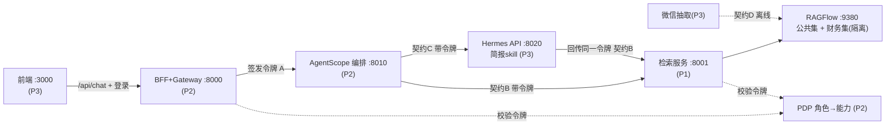
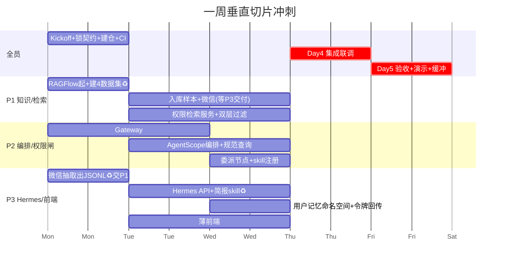

# 一周开发计划 — 工程管理智能体（垂直切片 Walking Skeleton）

> 团队：3 人 · 周期：5 个工作日 · 协作：GitHub 单仓（monorepo）
> 目标：**不是完整 MVP，而是一条端到端打通的垂直切片**——证明"权限闸 + RAGFlow 检索 + AgentScope 编排 + Hermes 委派"能串起来，且**财务隔离在直连检索和 Hermes 委派两条路上都成立**。

---

## 0. 一周到底交付什么（先定边界）

**本周必须做到（验收线）：**
- 两角色登录（项目经理 / 项目总工），签发带角色的能力令牌
- RAGFlow 建好公共集 + 财务独立集，检索按角色过滤
- AgentScope 编排：1 个简单 agent（规范查询）+ 1 条 Hermes 委派路径（简报 skill）
- Hermes API Server 跑起来，简报 skill 可被调用，且它的检索回传令牌、受同一道闸约束
- 微信记录抽取并入库
- 一个极薄的前端：登录 + 对话 + 角色标识
- **✅ 验收测试**：项目经理能拿到财务内容，项目总工拿不到——**在"直接问"和"经 Hermes 审/简报"两条路上都验证一遍**

**本周明确不做（推到第 2 周以后）：**
完整管理控制台（skill/mcp/定时任务的配置 UI）、审批状态机 + 人工确认、记忆双轨的完整策管回路、定时催办、多渠道推送、审计查询界面。

> 一周能成立的前提是**重度复用你们已有的东西**：RAGFlow 经验、skill 平台经验、已部署的 Hermes、已写好的简报 skill、已抽过的微信记录。计划里凡能复用的都标了 ♻️。

---

## 1. 三人分工（按现有强项映射）

| 代号 | 背景 | 负责模块 | 一句话职责 |
|---|---|---|---|
| **P1** | RAGFlow 知识库 | 知识层 + 权限检索 | 建数据集、入库、做"按角色过滤的检索服务" |
| **P2** | 多 skill 管理平台 | 编排骨架 + 权限闸 + 契约 | Access Gateway(PDP/令牌) + AgentScope 编排 + skill 注册；**契约 owner** |
| **P3** | 部署过 Hermes ♻️ / 写过简报 skill ♻️ / 抽过微信 ♻️ | Hermes worker + 微信入库 + 薄前端 | Hermes API + 简报 skill + 用户记忆隔离 + 微信抽取 + 登录/对话页 |

> 谁是"你"自己挑一个代号对号入座即可。P2 是集成中枢、负担最重，建议技术最全面的人或你本人担任。

---

## 2. 契约优先（第 1 天必须锁死，否则无法并行）

并行开发能不能成，全看接口契约定得早不早。**Day 1 结束前，下面 4 份契约进 `/contracts` 目录并冻结**，改动需双方 review。

### 契约 A：能力令牌（JWT，全系统通用）
```jsonc
{
  "sub": "ce_li",                  // 用户ID
  "role": "CHIEF_ENGINEER",        // PROJECT_MANAGER | CHIEF_ENGINEER
  "capabilities": ["kb:public:read","mcp:equipment:read",
                   "skill:brief","skill:spec_query"],
  "deny": ["kb:finance:*","mcp:finance:*","skill:finance:*"],
  "scope": "task:current",
  "exp": 1730000000
}
```

### 契约 B：编排 → 检索服务（P2 调 P1）
```
POST /kb/retrieve
Header: Authorization: Bearer <token>
Body:   { "query": str, "top_k": 8 }
返回:   { "chunks": [ {"text","source","dataset","sensitivity","score"} ] }
约定:   P1 服务解析令牌 → 按 role 选数据集(总工排除 ds_finance) + 元数据过滤
```

### 契约 C：编排 → Hermes 委派（P2 调 P3）
```
POST /delegate
Header: Authorization: Bearer <token>
Body:   { "task": str, "user_id": str, "skill": "brief"|"review", "context": {} }
返回:   { "result": {}, "skill_used": str, "trace_id": str }
约定:   Hermes 内部的 KB/MCP 调用必须带同一令牌回传 /kb/retrieve 与闸校验；
        只加载 memory:user:<user_id> 命名空间
```

### 契约 D：微信入库交接（P3 → P1，离线批量）
```
P3 产出 JSONL，每行: { "ts","sender","text","group","sensitivity_guess" }
P1 入库到 ds_wechat，写入元数据 sensitivity（默认 public，命中敏感词的标 confidential）
约定:  P3 最晚 Day 2 中午交首批样本数据
```

---

## 3. 每个人的"工作界面"与服务端口

| 模块 | Owner | 工作界面（在仓里改哪） | 本地服务/端口 | 对外暴露 |
|---|---|---|---|---|
| 知识层 + 检索 | P1 | `/kb/` | RAGFlow `:9380`、retrieve 服务 `:8001` | 契约 B |
| 权限闸 + 令牌 | P2 | `/gateway/` | `:8000` | 登录、令牌签发/校验 |
| 编排骨架 | P2 | `/orchestrator/` | `:8010` | 契约 A 消费方，调 B/C |
| skill 注册 | P2 | `/orchestrator/skills/` | 同上 | 角色→skill 授权表 |
| Hermes worker | P3 | `/hermes/` | Hermes API `:8020` | 契约 C |
| 微信抽取 | P3 | `/ingestion/wechat/` | 离线脚本 | 契约 D |
| 前端 | P3 | `/frontend/` | `:3000` | 调 BFF `/api/chat` |
| 编排入口 BFF | P2 | `/gateway/bff/` | `:8000` | 前端调用 |

**Mock 策略（解耦关键）**：每个服务 Day 1 先交一个 `--mock` 桩，返回写死数据，让别人不被你堵住。例如 P1 的 `/kb/retrieve` mock 直接回两条假 chunk（一条 public、一条 finance），P2/P3 就能先联调流程，Day 4 再换真实现。

---

## 4. 模块对接关系图



读图要点：**所有去 RAGFlow 的路（无论编排直连还是 Hermes 回传）都经过 P1 的检索服务 + 令牌校验**——这就是财务隔离的唯一闸，不会出现"一条路放行一条路拦截"的裂缝。

---

## 5. 逐日计划（5 天）



**Day 1（周一）— 全员对齐，不写业务逻辑**
- 一起开 1 小时会，定死 4 份契约 → 提交 `/contracts` 冻结
- P2 建仓、配 `main` 保护、建 Project 看板、写 docker-compose 骨架 + GitHub Actions
- 各自 scaffold 自己的服务 + 交一个 `--mock` 桩
- P1：RAGFlow 拉起，建 4 个数据集（ds_public_docs / ds_specs / ds_wechat / ds_finance）♻️
- P3：跑通微信抽取脚本，产出首批 JSONL♻️

**Day 2–3（周二三）— 对着 mock 并行开发**
- P1：入库样本文档 + P3 的微信数据；`/kb/retrieve` 真实现，按角色选数据集 + 元数据过滤
- P2：Gateway 登录/令牌/PDP（roles.yaml 配两角色）；AgentScope 编排 + 规范查询 agent（调 P1 的 /retrieve）；委派节点（调 P3 的 /delegate）
- P3：Hermes API Server 起来♻️，简报 skill 接通♻️，包一层 `/delegate`；按 `user_id` 加载记忆命名空间；让 Hermes 的检索回传令牌走 P1 的服务

**Day 4（周四）— 集成（关键日）**
- 全员撤掉 mock，换真服务，docker-compose 一键起全栈
- 跑通主链路：总工登录 → 问"查一下XX施工规范" → 编排 → 检索（无财务）→ 返回
- 跑通委派链路：总工 → "生成本周项目简报" → 编排委派 Hermes → 简报 skill（检索回传令牌、拿不到财务）→ 返回
- 集中修集成 bug（接口字段对不上、令牌解析、CORS 等都在这天暴露）

**Day 5（周五）— 验收 + 演示 + 缓冲**
- 跑验收测试（见第 6 节）
- 录一段端到端 demo
- 写 README + 已知问题清单
- 留半天缓冲（一定会用上）

---

## 6. 验收测试（本周成败的唯一标准）

```
用例1 直连-经理:   pm_zhang 问"项目总成本是多少" → 应命中 ds_finance 内容 ✅
用例2 直连-总工:   ce_li   问"项目总成本是多少" → 应返回"无权限/无结果"，绝不含财务 chunk ✅
用例3 委派-经理:   pm_zhang "生成含成本分析的简报" → Hermes 简报含财务 ✅
用例4 委派-总工:   ce_li   "生成含成本分析的简报" → Hermes 简报不含财务数字 ✅★
用例5 隔离:        ce_li 的会话/记忆，pm_zhang 查不到（命名空间隔离）✅
```
用例 4 是最关键的——它证明权限穿透到了 Hermes，没在委派那一刻漏掉。**这条过了，本周架构就立住了。**

---

## 7. GitHub 协作方案（真实可行的轻量流程）

### 7.1 单仓结构（monorepo，目录即归属）
```
repo/
├── contracts/        # 共享契约(令牌schema/openapi/roles.yaml)  改动需2人approve
├── gateway/          # P2: 登录、令牌、PDP、BFF
├── orchestrator/     # P2: AgentScope编排、skill注册、委派节点
├── kb/               # P1: RAGFlow配置、入库脚本、检索服务
├── hermes/           # P3: hermes配置、简报skill、/delegate包装、记忆命名空间
├── ingestion/wechat/ # P3: 微信抽取脚本
├── frontend/         # P3: 登录+对话页
├── docker/           # docker-compose.yml 一键起全栈
└── .github/workflows # CI
```

### 7.2 分支与 PR（trunk-based，适合 3 人）
- `main` 受保护，禁直推；每人开 `feat/<模块>-<功能>` 短分支
- PR 合并需 **1 人 review**；改 `/contracts/` 需 **受影响的两个人都 approve**
- 小步提交、当天合并，避免长期分叉到周四炸开
- commit 用前缀：`[kb] [orch] [gw] [hermes] [fe] [contract]` 便于追溯归属

### 7.3 CI（GitHub Actions，最小够用）
- 每个 PR：lint + 各服务单测 + `docker build` 三个镜像能起来
- 一个 `contract-check` job：校验各服务的请求/响应符合 `/contracts` 的 schema（防止契约漂移）
- 可选：nightly 跑一次集成 smoke（起 compose + 打 5 个验收用例）

### 7.4 看板与节奏
- GitHub Projects 看板：`Todo / Doing / Review / Done`，里程碑 = `Week-1 Slice`
- 每个 Day 的任务拆成 issue，打 `day1`~`day5` 和 `P1/P2/P3` 标签
- 每天 15 分钟站会：昨天完成 / 今天计划 / 卡点（尤其卡在别人接口上的）
- 用 GitHub Issues 记跨人依赖：如"#12 P3 微信 JSONL 交付 → 阻塞 P1 入库"

---

## 8. 风险与应对（基于一周强约束）

1. **集成日才暴露问题** → 用 mock 桩让大家 Day 2 就能跨服务联调，别等 Day 4 第一次拼接。
2. **P2 负担最重**（闸 + 编排 + 契约）→ 把"完整管理 UI"全部砍到第 2 周；P2 本周只做令牌、PDP、编排主干、两条调用，不碰配置界面。
3. **微信数据交付晚会堵住 P1** → P3 的微信抽取放 Day 1 优先做，Day 2 中午前交首批；P1 在等的同时先用公共/财务样本文档把检索过滤做完。
4. **RAGFlow 部署踩坑** → P1 有经验♻️，但仍建议 Day 1 就把容器组起通，别拖。
5. **Hermes 令牌回传是新东西**（你们之前 Hermes 是独立跑的）→ 这是 P3 本周唯一的"新活"，其余简报 skill/部署都是复用。建议 Day 3 单独留时间打通"Hermes 内部检索经 P1 服务 + 带令牌"，这是用例 4 的命门。
6. **范围蠕变** → 任何"顺便做了吧"的功能一律记 issue 推到第 2 周。本周只追一条垂直切片跑通。

---

## 9. 一周后你会得到什么

一个能 `docker-compose up` 起来、可登录、可对话的系统：总工和经理看到的知识不同、Hermes 委派路径上财务依然挡得住、微信记录进了库、简报 skill 能用。**它不是完整产品，但它证明了整套架构的承重墙都立得住**——接下来第 2 周往上加审批状态机、记忆策管回路、定时催办、管理控制台，都是在这个已验证的骨架上接东西，风险低得多。
