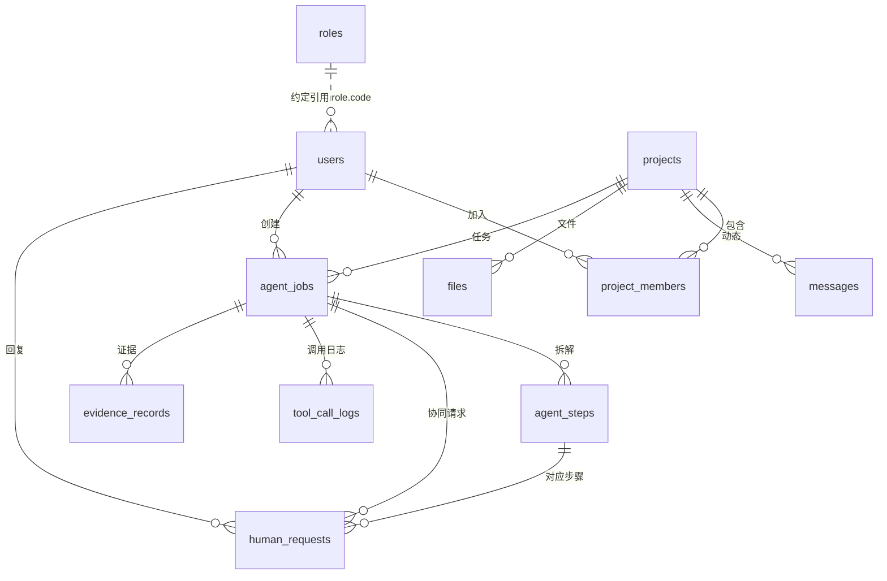

# 工程项目智能管理 — 数据表设计

> 版本：v3 · 第一阶段
> 数据库：PostgreSQL 15
> 说明：本文档与代码 `gateway/app/models.py` 保持一致，是数据层的对外交付物。

---

## 1. 总览

数据表分为两组：

| 分组 | 表 | 第一阶段是否使用 | 说明 |
|---|---|---|---|
| **基础业务表** | roles、users、projects、project_members、messages、files | ✅ 使用 | 第一阶段验证靠这 6 张表跑通：角色、登录、项目、成员可见范围、动态摘要、文件 |
| **智能体任务表（预留）** | agent_jobs、agent_steps、human_requests、tool_registry、tool_call_logs、evidence_records | ⛔ 暂不启用（先建好） | 后期接 LangGraph 做长周期协同任务时启用；先建好结构，避免后期改表。其中 `tool_call_logs` 的最小子集被第一阶段“技能调用记录”复用 |

设计原则：

- **先建后用**：后期表结构提前定好，第一阶段代码不依赖它们，避免上线后再改表。
- **可追溯**：摘要、结论都保留来源标识（`source_ref` / evidence），结论要能说清依据来自哪里。
- **可恢复**：任务类表带状态机与步骤留痕，支持暂停、恢复、重启不丢进度。

---

## 2. 字段约定

| 约定 | 说明 |
|---|---|
| 主键 | 统一字段名 `id`，整型自增 |
| 时间 | `created_at` / `updated_at`，UTC 时间 |
| 字符串长度 | `String(n)` 表示该字段最大字符数 |
| 外键 | `xxx_id` 命名，指向对应表的 `id` |
| 状态字段 | `status`，取值见各表说明 |

---

## 3. 基础业务表（第一阶段使用）

### 3.1 roles — 角色（RBAC）

> 角色字典。`code` 为英文标识（如 `admin`），`name` 为中文名（如 管理员）。`builtin` 标记内置角色不可删除。

| 字段 | 类型 | 约束 | 说明 |
|---|---|---|---|
| id | Integer | PK | 主键 |
| code | String(32) | 唯一，非空 | 英文标识，如 `admin` / `member` |
| name | String(64) | 非空 | 中文名称，如 管理员 |
| description | Text | | 角色说明 |
| builtin | Boolean | 默认 false | 内置角色，不可删除 |
| created_at | DateTime | | 创建时间 |

> 说明：`users.role` 存的是角色 `code`（字符串），与 `roles.code` 是**约定引用**，无强外键。

### 3.2 users — 用户

| 字段 | 类型 | 约束 | 说明 |
|---|---|---|---|
| id | Integer | PK | 主键 |
| username | String(64) | 唯一，非空 | 登录名 |
| password_hash | String(128) | 非空 | bcrypt 密码哈希 |
| display_name | String(64) | | 显示名 |
| role | String(32) | 默认 `member` | 全局角色：`admin` / `member` |
| created_at | DateTime | | 创建时间 |

### 3.3 projects — 项目

| 字段 | 类型 | 约束 | 说明 |
|---|---|---|---|
| id | Integer | PK | 主键 |
| name | String(128) | 非空 | 项目名 |
| description | Text | | 描述 |
| status | String(32) | 默认 `active` | 项目状态 |
| created_at | DateTime | | 创建时间 |

### 3.4 project_members — 项目成员

> 决定用户能看到哪些项目（可见范围控制）。

| 字段 | 类型 | 约束 | 说明 |
|---|---|---|---|
| id | Integer | PK | 主键 |
| project_id | Integer | FK→projects.id，非空 | 所属项目 |
| user_id | Integer | FK→users.id，非空 | 用户 |
| role | String(32) | 默认 `member` | 项目内角色：`owner` / `member` |

唯一约束：`(project_id, user_id)` 不可重复（`uq_project_user`）。

### 3.5 messages — 原始信息 / 摘要

> C 把项目动态摘要写进来；`source_ref` 用于来源追溯。`todos` / `weekly_report` 为预留字段，前期不填。

| 字段 | 类型 | 约束 | 说明 |
|---|---|---|---|
| id | Integer | PK | 主键 |
| project_id | Integer | FK→projects.id，非空 | 所属项目 |
| source | String(32) | 默认 `wechat` | 来源类型：`wechat` / `email` / `file` … |
| source_ref | String(256) | | 原始来源标识：群名、消息 ID、文件名等 |
| raw_text | Text | | 原始文本 |
| summary | Text | | 动态摘要 |
| todos | Text | | 预留（前期不启用） |
| weekly_report | Text | | 预留（前期不启用） |
| created_at | DateTime | | 创建时间 |

### 3.6 files — 文件

> 记录上传到 MinIO 的对象元数据。

| 字段 | 类型 | 约束 | 说明 |
|---|---|---|---|
| id | Integer | PK | 主键 |
| project_id | Integer | FK→projects.id | 所属项目 |
| filename | String(256) | 非空 | 原始文件名 |
| object_key | String(512) | 非空 | MinIO 对象键 |
| created_at | DateTime | | 创建时间 |

---

## 4. 智能体任务表（后期启用 · 先建好）

### 4.1 agent_jobs — 智能体任务

> 一个长周期、带状态、可暂停恢复的任务。

| 字段 | 类型 | 约束 | 说明 |
|---|---|---|---|
| id | Integer | PK | 主键 |
| project_id | Integer | FK→projects.id，非空 | 所属项目 |
| created_by | Integer | FK→users.id | 创建人 |
| goal | Text | 非空 | 任务目标 |
| status | String(32) | 默认 `created` | 状态机（见下） |
| priority | Integer | 默认 0 | 优先级 |
| current_step | Integer | 默认 0 | 当前步骤序号 |
| result_summary | Text | | 结果摘要 |
| deadline | DateTime | | 截止时间 |
| created_at | DateTime | | 创建时间 |
| updated_at | DateTime | | 更新时间 |

任务状态机：`created → planning → running → waiting_tool / waiting_human → reviewing → completed / failed / cancelled`

### 4.2 agent_steps — 任务步骤

> 一个任务被拆解成的有序步骤。

| 字段 | 类型 | 约束 | 说明 |
|---|---|---|---|
| id | Integer | PK | 主键 |
| job_id | Integer | FK→agent_jobs.id，非空 | 所属任务 |
| step_order | Integer | 非空 | 步骤序号 |
| step_name | String(128) | | 步骤名 |
| step_type | String(32) | | 类型：`tool_call` / `human_request` / `llm_reasoning` / `database_query` / `report_generation` / `approval` |
| status | String(32) | 默认 `pending` | 步骤状态 |
| input_data | Text | | 输入 |
| output_data | Text | | 输出 |
| error_message | Text | | 错误信息 |
| created_at | DateTime | | 创建时间 |
| updated_at | DateTime | | 更新时间 |

### 4.3 human_requests — 人员协同请求

> 智能体向人发起的结构化确认。

| 字段 | 类型 | 约束 | 说明 |
|---|---|---|---|
| id | Integer | PK | 主键 |
| job_id | Integer | FK→agent_jobs.id | 所属任务 |
| step_id | Integer | FK→agent_steps.id | 所属步骤 |
| project_id | Integer | FK→projects.id | 所属项目 |
| target_user_id | Integer | FK→users.id | 指定回复人 |
| target_role | String(32) | | 指定回复角色 |
| question | Text | 非空 | 提问内容 |
| status | String(16) | 默认 `pending` | `pending` / `answered` / `timeout` / `cancelled` |
| response | Text | | 回复内容 |
| response_time | DateTime | | 回复时间 |
| deadline | DateTime | | 截止时间 |
| remind_count | Integer | 默认 0 | 催办次数 |
| created_at | DateTime | | 创建时间 |

### 4.4 tool_registry — 工具注册表

> 智能体只能调用注册过的工具，受权限与风险等级约束。

| 字段 | 类型 | 约束 | 说明 |
|---|---|---|---|
| id | Integer | PK | 主键 |
| tool_name | String(64) | 唯一，非空 | 工具名 |
| description | Text | | 描述 |
| input_schema | Text | | 入参 schema |
| output_schema | Text | | 出参 schema |
| permission_required | String(64) | | 需要的权限 |
| is_readonly | Integer | 默认 1 | 1=只读，0=有副作用 |
| risk_level | String(16) | 默认 `low` | `low` / `medium` / `high` |
| enabled | Integer | 默认 1 | 是否启用 |

### 4.5 tool_call_logs — 工具调用日志

> 每次工具调用留痕。第一阶段的“技能调用记录”复用本表的最小子集。

| 字段 | 类型 | 约束 | 说明 |
|---|---|---|---|
| id | Integer | PK | 主键 |
| job_id | Integer | FK→agent_jobs.id | 所属任务 |
| step_id | Integer | FK→agent_steps.id | 所属步骤 |
| project_id | Integer | FK→projects.id | 所属项目 |
| tool_name | String(64) | 非空 | 工具名 |
| input_args | Text | | 调用入参 |
| output_result | Text | | 调用结果 |
| status | String(16) | 默认 `ok` | 调用状态 |
| error_message | Text | | 错误信息 |
| created_at | DateTime | | 创建时间 |

### 4.6 evidence_records — 证据 / 来源记录

> 智能体给结论时，依据来自哪里。

| 字段 | 类型 | 约束 | 说明 |
|---|---|---|---|
| id | Integer | PK | 主键 |
| job_id | Integer | FK→agent_jobs.id | 所属任务 |
| project_id | Integer | FK→projects.id | 所属项目 |
| source_type | String(32) | | `message` / `file` / `human_reply` … |
| source_id | BigInteger | | 来源记录 ID |
| summary | Text | | 证据摘要 |
| file_path | String(512) | | 文件路径 |
| message_id | Integer | | 关联消息 ID |
| created_at | DateTime | | 创建时间 |

---

## 5. 关系图



> 注：`tool_registry` 为独立配置表，按 `tool_name` 被 `tool_call_logs` 引用，无强外键。
```
