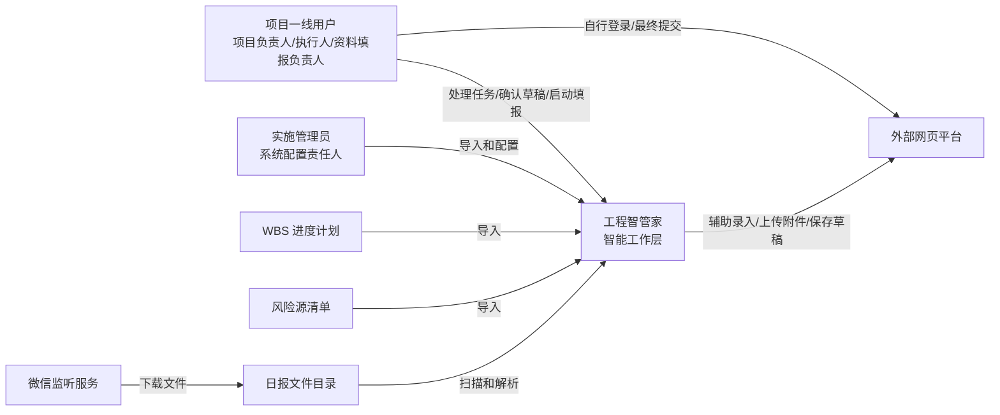
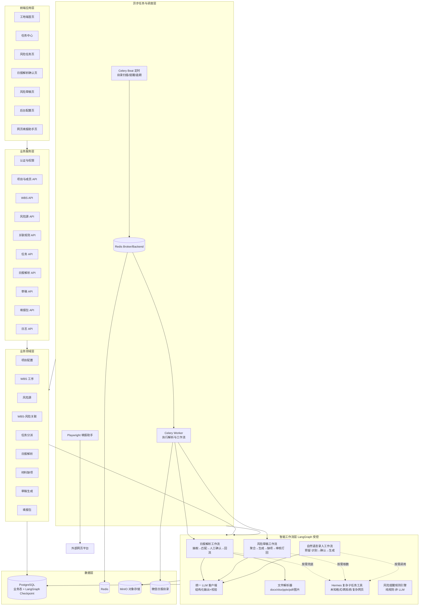
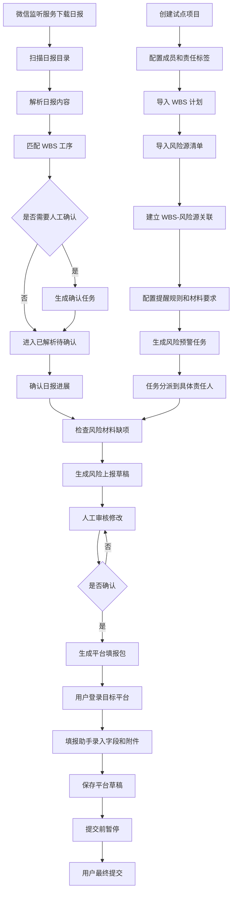
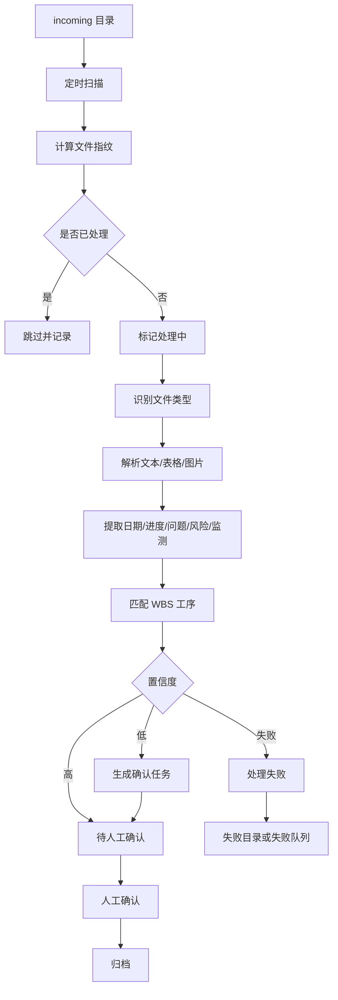
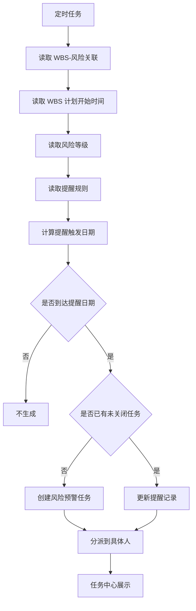
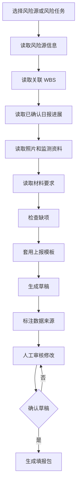
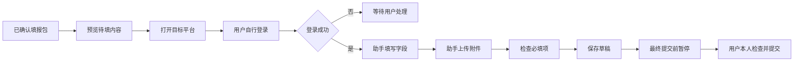
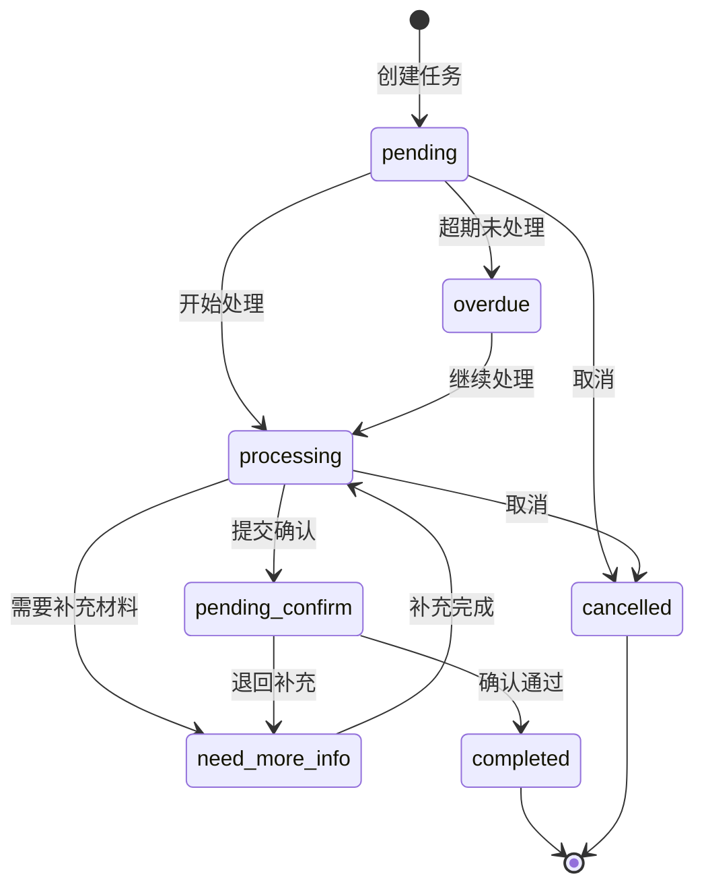
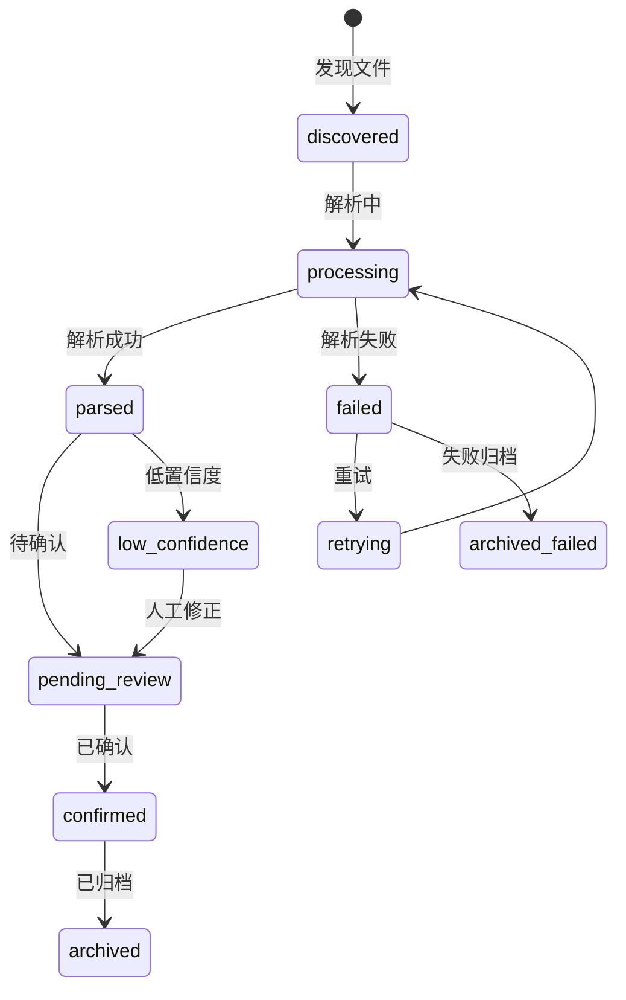
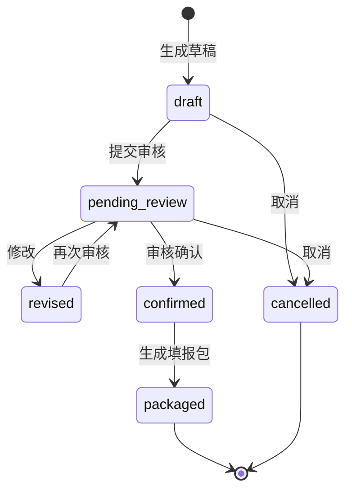

# 工程智管家 MVP 系统架构设计

> 文档状态：开发前期基线
> 文档目的：说明系统上下文、逻辑架构、关键流程、状态机、安全边界和技术分层。

---

## 1. 架构目标

工程智管家 MVP 的架构目标是在项目一线和既有平台之间建立智能工作层，支撑以下能力：

- 后台初始化 WBS、风险源、项目成员和责任标签。
- 根据 WBS 和风险源关联生成风险预警任务。
- 从微信群日报目录读取实际进展。
- 将日报进展、照片、监测资料用于草稿生成。
- 将任务、草稿、填报包都纳入人工确认和日志追溯。
- 在用户登录外部平台后，辅助录入字段和上传附件。

### 1.1 技术架构总则：确定性业务流 + 受控智能工作流（A/B 双层）

系统内部存在两类性质完全不同的工作，必须分层、用不同技术承载，不能一锅煮：

- A 类·确定性业务流（约占 70%）：项目/成员/责任配置、WBS 与风险源导入、WBS-风险关联、提醒规则按日期计算、任务状态机流转、日报目录扫描去重、填报包组装。这些是规则 + SQL + 定时器，用 FastAPI + SQLAlchemy 直接实现，不引入任何图编排或大模型。
- B 类·受控智能工作流（约占 30%，但是系统价值核心）：日报解析（抽取 → 低置信度补抽取 → WBS 语义匹配 → 低置信度挂起人工确认 → 回流）、风险草稿生成（多源聚合 → 套模板生成 → 缺项检查 → 人工审核打回重生成）、自然语言录入（预留，识别意图 → 结构化候选 → 人工确认 → 生成任务/草稿）。这三类都是“多步 + 条件分支 + 循环重试 + 中途暂停等人工确认再恢复”的流程，用 LangGraph 编排。

关键定位（避免误解）：本系统使用 LangGraph 只取其“状态机 + 人在环 interrupt + 持久化断点续跑”能力，把它当作确定性工作流引擎。节点和边由工程师写死，大模型只在节点内负责“文本 → 结构化”的填空，不允许自主决定流程走向。Hermes 可以作为 LangGraph 按需调用的复杂子任务工具，用于未知格式兜底、跨系统取数、复杂网页操作，但不作为流程编排者，不允许自主接管业务闭环。因此本系统仍是一个流程可控、结果可审、可追溯的上报辅助系统。

---

## 2. 系统上下文图

---

## 3. 逻辑架构图

---

## 4. 主业务流程图

---

## 5. 日报文件处理流程

---

## 6. 风险提醒生成流程

---

## 7. 草稿生成流程

---

## 8. 网页填报安全边界

安全要求：

- 平台账号密码只在目标平台输入。
- 系统不保存密码。
- 系统不绕过验证码。
- 系统不绕过平台权限。
- 系统不自动最终提交。
- 字段录入和附件上传必须记录日志。

---

## 9. 核心状态机

### 9.1 任务状态机

### 9.2 日报解析状态机

### 9.3 风险草稿状态机

---

## 10. 技术选型与分层（已定基线）

技术栈按职责分层选型：前端采用独立 Web 工程，不使用 Python 前端；推荐 Vue 3 + TypeScript + Vite + Element Plus。A 类确定性业务用成熟的 FastAPI + PostgreSQL，B 类智能工作流单独引入 LangGraph，配合文件解析与网页自动化组件。基础设施统一为 PostgreSQL 15、Redis 7、Celery、MinIO。

| 层级 | 选型 | 说明 |
|---|---|---|
| 前端层 | Vue 3 + TypeScript + Vite + Element Plus | 独立前端工程，通过 JSON API 调用后端；负责路由、表格、表单、状态轮询、任务操作与审核交互 |
| 业务服务层（A 类） | FastAPI + Pydantic | 承载业务 API、认证、权限、日志，纯确定性逻辑 |
| 业务数据层 | PostgreSQL 15 + SQLAlchemy 2.0 | 存结构化业务态 |
| 对象存储层 | MinIO | 存日报、照片、附件原件，元数据落附件表 |
| 缓存与队列 | Redis 7 | 作 Celery Broker/Backend 与缓存 |
| 智能工作流层（B 类） | LangGraph + PostgreSQL Checkpointer | 日报解析、草稿生成、自然语言录入预留三条工作流；状态机 + interrupt 人在环 + 断点续跑落 Postgres |
| 大模型访问层 | 统一 LLM 客户端（OpenAI 兼容） | 模型/超时/重试/降级集中管理；输出走 Pydantic 结构化校验；Prompt 与输出 schema 版本化 |
| 文件解析层 | python-docx / openpyxl / python-pptx / pdfplumber（图片 OCR 可选） | 按 MIME 分发的 Parser 接口，新增格式只加实现 |
| 复杂子任务工具 | Hermes | 被 LangGraph 按需调用，用于未知格式兜底、跨系统取数、复杂网页操作；不作为流程编排者 |
| 异步与调度层 | Celery（Beat + Worker）+ Redis | Celery Beat 跑定时（目录扫描/提醒生成/逾期检查），耗时解析与工作流投递到 Celery Worker 执行，避免阻塞 API |
| 网页填报层 | Playwright（受控后端服务） | 用户自行登录，助手仅录入与上传，不存密码、不绕验证码、不自动提交，全程留日志 |

### 10.1 智能工作流层与人在环

日报解析（见第 5 节）、风险草稿生成（见第 7 节）和自然语言录入预留工作流各实现为一张 LangGraph StateGraph：

- 节点是确定步骤（解析、抽取、匹配、生成、缺项检查），边的走向由工程师定义的条件函数决定，大模型不决定流程。
- 低置信度匹配、草稿待审核等需要人判断的环节，用 LangGraph interrupt 暂停，把控制权交回任务中心；人工确认后从断点恢复，不重跑整条流程。
- 图的执行态（节点进度、中间状态）由 LangGraph 的 PostgreSQL Checkpointer 持久化；业务态（日报确认状态、草稿状态、任务状态）仍写业务表，二者分离。

### 10.2 异步任务与调度

- 定时触发：Celery Beat 周期执行日报目录扫描、风险提醒生成、逾期检查等 A 类规则任务。
- 耗时执行：文件解析 + LLM 工作流耗时较长，由触发方（API 或定时任务）将作业投递到 Celery 队列，Celery Worker 取出执行 LangGraph 工作流，前端通过作业状态轮询查看进度。
- 作业可见性：Celery 负责执行与重试，async_jobs 表负责面向 UI 的持久化状态镜像，记录 celery_task_id、业务对象、进度和错误信息。

### 10.3 不采用的方案与原因

- 不让开放式自主 Agent / Hermes 编排业务流程：Hermes 只作为 LangGraph 节点按需调用的复杂子任务工具，不能替代确定性流程图。
- 不把 A 类业务流塞进 LangGraph：纯 CRUD 与规则用图编排是负担，无分支价值。
- 不自建步骤/状态表替代 LangGraph：工作流执行态交给 Checkpointer，避免重复造一个简陋的状态机。

---

## 11. 架构落地顺序

建议先建设可验收的业务主干：

1. 项目、成员、责任标签、日志。
2. WBS 导入。
3. 风险源导入。
4. WBS-风险关联。
5. 风险提醒任务。
6. 任务中心。
7. 日报目录扫描。
8. 日报基础解析。
9. 日报人工确认。
10. 风险草稿生成。
11. 填报包预览。
12. 网页填报助手原型。
