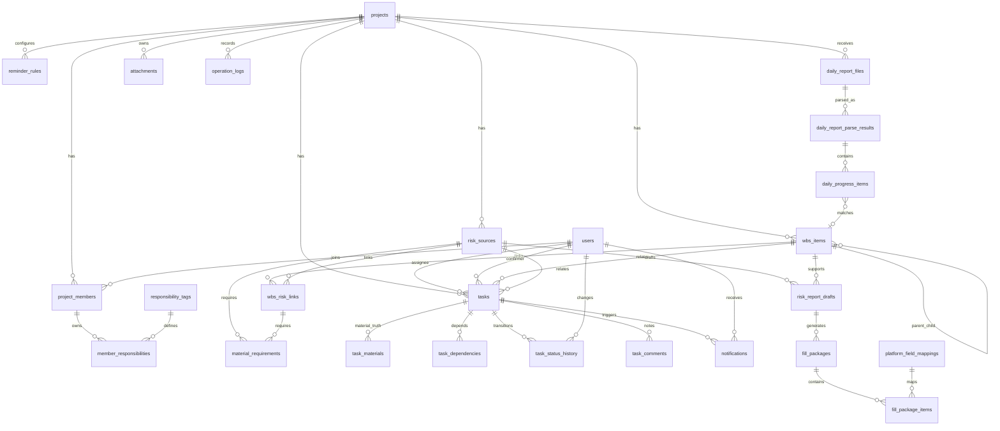

# 工程智管家 MVP 初步数据库设计

> 文档状态：开发前期基线版
> 编制日期：2026-06-09
> 数据库建议：PostgreSQL
> 文档目的：给出 MVP 阶段核心数据对象、表结构、字段、关系和状态枚举，作为后端建模和接口开发的初步依据。

---

## 1. 设计原则

数据库设计围绕 MVP 主闭环展开：

```text
项目配置 -> WBS 工序 -> 风险源 -> WBS-风险关联 -> 风险任务 -> 日报解析 -> 草稿 -> 填报包 -> 操作日志
```

设计原则：

- 先支撑试点项目闭环，不追求一次性覆盖所有企业级场景。
- 结构化字段优先，原始文件和解析中间结果允许保留 JSON 扩展字段。
- 智能生成内容必须保留来源、状态和人工确认记录。
- 任务、草稿、填报包必须有状态机，便于追踪和恢复。
- 外部平台账号密码不入库。
- 关键操作写入操作日志。

### 1.1 设计基线约定

数据库按以下基线设计，并与 LangGraph 工作流引擎职责分离：

- 主键类型统一：全库主键统一用 bigint（BIGSERIAL），避免 int4 与 int8 外键混用。
- 项目外键统一用 project_id：projects.id 是项目唯一主键，各子表关联项目时统一使用 project_id（指向 projects.id）；不再设置项目业务编码字段，projects 表也不再单独维护标段名称字段。
- project_members 一张表承载成员与归属：含 user_id、project_id、member_role，并扩展 display_name、phone、status；member_role 仅表示 owner、manager、member 等粗粒度归属，不承载业务责任。
- 附件归一到一张表：attachments（接 MinIO）统一承担日报、照片、附件原件的元数据，含 file_hash、file_type、source_type、source_id、uploaded_by。
- 身份、权限、参与、职责四轴正交：users 表只存自然人账号（登录账号、姓名、手机、所属单位、工号、头像等），跨项目唯一一份，不绑定具体项目；users.role 承担系统级权限（superadmin/admin/member）；project_members 承担“参与了哪些项目”及项目内显示名与联系方式；responsibility_tags + member_responsibilities 承担“在项目内担任什么岗位责任”（安全负责人、风险确认人等）与任务分派。四条轴分别落在不同表、互不耦合，禁止把项目相关属性塞进 users 表，也禁止把账号身份信息冗余进 project_members。
- B 类工作流执行态交 LangGraph：节点进度、中间状态、断点由 LangGraph 的 PostgreSQL Checkpointer 自带表持久化；人在环确认用 tasks 表（daily_review、draft_review 等任务类型）+ LangGraph interrupt 实现，不自建工作流步骤表；task_status_history 仅记录业务任务状态流转。
- 异步作业统一由 Celery 执行：Celery Beat 负责定时触发，Celery Worker 负责耗时作业执行；async_jobs 表只作为面向业务和前端的持久化状态镜像。
- 自然语言录入作为 B 类预留工作流：本期只在 source_type/job_type 等字段中保留 nl_intake 取值，不纳入 MVP 必交付实现。

---

## 2. 表分组

| 分组 | 表 | 说明 |
|---|---|---|
| 基础配置 | projects、users、project_members、responsibility_tags、member_responsibilities | 项目、成员、责任标签 |
| WBS 与风险底图 | wbs_items、risk_sources、wbs_risk_links、reminder_rules、material_requirements | WBS、风险源、关联、提醒和材料要求 |
| 任务与消息 | tasks、task_materials、task_dependencies、task_status_history、task_comments、notifications | 任务中心（风险提醒、材料补充、日报确认、草稿审核、填报）、任务依赖、状态流转历史与用户站内消息通知 |
| 日报解析 | daily_report_configs、daily_report_files、daily_report_parse_results、daily_progress_items | 日报目录配置、微信日报文件、解析结果、进度条目 |
| 草稿与填报 | risk_report_drafts、fill_packages、platform_field_mappings、fill_package_items | 风险上报草稿、填报包、字段映射 |
| 附件、作业与日志 | attachments、async_jobs、operation_logs | 文件附件、异步作业状态、操作日志 |

---

## 3. 核心关系图



---

## 4. 基础配置表

### 4.1 projects 项目表

**作用：**工程项目主数据，是全系统的顶层归属。projects.id 是项目唯一主键，各子表均通过 project_id 关联到项目。
**关联表：**被 project_members、wbs_items、risk_sources、tasks 等几乎所有业务表以 project_id 引用。

| 字段 | 类型 | 约束 | 说明 |
|---|---|---|---|
| id | bigserial | PK | 主键 |
| project_name | varchar(200) | not null | 项目名称 |
| owner_unit | varchar(200) | | 所属单位 |
| description | text | | 项目说明 |
| status | varchar(32) | default active | 状态：active、inactive、archived |
| created_at | timestamptz | not null | 创建时间 |
| updated_at | timestamptz | not null | 更新时间 |

### 4.2 users 用户表

系统内的自然人账号，是“身份”这一条独立的轴：一个人在系统里只有一份账号、跨所有项目复用，账号本身不绑定任何项目。一个人“参与了哪些项目”由 project_members 承载，“在某个项目里担任什么岗位责任”由 member_responsibilities 承载，“在系统里有什么管理权限”由本表的 role 承载——四者正交，互不替代。所以用户表绝不是一个简单关联，而要完整刻画账号、个人信息、组织归属与系统权限。

| 字段 | 类型 | 约束 | 说明 |
|---|---|---|---|
| id | bigserial | PK | 主键 |
| username | varchar(64) | unique not null | 登录账号 |
| password_hash | varchar(255) | not null | 密码哈希（bcrypt/argon2） |
| real_name | varchar(100) | not null | 真实姓名 |
| phone | varchar(50) | unique | 手机号，可作登录名 |
| email | varchar(200) | | 邮箱 |
| employee_no | varchar(64) | | 工号 |
| gender | varchar(16) | | 性别：male、female、unknown |
| avatar_url | varchar(1000) | | 头像地址 |
| org_name | varchar(200) | | 所属单位名称 |
| org_type | varchar(32) | | 单位类型：owner、general_contractor、supervisor、designer、subcontractor |
| title | varchar(100) | | 职务/岗位：项目经理、总工、安全员等 |
| role | varchar(32) | default member | 系统级角色：superadmin、admin、member |
| status | varchar(32) | default active | 账号状态：active、disabled、locked |
| last_login_at | timestamptz | | 最近登录时间 |
| last_login_ip | varchar(64) | | 最近登录 IP |
| created_at | timestamptz | not null | 创建时间 |
| updated_at | timestamptz | not null | 更新时间 |

说明：org_name / org_type 在 MVP 阶段以字段冗余在用户上承载“所属参建单位”（业主、总包、监理、设计、分包），暂不单独建 organizations 表；若后续单位需要独立维护层级与资质，再抽出组织表并将本表 org 字段换成 org_id 外键。

### 4.3 project_members 项目成员表

**作用：**记录“哪个用户参与了哪个项目”及其项目内显示名与联系方式，是 users 与 projects 的多对多连接表。
**关联表：**关联 projects（project_id）与 users；被 member_responsibilities 引用。

| 字段 | 类型 | 约束 | 说明 |
|---|---|---|---|
| id | bigserial | PK | 主键 |
| project_id | bigint | FK | 项目 ID，关联 projects.id |
| user_id | bigint | FK | 用户 ID |
| member_role | varchar(32) | default member | 项目内粗粒度角色：owner、manager、member；不承载业务责任 |
| display_name | varchar(100) | | 项目内显示名 |
| phone | varchar(50) | | 联系方式 |
| status | varchar(32) | default active | 状态 |
| created_at | timestamptz | not null | 创建时间 |

唯一约束：project_id + user_id。

### 4.4 responsibility_tags 责任标签表

**作用：**可复用的岗位责任标签字典（如安全负责人、风险确认人），全局共享，不属于具体项目。
**关联表：**被 member_responsibilities 引用。

| 字段 | 类型 | 约束 | 说明 |
|---|---|---|---|
| id | bigserial | PK | 主键 |
| code | varchar(64) | unique not null | 标签编码 |
| tag_name | varchar(100) | not null | 标签名称 |
| description | text | | 说明 |
| builtin | boolean | default false | 是否内置 |

### 4.5 member_responsibilities 成员责任表

**作用：**把责任标签授予某个项目成员并限定范围（项目/风险/WBS），是“项目内职责”这条轴的落地表。
**关联表：**关联 projects、project_members、responsibility_tags；scope_type 为 risk/wbs 时分别关联 risk_sources、wbs_items。

| 字段 | 类型 | 约束 | 说明 |
|---|---|---|---|
| id | bigserial | PK | 主键 |
| project_id | bigint | FK | 项目 ID，关联 projects.id；必须与 project_member_id 所属项目一致 |
| project_member_id | bigint | FK | 项目成员 ID |
| responsibility_tag_id | bigint | FK | 责任标签 ID |
| scope_type | varchar(64) | | 范围类型：project、risk、wbs |
| risk_source_id | bigint | FK nullable | scope_type 为 risk 时填写风险源 ID |
| wbs_item_id | bigint | FK nullable | scope_type 为 wbs 时填写 WBS 工序 ID |
| created_at | timestamptz | not null | 创建时间 |

---

## 5. WBS 与风险底图表

### 5.1 wbs_items WBS 工序表

**作用：**项目进度计划的工序分解（WBS），parent_id 自关联形成父子层级，是进度与提醒的基准。
**关联表：**关联 projects；被 wbs_risk_links、tasks、daily_progress_items、risk_report_drafts 引用。

| 字段 | 类型 | 约束 | 说明 |
|---|---|---|---|
| id | bigserial | PK | 主键 |
| project_id | bigint | FK | 项目 ID，关联 projects.id |
| parent_id | bigint | FK nullable | 父级工序 |
| code | varchar(100) | | WBS 编码 |
| wbs_item_name | varchar(300) | not null | 工序名称 |
| level | integer | | 层级 |
| planned_start | date | | 计划开始时间 |
| planned_finish | date | | 计划完成时间 |
| duration_days | integer | | 工期 |
| predecessor | varchar(300) | | 前置工序 |
| successor | varchar(300) | | 后续工序 |
| is_key_node | boolean | default false | 是否关键节点 |
| status | varchar(32) | default not_started | 工序状态 |
| source_file_id | bigint | | 来源文件 ID |
| raw_data | jsonb | | 导入原始字段 |
| created_at | timestamptz | not null | 创建时间 |
| updated_at | timestamptz | not null | 更新时间 |

状态建议：not_started、approaching、started、in_progress、completed、delayed、paused、pending_review。

### 5.2 risk_sources 风险源表

**作用：**项目的风险底图清单（重大/较大/一般风险）及其状态、负责人、控制要求。
**关联表：**关联 projects；被 wbs_risk_links、risk_report_drafts、tasks 引用。

| 字段 | 类型 | 约束 | 说明 |
|---|---|---|---|
| id | bigserial | PK | 主键 |
| project_id | bigint | FK | 项目 ID，关联 projects.id |
| risk_name | varchar(300) | not null | 风险名称 |
| level | varchar(64) | | 风险等级 |
| type | varchar(100) | | 风险类型 |
| description | text | | 风险描述 |
| planned_start | date | | 风险计划开始 |
| planned_finish | date | | 风险计划结束 |
| responsible_user_id | bigint | FK nullable | 风险负责人 |
| leader_name | varchar(100) | | 挂牌领导 |
| current_progress | text | | 当前进展 |
| control_requirements | text | | 控制要求 |
| status | varchar(32) | default active | 风险状态 |
| raw_data | jsonb | | 导入原始字段 |
| created_at | timestamptz | not null | 创建时间 |
| updated_at | timestamptz | not null | 更新时间 |

### 5.3 wbs_risk_links WBS 风险关联表

**作用：**工序与风险源的多对多关联，并配置触发阶段与提前提醒天数，是“工序临近→生成风险提醒任务”的规则底座。
**关联表：**关联 wbs_items、risk_sources；被 material_requirements 引用。

| 字段 | 类型 | 约束 | 说明 |
|---|---|---|---|
| id | bigserial | PK | 主键 |
| project_id | bigint | FK | 项目 ID，关联 projects.id |
| wbs_item_id | bigint | FK | WBS 工序 ID |
| risk_source_id | bigint | FK | 风险源 ID |
| trigger_stage | varchar(64) | | 触发阶段：before_start、started、in_progress、completed |
| reminder_days | integer[] | | 提前提醒天数，如 {14,7,3} |
| responsible_user_id | bigint | FK nullable | 负责人 |
| confirmer_user_id | bigint | FK nullable | 确认人 |
| basis | text | | 关联依据 |
| status | varchar(32) | default active | 状态 |
| created_at | timestamptz | not null | 创建时间 |
| updated_at | timestamptz | not null | 更新时间 |

唯一约束建议：project_id + wbs_item_id + risk_source_id + trigger_stage。

### 5.4 material_requirements 材料要求表

**作用：**某风险或关联规则触发时需要准备的材料清单，供生成任务时带出待补材料。
**关联表：**关联 risk_sources、wbs_risk_links。

| 字段 | 类型 | 约束 | 说明 |
|---|---|---|---|
| id | bigserial | PK | 主键 |
| project_id | bigint | FK | 项目 ID，关联 projects.id |
| risk_source_id | bigint | FK nullable | 风险源 ID |
| wbs_risk_link_id | bigint | FK nullable | 关联规则 ID |
| material_type | varchar(100) | not null | 材料类型 |
| material_name | varchar(200) | not null | 材料名称 |
| required | boolean | default true | 是否必需 |
| description | text | | 要求说明 |
| created_at | timestamptz | not null | 创建时间 |

### 5.5 reminder_rules 提醒规则表

**作用：**按风险等级配置的提前提醒天数与默认负责人/确认人，是 wbs_risk_links 未单独指定时的默认提醒策略。
**关联表：**关联 projects、users。

| 字段 | 类型 | 约束 | 说明 |
|---|---|---|---|
| id | bigserial | PK | 主键 |
| project_id | bigint | FK | 项目 ID，关联 projects.id |
| risk_level | varchar(64) | | 风险等级，如重大风险、较大风险、一般风险 |
| reminder_days | integer[] | not null | 提前提醒天数，如 {14,7,3} |
| repeat_enabled | boolean | default true | 是否允许重复提醒 |
| default_assignee_user_id | bigint | FK nullable | 默认负责人 |
| default_confirmer_user_id | bigint | FK nullable | 默认确认人 |
| status | varchar(32) | default active | 状态 |
| created_at | timestamptz | not null | 创建时间 |
| updated_at | timestamptz | not null | 更新时间 |

---

## 6. 任务与消息中心表

### 6.1 tasks 任务表

**作用：**所有提醒、确认、填报类待办的统一载体（风险提醒、材料补充、日报确认、草稿审核、平台填报等），也是 B 类工作流人在环确认的落地点。
**关联表：**关联 projects、users（负责人/确认人）、wbs_items、risk_sources；被 task_materials、task_dependencies、task_status_history、task_comments、notifications 引用。

| 字段 | 类型 | 约束 | 说明 |
|---|---|---|---|
| id | bigserial | PK | 主键 |
| project_id | bigint | FK | 项目 ID，关联 projects.id |
| dedup_key | varchar(300) | unique nullable | 幂等键，用于定时生成预警任务时避免每日重复生成 |
| title | varchar(300) | not null | 任务标题 |
| type | varchar(64) | not null | 任务类型 |
| status | varchar(32) | default pending | 任务状态 |
| priority | integer | default 0 | 优先级 |
| assignee_user_id | bigint | FK | 负责人 |
| confirmer_user_id | bigint | FK nullable | 确认人 |
| due_at | timestamptz | | 截止时间 |
| started_at | timestamptz | | 开始处理时间，用于计算处理时长 |
| last_reminded_at | timestamptz | | 最近提醒时间，用于控制重复提醒频率 |
| next_remind_at | timestamptz | | 下次提醒时间，任务完成或取消后置空 |
| wbs_item_id | bigint | FK nullable | WBS 工序 |
| risk_source_id | bigint | FK nullable | 风险源 |
| source_type | varchar(64) | | 来源类型，可取 reminder_rule、wbs_risk_link、daily_report、draft、fill_package、nl_intake、manual 等 |
| source_id | bigint | | 来源对象 ID |
| required_materials | jsonb | | 所需材料只读展示快照，不作为材料是否齐全的判断依据 |
| trigger_reason | text | | 触发原因 |
| result | text | | 处理结果 |
| created_at | timestamptz | not null | 创建时间 |
| updated_at | timestamptz | not null | 更新时间 |
| completed_at | timestamptz | | 完成时间 |

任务类型建议：risk_warning、material_prepare、photo_supplement、monitor_upload、risk_status_confirm、daily_review、draft_review、platform_fill。

任务状态建议：pending、processing、need_more_info、pending_confirm、completed、overdue、cancelled。

说明：材料齐否以 task_materials.status 为准；tasks.required_materials 仅保存任务生成当时的展示快照，避免与 task_materials 双写冲突。

### 6.2 task_materials 任务材料表

**作用：**任务材料的真相源，记录某任务应准备/已提交的材料项、状态、附件与提交人。材料是否齐全、是否待补，以本表 status 为准。
**关联表：**关联 tasks、attachments、users。

| 字段 | 类型 | 约束 | 说明 |
|---|---|---|---|
| id | bigserial | PK | 主键 |
| task_id | bigint | FK | 任务 ID |
| material_type | varchar(100) | | 材料类型 |
| material_name | varchar(200) | | 材料名称 |
| required | boolean | default true | 是否必需 |
| status | varchar(32) | default pending | 材料状态：pending、submitted、accepted、rejected、missing |
| attachment_id | bigint | FK nullable | 附件 ID，未提交时为空 |
| submitted_by | bigint | FK nullable | 提交人 |
| submitted_at | timestamptz | | 提交时间 |
| reviewed_by | bigint | FK nullable | 审核人 |
| reviewed_at | timestamptz | | 审核时间 |
| created_at | timestamptz | not null | 创建时间 |

### 6.3 task_dependencies 任务依赖表

**作用：**承载任务之间的先后依赖，例如“先备料后填报”。
**关联表：**两次关联 tasks，分别表示当前任务和前置任务。

| 字段 | 类型 | 约束 | 说明 |
|---|---|---|---|
| id | bigserial | PK | 主键 |
| task_id | bigint | FK | 当前任务 ID |
| depends_on_task_id | bigint | FK | 前置任务 ID |
| dep_type | varchar(64) | default finish_to_start | 依赖类型：finish_to_start、start_to_start、manual |
| created_at | timestamptz | not null | 创建时间 |

建议唯一约束：task_id + depends_on_task_id + dep_type。

### 6.4 task_status_history 任务状态历史表

**作用：**记录任务状态流转历史，保留“曾经逾期”等事实，支撑按期率、处理时长、退回次数等统计。
**关联表：**关联 tasks、users。

| 字段 | 类型 | 约束 | 说明 |
|---|---|---|---|
| id | bigserial | PK | 主键 |
| task_id | bigint | FK | 任务 ID |
| from_status | varchar(32) | | 原状态 |
| to_status | varchar(32) | not null | 新状态 |
| changed_by | bigint | FK nullable | 变更人，系统自动流转时为空 |
| reason | text | | 变更原因 |
| changed_at | timestamptz | not null | 变更时间 |

### 6.5 task_comments 任务备注表

**作用：**任务下的处理备注与沟通记录，保留任务推进过程。
**关联表：**关联 tasks、users。

| 字段 | 类型 | 约束 | 说明 |
|---|---|---|---|
| id | bigserial | PK | 主键 |
| task_id | bigint | FK | 任务 ID |
| user_id | bigint | FK nullable | 备注人 |
| content | text | not null | 备注内容 |
| created_at | timestamptz | not null | 创建时间 |

### 6.6 notifications 消息通知表

面向用户的站内消息中心。任务分派、提醒到期、草稿待审核、解析待确认等事件生成一条消息推送给具体收件人；消息只是提醒入口，实际待办仍以任务为准（遵循“提醒转化为任务，不只发消息”的原则，多数消息通过 source_type/source_id 指向一条任务）。

| 字段 | 类型 | 约束 | 说明 |
|---|---|---|---|
| id | bigserial | PK | 主键 |
| project_id | bigint | FK nullable | 项目 ID，关联 projects.id |
| recipient_user_id | bigint | FK | 接收人 |
| type | varchar(64) | not null | 消息类型 |
| title | varchar(300) | not null | 消息标题 |
| content | text | | 消息正文 |
| level | varchar(32) | default info | 级别：info、warning、urgent |
| source_type | varchar(64) | | 关联对象类型：task、risk_source、daily_report、draft |
| source_id | bigint | | 关联对象 ID |
| link | varchar(500) | | 前端跳转路由 |
| is_read | boolean | default false | 是否已读 |
| read_at | timestamptz | | 已读时间 |
| created_at | timestamptz | not null | 创建时间 |

消息类型建议：task_assigned（任务分派）、task_due_soon（任务即将到期）、task_overdue（任务逾期）、risk_reminder（风险提醒）、draft_review（草稿待审核）、parse_confirm（日报解析待确认）、system（系统公告）。

索引建议：recipient_user_id + is_read（查“我的未读”）、recipient_user_id + created_at（消息列表倒序）。

---

## 7. 日报解析表

### 7.1 daily_report_configs 日报目录配置表

**作用：**配置每个项目的日报文件来源目录与扫描参数，是日报扫描任务的源头。
**关联表：**关联 projects。

| 字段 | 类型 | 约束 | 说明 |
|---|---|---|---|
| id | bigserial | PK | 主键 |
| project_id | bigint | FK | 项目 ID，关联 projects.id |
| incoming_dir | varchar(1000) | not null | 新文件目录 |
| processing_dir | varchar(1000) | | 处理中目录 |
| processed_dir | varchar(1000) | | 处理成功目录 |
| failed_dir | varchar(1000) | | 处理失败目录 |
| archive_dir | varchar(1000) | | 原始文件归档目录 |
| scan_interval_seconds | integer | default 600 | 扫描间隔 |
| enabled | boolean | default true | 是否启用 |
| created_at | timestamptz | not null | 创建时间 |
| updated_at | timestamptz | not null | 更新时间 |

### 7.2 daily_report_files 日报文件表

**作用：**扫描发现的微信日报原始文件及其去重指纹与处理状态。
**关联表：**关联 projects；被 daily_report_parse_results 引用。

| 字段 | 类型 | 约束 | 说明 |
|---|---|---|---|
| id | bigserial | PK | 主键 |
| project_id | bigint | FK | 项目 ID，关联 projects.id |
| original_filename | varchar(500) | not null | 原始文件名 |
| file_path | varchar(1000) | not null | 文件路径 |
| file_hash | varchar(128) | not null | 文件指纹 |
| file_type | varchar(64) | | 文件类型 |
| source_group | varchar(200) | | 微信群名 |
| source_sender | varchar(100) | | 发送人 |
| source_sent_at | timestamptz | | 发送时间 |
| process_status | varchar(32) | default discovered | 处理状态 |
| error_message | text | | 错误信息 |
| created_at | timestamptz | not null | 创建时间 |
| processed_at | timestamptz | | 处理时间 |

唯一约束建议：project_id + file_hash。

### 7.3 daily_report_parse_results 日报解析结果表

**作用：**LLM 对单个日报文件的结构化解析结果（施工内容、进度、问题、风险等）与人工确认状态。
**关联表：**关联 daily_report_files、users（确认人）；被 daily_progress_items 引用。

| 字段 | 类型 | 约束 | 说明 |
|---|---|---|---|
| id | bigserial | PK | 主键 |
| project_id | bigint | FK | 项目 ID，关联 projects.id |
| file_id | bigint | FK | 日报文件 ID |
| report_date | date | | 日报日期 |
| construction_content | text | | 施工内容 |
| progress_text | text | | 当前进度 |
| cumulative_progress | text | | 累计进展 |
| issues | text | | 存在问题 |
| next_plan | text | | 明日计划 |
| risk_text | text | | 风险相关内容 |
| monitor_text | text | | 监测相关内容 |
| confidence | numeric(5,2) | | 解析置信度 |
| review_status | varchar(32) | default pending_review | 确认状态 |
| reviewer_user_id | bigint | FK nullable | 确认人 |
| reviewed_at | timestamptz | | 确认时间 |
| raw_text | text | | 原始提取文本 |
| structured_data | jsonb | | 结构化解析结果 |
| created_at | timestamptz | not null | 创建时间 |

### 7.4 daily_progress_items 日报进度条目表

**作用：**解析结果内拆出的逐条进度，语义匹配到具体 WBS 工序以回填进度。
**关联表：**关联 projects、daily_report_parse_results、wbs_items。

| 字段 | 类型 | 约束 | 说明 |
|---|---|---|---|
| id | bigserial | PK | 主键 |
| parse_result_id | bigint | FK | 解析结果 ID |
| project_id | bigint | FK | 项目 ID，关联 projects.id；必须与 parse_result_id 所属项目一致 |
| wbs_item_id | bigint | FK nullable | 匹配 WBS |
| progress_text | text | not null | 进度描述 |
| match_confidence | numeric(5,2) | | 匹配置信度 |
| match_status | varchar(32) | default pending_review | 匹配状态 |
| confirmed_by | bigint | FK nullable | 确认人 |
| confirmed_at | timestamptz | | 确认时间 |

---

## 8. 草稿与填报表

### 8.1 risk_report_drafts 风险上报草稿表

**作用：**LLM 生成、人工审核的风险上报草稿，含数据来源摘要与缺材料提示。
**关联表：**关联 projects、risk_sources、wbs_items、daily_report_parse_results、attachments；被 fill_packages 引用。

| 字段 | 类型 | 约束 | 说明 |
|---|---|---|---|
| id | bigserial | PK | 主键 |
| project_id | bigint | FK | 项目 ID，关联 projects.id |
| risk_source_id | bigint | FK | 风险源 ID |
| wbs_item_id | bigint | FK nullable | WBS 工序 ID |
| title | varchar(300) | not null | 草稿标题 |
| content | text | not null | 草稿正文 |
| source_summary | text | | 数据来源摘要 |
| daily_report_parse_result_ids | bigint[] | | 关联的日报解析结果 ID 列表 |
| missing_materials | jsonb | | 缺少材料 |
| attachment_ids | bigint[] | | 附件 ID 列表 |
| status | varchar(32) | default draft | 草稿状态 |
| reviewer_user_id | bigint | FK nullable | 审核人 |
| confirmed_at | timestamptz | | 确认时间 |
| created_by | bigint | FK nullable | 创建人或系统用户 |
| created_at | timestamptz | not null | 创建时间 |
| updated_at | timestamptz | not null | 更新时间 |

草稿状态建议：draft、pending_review、revised、confirmed、packaged、cancelled。

### 8.2 fill_packages 填报包表

**作用：**由草稿生成、面向某目标平台的待填报数据包，package_data 存待填字段与附件。
**关联表：**关联 risk_report_drafts；被 fill_package_items 引用。

| 字段 | 类型 | 约束 | 说明 |
|---|---|---|---|
| id | bigserial | PK | 主键 |
| project_id | bigint | FK | 项目 ID，关联 projects.id |
| draft_id | bigint | FK | 草稿 ID |
| target_platform | varchar(100) | | 目标平台 |
| business_flow | varchar(100) | | 业务流程 |
| status | varchar(32) | default created | 状态 |
| package_data | jsonb | | 待填字段和附件数据 |
| created_by | bigint | FK nullable | 创建人 |
| created_at | timestamptz | not null | 创建时间 |
| updated_at | timestamptz | not null | 更新时间 |

状态建议：created、ready、filling、saved_as_draft、failed、submitted_by_user、cancelled。

### 8.3 platform_field_mappings 平台字段映射表

**作用：**目标上报平台的字段与本系统来源字段的映射规则，含网页选择器定位提示。
**关联表：**关联 projects；被 fill_package_items 引用。

| 字段 | 类型 | 约束 | 说明 |
|---|---|---|---|
| id | bigserial | PK | 主键 |
| project_id | bigint | FK | 项目 ID，关联 projects.id |
| target_platform | varchar(100) | not null | 目标平台 |
| business_flow | varchar(100) | not null | 业务流程 |
| platform_field_key | varchar(200) | not null | 平台字段标识 |
| platform_field_label | varchar(200) | | 平台字段名称 |
| source_field_path | varchar(300) | not null | 来源字段路径 |
| field_type | varchar(64) | | 字段类型 |
| required | boolean | default false | 是否必填 |
| selector_hint | text | | 网页选择器或定位提示 |
| status | varchar(32) | default active | 状态 |
| created_at | timestamptz | not null | 创建时间 |

### 8.4 fill_package_items 填报包明细表

**作用：**填报包内逐字段/逐附件的填报项与填报状态，是网页自动填报的最小执行单元。
**关联表：**关联 fill_packages、platform_field_mappings、attachments。

| 字段 | 类型 | 约束 | 说明 |
|---|---|---|---|
| id | bigserial | PK | 主键 |
| fill_package_id | bigint | FK | 填报包 ID |
| mapping_id | bigint | FK nullable | 字段映射 ID |
| item_type | varchar(64) | not null | 类型：field、attachment |
| label | varchar(200) | | 字段或附件名称 |
| value_text | text | | 待填写文本 |
| attachment_id | bigint | FK nullable | 附件 ID |
| required | boolean | default false | 是否必填 |
| fill_status | varchar(32) | default pending | 填报状态 |
| error_message | text | | 失败原因 |
| created_at | timestamptz | not null | 创建时间 |

---

## 9. 附件与日志表

### 9.1 attachments 附件表

**作用：**统一接入 MinIO 的附件元数据，一表承载日报、现场照片、上报附件等原件（source_type/source_id 指向来源对象）。
**关联表：**关联 projects；被 task_materials、fill_package_items 引用。

| 字段 | 类型 | 约束 | 说明 |
|---|---|---|---|
| id | bigserial | PK | 主键 |
| project_id | bigint | FK | 项目 ID，关联 projects.id |
| filename | varchar(500) | not null | 文件名 |
| file_path | varchar(1000) | not null | 文件路径或对象键 |
| file_hash | varchar(128) | | 文件指纹 |
| file_type | varchar(64) | | 文件类型 |
| source_type | varchar(64) | | 来源类型：daily_report、manual_upload、platform |
| source_id | bigint | | 来源对象 ID |
| uploaded_by | bigint | FK nullable | 上传人 |
| created_at | timestamptz | not null | 创建时间 |

### 9.2 operation_logs 操作日志表

**作用：**关键操作的审计留痕，记录变更前后快照、操作人与客户端信息。
**关联表：**关联 projects、users。

| 字段 | 类型 | 约束 | 说明 |
|---|---|---|---|
| id | bigserial | PK | 主键 |
| project_id | bigint | FK nullable | 项目 ID，关联 projects.id |
| user_id | bigint | FK nullable | 操作人 |
| action | varchar(100) | not null | 操作类型 |
| target_type | varchar(100) | | 操作对象类型 |
| target_id | bigint | | 操作对象 ID |
| summary | text | | 操作摘要 |
| before_data | jsonb | | 变更前 |
| after_data | jsonb | | 变更后 |
| ip_address | varchar(100) | | IP |
| user_agent | text | | 客户端信息 |
| created_at | timestamptz | not null | 创建时间 |

### 9.3 async_jobs 异步作业表

用于把“文件解析、日报工作流、草稿工作流、自然语言录入、网页填报”等耗时作业的执行状态对前端可见（Celery 自身有执行态，本表是面向业务与 UI 的持久化镜像，便于轮询和审计）。

| 字段 | 类型 | 约束 | 说明 |
|---|---|---|---|
| id | bigserial | PK | 主键 |
| project_id | bigint | FK | 项目 ID，关联 projects.id |
| job_type | varchar(64) | not null | 作业类型：daily_parse、daily_workflow、draft_workflow、nl_intake、web_fill |
| status | varchar(32) | default queued | 状态：queued、running、interrupted、succeeded、failed、cancelled |
| target_type | varchar(64) | | 关联对象类型：daily_report_file、risk_source、fill_package、nl_intake |
| target_id | bigint | | 关联对象 ID |
| celery_task_id | varchar(128) | | Celery 任务 ID |
| checkpoint_thread_id | varchar(128) | | LangGraph 线程/检查点 ID |
| progress | numeric(5,2) | | 进度百分比 |
| error_message | text | | 失败原因 |
| created_at | timestamptz | not null | 创建时间 |
| updated_at | timestamptz | not null | 更新时间 |

说明：interrupted 状态表示工作流在 LangGraph interrupt 处暂停、等待人工确认，对应任务中心的一条确认任务；人工确认后从 checkpoint_thread_id 恢复。

---

## 10. 初步 DDL 示例

以下 DDL 仅用于开发前期建模参考，实际实现以迁移机制生成、以本文表结构为准。

```sql
CREATE TABLE projects (
    id BIGSERIAL PRIMARY KEY,
    project_name VARCHAR(200) NOT NULL,
    owner_unit VARCHAR(200),
    description TEXT,
    status VARCHAR(32) NOT NULL DEFAULT 'active',
    created_at TIMESTAMPTZ NOT NULL DEFAULT now(),
    updated_at TIMESTAMPTZ NOT NULL DEFAULT now()
);

CREATE TABLE users (
    id BIGSERIAL PRIMARY KEY,
    username VARCHAR(64) NOT NULL UNIQUE,
    password_hash VARCHAR(255) NOT NULL,
    real_name VARCHAR(100) NOT NULL,
    phone VARCHAR(50) UNIQUE,
    email VARCHAR(200),
    employee_no VARCHAR(64),
    gender VARCHAR(16),
    avatar_url VARCHAR(1000),
    org_name VARCHAR(200),
    org_type VARCHAR(32),
    title VARCHAR(100),
    role VARCHAR(32) NOT NULL DEFAULT 'member',
    status VARCHAR(32) NOT NULL DEFAULT 'active',
    last_login_at TIMESTAMPTZ,
    last_login_ip VARCHAR(64),
    created_at TIMESTAMPTZ NOT NULL DEFAULT now(),
    updated_at TIMESTAMPTZ NOT NULL DEFAULT now()
);

CREATE TABLE wbs_items (
    id BIGSERIAL PRIMARY KEY,
    project_id BIGINT NOT NULL REFERENCES projects(id),
    parent_id BIGINT REFERENCES wbs_items(id),
    code VARCHAR(100),
    wbs_item_name VARCHAR(300) NOT NULL,
    level INTEGER,
    planned_start DATE,
    planned_finish DATE,
    duration_days INTEGER,
    predecessor VARCHAR(300),
    successor VARCHAR(300),
    is_key_node BOOLEAN NOT NULL DEFAULT false,
    status VARCHAR(32) NOT NULL DEFAULT 'not_started',
    source_file_id BIGINT,
    raw_data JSONB,
    created_at TIMESTAMPTZ NOT NULL DEFAULT now(),
    updated_at TIMESTAMPTZ NOT NULL DEFAULT now()
);

CREATE TABLE risk_sources (
    id BIGSERIAL PRIMARY KEY,
    project_id BIGINT NOT NULL REFERENCES projects(id),
    risk_name VARCHAR(300) NOT NULL,
    level VARCHAR(64),
    type VARCHAR(100),
    description TEXT,
    planned_start DATE,
    planned_finish DATE,
    responsible_user_id BIGINT,
    leader_name VARCHAR(100),
    current_progress TEXT,
    control_requirements TEXT,
    status VARCHAR(32) NOT NULL DEFAULT 'active',
    raw_data JSONB,
    created_at TIMESTAMPTZ NOT NULL DEFAULT now(),
    updated_at TIMESTAMPTZ NOT NULL DEFAULT now()
);

CREATE TABLE wbs_risk_links (
    id BIGSERIAL PRIMARY KEY,
    project_id BIGINT NOT NULL REFERENCES projects(id),
    wbs_item_id BIGINT NOT NULL REFERENCES wbs_items(id),
    risk_source_id BIGINT NOT NULL REFERENCES risk_sources(id),
    trigger_stage VARCHAR(64),
    reminder_days INTEGER[],
    responsible_user_id BIGINT,
    confirmer_user_id BIGINT,
    basis TEXT,
    status VARCHAR(32) NOT NULL DEFAULT 'active',
    created_at TIMESTAMPTZ NOT NULL DEFAULT now(),
    updated_at TIMESTAMPTZ NOT NULL DEFAULT now(),
    UNIQUE(project_id, wbs_item_id, risk_source_id, trigger_stage)
);

CREATE TABLE tasks (
    id BIGSERIAL PRIMARY KEY,
    project_id BIGINT NOT NULL REFERENCES projects(id),
    dedup_key VARCHAR(300) UNIQUE,
    title VARCHAR(300) NOT NULL,
    type VARCHAR(64) NOT NULL,
    status VARCHAR(32) NOT NULL DEFAULT 'pending',
    priority INTEGER NOT NULL DEFAULT 0,
    assignee_user_id BIGINT,
    confirmer_user_id BIGINT,
    due_at TIMESTAMPTZ,
    started_at TIMESTAMPTZ,
    last_reminded_at TIMESTAMPTZ,
    next_remind_at TIMESTAMPTZ,
    wbs_item_id BIGINT REFERENCES wbs_items(id),
    risk_source_id BIGINT REFERENCES risk_sources(id),
    source_type VARCHAR(64),
    source_id BIGINT,
    required_materials JSONB,
    trigger_reason TEXT,
    result TEXT,
    created_at TIMESTAMPTZ NOT NULL DEFAULT now(),
    updated_at TIMESTAMPTZ NOT NULL DEFAULT now(),
    completed_at TIMESTAMPTZ
);

CREATE TABLE task_dependencies (
    id BIGSERIAL PRIMARY KEY,
    task_id BIGINT NOT NULL REFERENCES tasks(id),
    depends_on_task_id BIGINT NOT NULL REFERENCES tasks(id),
    dep_type VARCHAR(64) NOT NULL DEFAULT 'finish_to_start',
    created_at TIMESTAMPTZ NOT NULL DEFAULT now(),
    UNIQUE(task_id, depends_on_task_id, dep_type)
);

CREATE TABLE task_status_history (
    id BIGSERIAL PRIMARY KEY,
    task_id BIGINT NOT NULL REFERENCES tasks(id),
    from_status VARCHAR(32),
    to_status VARCHAR(32) NOT NULL,
    changed_by BIGINT REFERENCES users(id),
    reason TEXT,
    changed_at TIMESTAMPTZ NOT NULL DEFAULT now()
);
```

---

## 11. 索引建议

| 表 | 索引 |
|---|---|
| users | username、phone、role、status |
| wbs_items | project_id、planned_start、status |
| risk_sources | project_id、level、status |
| wbs_risk_links | project_id、wbs_item_id、risk_source_id、status |
| reminder_rules | project_id、risk_level、status |
| tasks | project_id、assignee_user_id、status、due_at、type、dedup_key、next_remind_at |
| task_dependencies | task_id、depends_on_task_id |
| task_status_history | task_id、changed_at、to_status |
| notifications | recipient_user_id、is_read、created_at |
| daily_report_configs | project_id、enabled |
| daily_report_files | project_id、file_hash、process_status、created_at |
| daily_report_parse_results | project_id、report_date、review_status |
| risk_report_drafts | project_id、risk_source_id、status |
| fill_package_items | fill_package_id、item_type、fill_status |
| async_jobs | project_id、job_type、status、celery_task_id |
| operation_logs | project_id、user_id、action、created_at |

---

## 12. 后续确认点

- 已定：users、projects、project_members、attachments 等核心表按本文基线新建（见 1.1）。
- 已定：附件统一用 attachments 表接入 MinIO（见 1.1）。
- 已定：B 类工作流执行态由 LangGraph PostgreSQL Checkpointer 承担，不自建步骤表（见 1.1）。
- 待确认：WBS 和风险源导入是否需要版本表。
- 待确认：外部平台字段映射是否需要保存网页选择器。
- 待确认：操作日志保留周期和敏感字段脱敏规则。
- 待确认：LangGraph Checkpointer 与业务库是否同库不同 schema（建议同库、独立 schema 便于隔离）。
- 待确认：日报与 WBS 语义匹配是否引入 pgvector。
- 待确认：Hermes 在内网/离线环境能否运行其依赖的浏览器与 MCP。
- 待确认：dedup_key 拼接规则需与预警生成逻辑一并定死，建议“链路 ID + 类型 + 触发日历日”。
