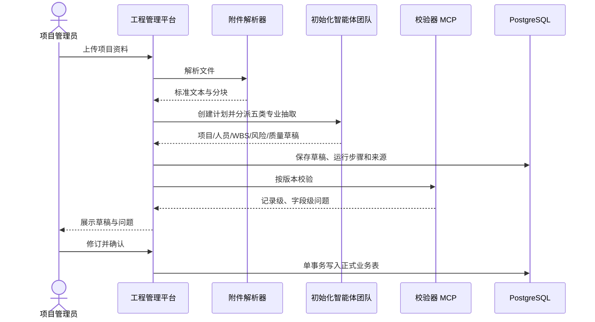
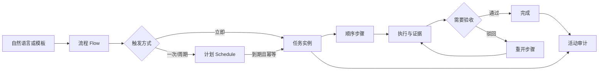
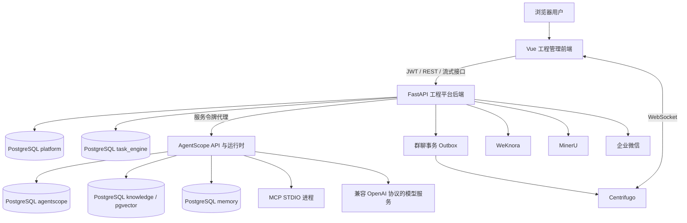
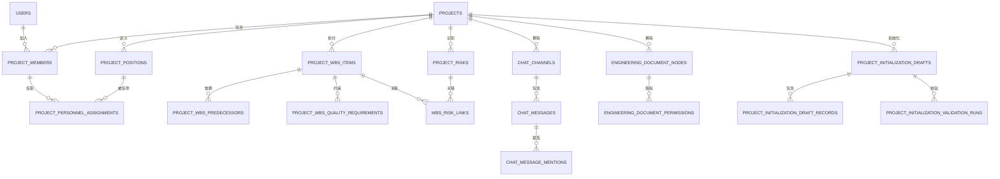

# Dobby 工程管理智能体项目全面说明

> 文档用途：供管理层、产品、项目实施、研发、测试和运维人员在不了解源码的情况下，快速建立对项目定位、已实现能力、技术架构、数据设计、部署方式、当前不足和后续建设方向的完整认识。
>
> 文档基线：代码提交 92d4fe29950cd06fcc6b4de8c5c0652bc3029d06（2026-08-31）。
>
> 编制日期：2026-08-31。

---

## 1. 项目概述

### 1.1 项目是什么

Dobby 工程管理智能体是一套面向工程项目全过程协同的 AI 业务平台。它不是单一聊天机器人，而是将工程项目基础数据、组织与岗位、WBS、风险、质量要求、任务闭环、工程资料、项目群聊和专业智能体统一到同一套工作环境中。

系统希望解决的核心问题是：

1. 工程信息分散在文件、群聊、台账和个人经验中，难以形成统一数据底座。
2. 项目任务依赖人工提醒，过程证据、验收、驳回和整改缺少闭环。
3. 通用大模型不了解项目上下文，回答与实际项目数据脱节。
4. 智能体具备工具调用能力后，数据库写入、外部通知和本地工具执行需要可控、可审计。
5. 项目资料数量大、格式复杂，传统目录检索难以支持自然语言问答和证据追溯。

系统当前形成了三层主体：

- 工程管理平台：承载用户、项目、WBS、风险、质量、任务、资料、群聊和业务工作台。
- AgentScope 智能体平台：承载模型、凭证、智能体、技能、MCP 工具、知识库、记忆、调度、权限审核和运行会话。
- 外部能力与基础设施：PostgreSQL、Centrifugo、WeKnora、MinerU、企业微信以及兼容 OpenAI 协议的模型服务。

### 1.2 当前成熟度判断

从代码和可运行链路看，项目已经超过原型阶段，具备“工程业务数据 + AI 智能体 + 任务闭环 + 知识库 + 实时协作 + 管理后台”的完整产品骨架，适合继续开展受控试点和内网部署验证。

当前还不宜直接按“公网、多租户、大规模横向扩容的成熟 SaaS”定位。主要原因不是核心功能缺失，而是项目级权限执行尚未完全统一、默认管理员安全策略需要收紧、发布迁移流程仍偏人工、部分新旧模块并存、前端与后端存在大文件和历史入口，以及标准运行方式仍包含进程内调度和消息总线。

建议的阶段性定位是：

| 场景 | 当前适用性 | 说明 |
|---|---:|---|
| 单组织、受控网络中的试点项目 | 较高 | 核心业务链路已具备，需完成生产检查清单 |
| 多项目并行的内部生产使用 | 中等 | 应先完成项目权限统一、监控、备份恢复和迁移治理 |
| 公网开放或跨组织多租户 SaaS | 较低 | 需要补齐租户隔离、账号安全、限流、对象存储和高可用 |
| 智能体能力演示与业务验证 | 较高 | 技能、MCP、知识库和受控数据库操作链路较完整 |

### 1.3 一页式能力总览

| 业务域 | 当前状态 | 已实现的核心价值 |
|---|---|---|
| 用户与项目 | 已实现 | 登录、个人资料、项目配置、成员、岗位和一人多岗 |
| AI 项目初始化 | 已实现 | 文件解析、多智能体抽取、草稿、校验、人工确认、原子入库 |
| 工作首页 | 已实现 | 我的工作队列、逾期/处理中任务、快捷 Dobby 对话 |
| 智能协同 | 已实现，部分能力待扩展 | 项目群聊、私聊、结构化 @、实时推送、显式召唤智能体 |
| 任务管理 | 已实现 | 流程生成、周期计划、步骤执行、证据、验收、驳回和审计 |
| 项目状态 | 已实现，部分指标依赖维护 | 项目健康、进度、风险、质量、安全、动态确认和过程监督 |
| 工程资料 | 已实现 | WeKnora 对接、本地目录镜像、权限、上传、检索和问答引用 |
| 业务工具 | 已实现 | 按权限加载已发布智能体，带项目上下文对话和工具确认 |
| 智能体管理中心 | 已实现 | 模型、凭证、智能体、技能、MCP、知识库、调度、审计 |
| 外部通知 | 企业微信已实现；其余部分实现 | 企业微信可靠投递；飞书、钉钉、邮件当前以配置保存为主 |
| 数据建模 | 已实现，开发测试兼容性待收口 | 数据画像、训练、评估、导出等完整 MCP 工具链 |

---

## 2. 使用对象、业务边界和权限角色

### 2.1 主要使用对象

| 使用者 | 主要诉求 | 对应入口 |
|---|---|---|
| 项目负责人/管理层 | 掌握项目状态、重大风险、任务执行和变更 | 项目状态、任务管理、智能协同 |
| 项目管理人员 | 建立项目基础信息、组织、WBS、风险和质量要求 | 工程配置、AI 项目初始化 |
| 一线项目成员 | 查看本人工作、提交证据、参与群聊、查询资料 | 工作首页、任务管理、智能协同、工程资料 |
| 专业人员 | 使用专业智能体完成分析、写作、检查或数据建模 | 业务工具、快捷 Dobby |
| 系统管理员 | 管理账号、模型、智能体、工具、知识库和安全策略 | 工程管理平台、智能体管理中心 |
| 运维/研发人员 | 部署、升级、监控、排障和数据维护 | 启动脚本、数据库迁移、日志和健康检查 |

### 2.2 当前角色体系

工程管理平台当前以系统用户角色和项目成员关系共同控制访问：

- 系统管理员：用户 role 为 admin，承担项目及全局管理职责。
- 普通用户：登录后使用被授权的项目与业务能力。
- 项目成员：通过 project_members 与项目绑定，并可通过 project_personnel_assignments 在同一项目承担多个岗位。
- 项目岗位：由 project_positions 定义，用于责任、资料权限和业务分工。
- 智能体管理权限：由 AgentScope 管理端的权限规则、协作白名单和工具授权进一步约束。

需要注意：当前项目成员校验已经用于群聊、工程资料、项目初始化、项目连接配置和智能体会话等关键入口，但尚未在所有项目资源接口中完全统一，详见第 11 章。

### 2.3 明确的系统边界

| 属于本项目 | 不属于或当前未覆盖 |
|---|---|
| 工程项目数据管理与 AI 协作 | 财务核算、支付、完整 ERP |
| 工程任务流程、证据和验收 | 通用 OA 的全部审批类型 |
| 工程资料目录、权限、检索和问答 | 专业 BIM/CAD 文件编辑器 |
| 风险、质量要求、WBS 和项目状态聚合 | 施工现场 IoT 硬件采集本身 |
| 企业微信通知 | 当前尚未完成飞书、钉钉、邮件的实际投递适配 |
| 受控数据库交互和可信 MCP 包 | 面向不可信代码的强沙箱执行平台 |
| AgentScope 智能体运行与管理 | 自建大模型训练基础设施 |

---

## 3. 已实现功能详解

### 3.1 登录、个人资料与项目管理

已实现能力：

- 用户名与密码登录，后端签发 JWT 访问令牌。
- 密码使用 bcrypt 哈希保存。
- 登录用户可以查看和修改个人资料、修改密码。
- 支持保存个人平台、邮件、企业微信、飞书和钉钉连接配置；敏感字段在服务端加密保存。
- 管理员可以创建和更新项目基础信息。
- 项目可维护建设单位、总包单位、监理单位、设计单位、勘察单位、合同工期和合同金额等信息。
- 支持项目成员、项目岗位以及“一人多岗”任职关系。
- 人员任职可记录证书、职责和序号。
- 前端提供当前项目选择器，后续页面按当前项目加载业务数据。

当前边界：

- 尚未形成完整的项目归档、删除和恢复流程。
- 成员、岗位的停用、离场和历史有效期能力不足。
- 登录体系暂未体现账号锁定、密码找回、刷新令牌、MFA 和统一身份认证。

### 3.2 工程配置

工程配置页面已经覆盖项目数据底座的主要维护入口：

- 项目概况与合同信息。
- 项目成员、岗位和人员任职。
- WBS 树形结构、编码、计划日期、进度、成本和外部计划数据。
- WBS 前置依赖关系，并校验循环依赖。
- 风险源、风险等级、触发条件、责任人、确认人、时间窗口和状态。
- WBS 质量验收要求、控制点、检查频次、资料要求、材料要求和责任岗位。
- WBS 与风险的关联、提前预警天数和通知规则。
- 外部平台字段映射和转换配置。
- 本地目录、扫描间隔、提醒规则和 WeKnora 智能体绑定。
- 工程资料访问方式、用户/岗位授权和继承权限。
- 项目级外部连接配置。

这部分是业务数据的人工维护入口，同时也是 AI 项目初始化最终落库后的查看和修订入口。

### 3.3 AI 项目初始化

项目初始化不是“上传文件后直接写库”，而是一条带草稿、校验和人工确认的受控链路。

主要流程：

1. 用户上传项目资料；初始化附件设置单文件大小限制，并按允许的文件类型接收。
2. 系统附件解析器优先调用 MinerU，失败时使用本地解析能力作为回退。
3. 主初始化智能体先建立任务计划，再调用五个常驻专业智能体。
4. 专业智能体分别抽取项目基础、人员组织、WBS、风险和质量要求。
5. 抽取结果写入隔离草稿区，不直接污染正式业务表。
6. 版本化校验器按记录和字段输出精确问题。
7. 用户修订、重新校验并确认。
8. 通过校验的草稿以事务方式原子应用到正式表。

专业团队配置位于 [project-initialization-team.json](../AgentScope/project-initialization-team.json)，对应六项技能：

- 项目初始化编排。
- 项目基础信息抽取。
- 人员组织整理。
- WBS/时间线整理与校验。
- 项目风险抽取。
- 质量要求映射。

该设计的关键价值是将“大模型输出”与“正式工程数据”隔离，保留附件、解析块、运行步骤、草稿版本、校验批次和问题明细，便于追溯和人工兜底。

### 3.4 工作首页

当前工作首页包含两类核心能力：

- 我的工作队列：汇总待处理、处理中、逾期等任务，并进入具体任务处理。
- 快捷 Dobby：在当前项目上下文内进行通用对话，支持附件、流式过程、工具调用确认和中止生成。

任务来源以 task_engine 中的新任务引擎为主。智能体在对话中生成的任务也可以回到工作队列，形成“对话提出需求—生成任务—人工执行/验收”的闭环。

### 3.5 智能协同与项目群聊

当前主导航“智能协同”使用项目群聊页面，已实现：

- 项目群聊频道。
- 私有多人会话。
- 结构化 @全体、@用户和 @智能体。
- 个人被 @后的回执和首次查看提示。
- Centrifugo 实时消息推送。
- 实时服务不可用时的轮询回退。
- 智能体只有在被明确 @时才运行，避免普通聊天意外触发模型费用和工具操作。
- 同一频道与同一智能体维持独立 AgentScope 会话。
- 将有限的最近聊天上下文传入智能体，控制上下文规模。
- 数据库事务提交后，通过 chat_realtime_outbox 可靠地安排实时广播。

当前未完成或仍需扩展：

- 群聊附件。
- 话题/子频道。
- 频道成员变更管理。
- 全量消息已读状态。
- 更完善的消息搜索、引用、撤回与内容治理。

实时通信的更细设计见 [项目群聊实时通信说明](项目群聊实时通信说明.md)。

### 3.6 任务管理与流程引擎

任务管理不是简单待办表，而是由流程模板、计划、任务实例、步骤和活动审计组成的独立引擎。

前端主要视图包括：

- 我的任务。
- 历史任务。
- 周期计划。
- 任务指派。

已实现能力：

- 通过自然语言生成流程；模型不可用时可使用规则和模板回退。
- 支持立即执行、一次性计划、周期计划和日历触发。
- 支持多步骤顺序执行。
- 步骤可指定执行人、地点、交付物、截止时间和确认人。
- 支持人工节点和自动 project_chat_message 节点。
- 支持上传执行证据、备注、转交、阻塞、完成、验收、驳回重开和取消。
- 支持计划暂停和取消。
- 活动表完整记录任务生命周期事件。
- fire_log 以“计划 + 触发时间”实现调度幂等。
- API 进程中按固定间隔执行调度 tick 和通知投递循环。

内置或可生成的典型流程包括隐患整改、资料补全、风险处置、报告审核和自定义流程。

需要区分两套数据：

- task_engine.tasks 是当前任务执行的权威数据源。
- platform.tasks 是历史兼容表，主要用于旧任务/旧页面和归档聚合。
- /tasks/archive 会合并新引擎已关闭任务与旧表记录，旧记录使用 legacy_ 前缀避免 ID 冲突。

任务引擎详细资料见 [功能手册](../mcp-packages/task-engine/功能手册.md) 和 [Dobby 接入指南](../mcp-packages/task-engine/Dobby接入指南.md)。

### 3.7 项目状态

项目状态页面聚合展示：

- 总体进度。
- 风险、安全、质量、开放事项和逾期事项等指标。
- 项目健康等级。
- 来自多来源的最新项目信息。
- 信息确认、否认和修订。
- 基于 WBS、质量、风险和任务的过程监督。
- 任务执行情况。
- 项目变更记录。

当前部分指标可以由业务表实时汇总，部分指标允许由 project_status_snapshots 快照覆盖或补充。因此，项目状态尚不是所有指标都能从原始业务事件自动计算，管理口径和数据刷新机制需要在后续统一。

### 3.8 工程资料与知识问答

当前主导航“工程资料”使用独立 DocumentLibraryView，已实现：

- 对接 WeKnora 知识库。
- 平台侧保存目录和文件的权威镜像，避免前端完全依赖外部系统临时返回。
- 文件夹、文件的上传、移动、重命名、删除、下载、预览和搜索。
- 项目公开与受限访问模式。
- 按用户或岗位授予查看、新增、修改、删除和管理权限。
- 父节点权限继承与能力计算。
- 工程资料智能问答。
- 保存问答会话、消息和引用范围。
- 对知识库同步状态、版本和错误进行持久化。

资料上传主链路有文件大小控制；平台还保留旧版 attachments、document_folders 等附件目录表，用于快捷对话和历史业务兼容。两套资料数据模型需要逐步明确主从关系。

WeKnora 对接细节见 [WeKnora 知识库对接文档](<WeKnora知识库对接文档-AgentScope2_0-v2 .md>)。

### 3.9 业务工具

“业务工具”页面动态加载 AgentScope 中已经发布且当前用户有权使用的业务智能体，支持：

- 按智能体建立和恢复会话。
- 注入当前用户和当前项目上下文。
- 上传附件。
- 流式显示模型和工具执行过程。
- 中断运行。
- 对高风险工具调用进行人工确认。
- 将工程平台业务权限传递到智能体工具链。

平台浏览器不直接持有 AgentScope 服务令牌，也不直接调用 AgentScope。所有调用经过工程平台后端代理，以便统一注入用户、项目、权限和审计上下文。

### 3.10 智能体管理中心

AgentScope 管理端已经形成较完整的智能体运营能力：

- 模型凭证与模型目录。
- 智能体角色创建、编辑、发布和会话。
- 技能管理。
- MCP 包上传、版本、启动和智能体分配。
- 内置工具管理。
- 知识库及文档管理。
- 智能体协作白名单。
- 定时调度。
- 数据库交互定义和授权。
- 权限审核器配置。
- 平台审计。
- 长期记忆、经验和技能事件。

图文操作说明见 [智能体管理中心全局操作说明](操作说明/智能体管理中心全局操作说明.html)，能力边界见 [AgentScope 能力矩阵](../AgentScope/dobby-skills/CAPABILITY_MATRIX.md)。

### 3.11 受控数据库交互

系统没有把任意 SQL 直接交给智能体，而是建立四层控制：

1. 表策略：明确哪些表允许读、写、插入或更新。
2. 交互定义：以业务名称定义参数、操作和返回结果。
3. 智能体授权：只有被分配的智能体可以看到和调用。
4. 运行时复核：再次验证用户、项目、交互状态、参数和权限。

直接对话中的写操作默认需要用户确认；来自可信任务流程的调用可以在严格上下文下自动执行。所有关键操作进入审计记录。

这套设计降低了提示注入或模型误判直接修改任意数据的风险，但它依赖策略配置正确，仍需要持续开展越权测试和最小权限审查。

### 3.12 MCP 工具包

项目采用标准输入输出（STDIO）方式运行 MCP。发布包包含运行时依赖，避免目标服务器临时联网安装。

| MCP 包 | 当前版本 | 主要用途 |
|---|---:|---|
| attachment-parser | 2.0.0 | 附件解析和标准化内容输出 |
| project-initialization-validator | 2.0.0 | 项目初始化草稿的版本化结构/业务校验 |
| task-engine | 0.1.0 | 流程、计划、任务、步骤和执行动作 |
| interactive-data-modeling | 2.1.4-platform.1 | 数据画像、建模、训练、评估、预测和导出 |
| wecom-notify | 0.2.0 | 企业微信文本、Markdown、图片、图文和状态查询 |

运行时按“会话 ID + MCP 名称”隔离进程，默认最大进程数 128、空闲 3600 秒回收。上传时检查路径穿越、压缩包大小和解压后大小。

重要边界：MCP 是本机可信代码扩展，不是面向任意第三方代码的安全沙箱。上传和分配权限应只开放给可信管理员。详细说明见 [MCP 包上传与运行说明](MCP包上传与运行说明.md)。

### 3.13 外部系统集成

| 集成 | 当前状态 | 说明 |
|---|---|---|
| 兼容 OpenAI 协议的模型服务 | 已实现 | 通过 AI_API_KEY、AI_BASE_URL、AI_MODEL 配置 |
| WeKnora | 已实现 | 工程资料知识库、目录同步和问答 |
| MinerU | 已实现，可回退 | 优先用于附件解析，本地解析作为回退 |
| 企业微信 | 已实现 | 项目机器人、个人标识、可靠投递队列和 MCP 工具 |
| Centrifugo | 已实现，可回退 | 项目群聊实时推送，失败时客户端轮询 |
| 飞书 | 部分实现 | 已有配置字段，尚未形成完整消息投递适配 |
| 钉钉 | 部分实现 | 已有配置字段，尚未形成完整消息投递适配 |
| 邮件 | 部分实现 | 已有配置字段，尚未形成完整通知投递链路 |
| Redis | 可选/预留 | 依赖与容器配置存在，标准 Windows 运行链路未作为消息总线使用 |
| MinIO/S3 | 可选/预留 | 组件和依赖存在，标准运行方式仍主要使用本地文件存储 |

---

## 4. 核心业务流程

### 4.1 项目初始化流程



### 4.2 任务闭环



### 4.3 群聊调用智能体

1. 用户在项目频道发送带结构化 @智能体的消息。
2. 平台先校验用户是否属于当前项目。
3. 普通消息直接入库；只有明确 @的智能体被调度。
4. 平台查找“频道 + 智能体”对应的 AgentScope 会话。
5. 平台带有限最近上下文、用户身份和项目身份调用 AgentScope。
6. 智能体按授权使用知识库、技能、MCP 或受控数据库交互。
7. 回复写入 platform.chat_messages。
8. 同一数据库事务写入 chat_realtime_outbox。
9. 后台投递到 Centrifugo；失败时客户端仍可通过轮询看到数据库中的消息。

### 4.4 工程资料问答

1. 用户选择当前项目和允许的知识范围。
2. 平台计算用户/岗位对目录节点的实际权限。
3. 问题和知识范围经平台后端发送到 WeKnora。
4. 回答、来源引用和会话记录写回平台数据库。
5. 页面展示答案及可追溯来源。

---

## 5. 技术架构

### 5.1 总体架构



### 5.2 架构原则

- 浏览器只信任工程平台后端，不直接持有 AgentScope 服务令牌。
- platform 业务表是工程项目数据权威来源。
- task_engine 是新任务生命周期的权威来源。
- AgentScope sessions/messages 是智能体运行会话的权威来源；platform.agent_conversations 只保存业务身份到会话的映射。
- 工程资料在平台保存目录和权限镜像，原始知识能力由 WeKnora 提供。
- 群聊数据库提交优先于实时广播，Centrifugo 是传输层而不是数据权威。
- 智能体写业务数据必须经过定义好的数据库交互和运行时权限复核。
- 高风险工具需要人工确认，主机 PowerShell 和任意宿主代码执行不向业务智能体开放。

### 5.3 技术栈

| 层次 | 主要技术 |
|---|---|
| 工程管理前端 | Vue 3、TypeScript、Vite、Pinia、Vue Router、Axios、Naive UI、Centrifuge、Markdown 渲染 |
| 工程平台后端 | Python 3.13 便携运行时、FastAPI、Pydantic、SQLAlchemy、Alembic |
| 智能体平台 | AgentScope 2.0.7 本地集成版本、管理 Web UI、技能与工具运行时 |
| 数据库 | PostgreSQL 16 兼容环境、pgvector、pgcrypto、pg_trgm |
| 实时通信 | Centrifugo + PostgreSQL 事务 Outbox |
| 知识库 | WeKnora；AgentScope 侧另有 PGVector 知识库 |
| 工具协议 | MCP STDIO |
| 可选基础设施 | Redis、MinIO/S3 |
| 外部通知 | 企业微信；飞书、钉钉、邮件待补齐投递适配 |

### 5.4 代码目录

| 目录/文件 | 作用 |
|---|---|
| frontend/ | 工程管理 Vue 前端 |
| backend/ | FastAPI 业务 API、ORM、迁移和后台循环 |
| AgentScope/ | 智能体运行时、管理平台、技能和测试 |
| mcp-packages/ | 项目自研 MCP 源码、发布包和测试 |
| python-3.13.14/ | 项目内嵌 Python 运行时 |
| scripts/ | 数据库初始化、服务网关、健康检查和冒烟验证脚本 |
| data/ | 本地运行数据和包缓存 |
| docs/ | 项目技术与操作文档 |
| 数据库更新/ | 生产数据库人工审核和执行的 SQL 更新 |
| start-all.bat 等 | 开发环境启动入口 |
| 服务器一键启动.bat 等 | Windows 服务器部署入口 |

### 5.5 服务与端口

| 端口 | 服务 | 是否核心 |
|---:|---|---|
| 38429 | 工程管理前端开发服务 | 开发模式使用 |
| 38430 | 工程管理 FastAPI | 核心 |
| 38431 | Centrifugo | 群聊实时能力 |
| 18642 | AgentScope API | 核心 |
| 25173 | AgentScope 管理 Web UI | 管理入口 |
| 23000 | AgentScope 辅助服务 | 运行脚本使用 |
| 5432 | PostgreSQL | 核心 |
| 6379 | Redis | 可选/预留 |
| 9000/9001 | MinIO API/控制台 | 可选/预留 |
| 8080 | WeKnora 默认地址 | 外部依赖，可配置 |

### 5.6 前端路由

| 路由 | 页面 | 说明 |
|---|---|---|
| /login | 登录 | 用户认证 |
| /workbench | 工作首页 | 工作队列和快捷 Dobby |
| /ai | 智能协同 | 当前项目群聊/私聊 |
| /tasks | 任务管理 | 我的、历史、计划、指派 |
| /project | 项目状态 | 指标、动态、过程和变更 |
| /docs | 工程资料 | 独立资料库和知识问答页面 |
| /tools | 业务工具 | 已发布智能体 |
| /profile | 个人设置 | 资料、密码和个人连接 |
| /settings | 工程配置 | 项目、组织、WBS、风险、质量等 |

旧的 dashboard、risks、daily-reports、drafts、filling、members、admin 等路径会重定向到当前主页面。部分旧页面代码和后端接口仍保留，但不等于当前主导航中仍有完整可操作入口。

### 5.7 数据权威关系

| 数据 | 权威来源 | 兼容/镜像 |
|---|---|---|
| 项目、成员、WBS、风险、质量 | platform | 无 |
| 新任务和计划 | task_engine | platform.tasks 仅历史兼容 |
| 项目群聊 | platform.chat_* | Centrifugo 仅负责传输 |
| 智能体会话与消息 | agentscope.sessions/messages | platform.agent_conversations 保存映射 |
| 工程资料目录和权限 | platform.engineering_document_* | WeKnora 提供知识处理和外部文档能力 |
| AgentScope 自有知识库 | knowledge + 动态向量表 | AgentScope knowledge_bases 保存管理元数据 |
| 长期记忆和经验 | memory | AgentScope 运行时消费 |

---

## 6. API 设计概览

当前工程平台后端约有 160 个路由处理器，按领域组织在 api.py、chat_api.py 和 database_interaction_router.py 等模块中。

| API 领域 | 主要资源/动作 |
|---|---|
| 认证与个人 | 登录、当前用户、资料、密码、个人连接 |
| 项目与组织 | 项目、成员、岗位、任职 |
| 工程数据 | WBS、前置关系、风险、质量要求、字段映射 |
| 项目初始化 | 文件、解析、运行、草稿、校验、应用 |
| 群聊 | 频道、成员、消息、@、回执、实时令牌、智能体回复 |
| 任务 | 流程生成、计划、任务、步骤、证据、验收和归档 |
| 项目状态 | 快照、信息、监督、任务摘要、变更 |
| 工程资料 | 节点、权限、上传、移动、下载、搜索、问答 |
| 智能体代理 | 智能体列表、会话、流式运行、确认和中断 |
| 通知 | 站内通知、外部投递队列、企业微信 |
| 数据库交互 | 表策略、交互定义、智能体分配和执行 |
| 旧业务兼容 | 日报、风险草稿、填报包、协作会话、旧附件目录 |

接口设计的正面特征：

- 使用 Pydantic 模型做输入输出校验。
- 业务写入通常放在数据库事务中。
- 智能体代理层集中处理 AgentScope 服务令牌。
- 初始化、群聊、资料和任务保留详细过程记录。
- 外部通知和群聊实时推送采用持久化队列/Outbox 思路。

当前主要问题：

- api.py 文件体量较大，业务域边界不够清晰。
- 项目成员鉴权尚未全部收敛到统一依赖。
- 前端 API 调用以手写 Store/请求为主，尚无根据 OpenAPI 自动生成的类型化客户端。
- 新旧资源同时存在，接口使用者容易混淆权威数据源。

---

## 7. 数据库设计

### 7.1 总体设计

系统以 PostgreSQL 为主数据库，通过 Schema 隔离不同业务域。

| Schema | 主要职责 | 当前对象规模 |
|---|---|---:|
| platform | 工程业务、群聊、资料、初始化、通知和治理 | 59 张 ORM 表 |
| task_engine | 流程、计划、任务、步骤和活动 | 6 张表 |
| agentscope | 智能体管理、会话、消息、调度和审计元数据 | 11 张表 |
| knowledge | PGVector 知识库目录和动态向量表 | 目录表 + 每知识库动态表 |
| memory | 记忆、经验、技能事件和审计 | 10 张表 |
| public | PostgreSQL 扩展 | vector、pgcrypto、pg_trgm |

设计特点：

- 业务域按 Schema 隔离，减少表名冲突并便于授权。
- platform 主要使用关系模型、外键和唯一约束表达工程关系。
- AgentScope 的管理对象大量使用 JSON payload，便于运行时版本演进。
- task_engine 使用独立存储边界，避免任务引擎与旧任务表互相绑死。
- knowledge 按知识库动态创建向量表，并使用 HNSW 索引。
- memory 使用向量、结构化字段和审计日志共同支持长期记忆。
- 所有关键流程均有状态、时间戳和过程/审计对象。

### 7.2 核心实体关系



### 7.3 platform：系统、用户和项目（8 张）

| 表 | 用途 | 关键关系/约束 |
|---|---|---|
| platform_schema_versions | 平台数据库版本记录 | version 唯一，记录应用时间 |
| users | 登录账号和人员主数据 | username 唯一；保存角色、姓名、联系方式、岗位称谓等 |
| user_connector_configs | 用户个人连接配置 | 关联 users；按用户和连接类型区分；密钥加密 |
| projects | 项目主数据 | 项目名称、工程类型、合同日期/工期/金额和参建单位 |
| project_connector_configs | 项目级连接配置 | 关联 projects；连接密钥加密 |
| project_status_snapshots | 项目状态快照 | project_id 为一对一主键；保存进度和 KPI |
| project_information_records | 项目动态/信息记录 | 关联项目；保存来源、作者、状态、置信度、内容和引用 |
| project_settings | 项目运行设置 | 关联项目；目录、扫描、提醒规则和 WeKnora 智能体 |

### 7.4 platform：工程资料与旧附件（7 张）

| 表 | 用途 | 关键关系/约束 |
|---|---|---|
| engineering_document_sync_states | 项目资料同步状态 | 按项目与 Agent/知识库记录状态、版本、时间和错误 |
| engineering_document_nodes | 工程资料目录树 | 关联项目并自关联 parent_id；保存外部 ID、路径和元数据 |
| engineering_document_permissions | 资料节点权限 | 对用户或岗位授权 CRUD/管理权限，支持继承 |
| attachments | 通用/历史附件元数据 | 关联项目、上传人和业务上下文 |
| document_folders | 旧版附件文件夹 | 项目内树形目录 |
| document_folder_items | 旧附件与文件夹关系 | 将 attachment 放入 folder |
| attachment_texts | 附件解析文本 | 关联附件，供检索或智能体上下文使用 |

### 7.5 platform：组织、WBS、风险和质量（9 张）

| 表 | 用途 | 关键关系/约束 |
|---|---|---|
| project_members | 项目成员 | project_id + user_id 唯一 |
| project_positions | 项目岗位 | 项目内岗位名称唯一 |
| project_personnel_assignments | 人员任职 | 同时关联项目、成员和岗位；复合外键防止跨项目误关联 |
| project_wbs_items | WBS 树和计划数据 | 项目内 WBS 编码唯一；父子结构、日期、进度、成本、外部计划字段 |
| project_wbs_predecessors | WBS 前置依赖 | 关联前后 WBS；接口层校验循环依赖 |
| project_risks | 项目风险源 | 项目内序号、等级、触发条件、时间窗、责任/确认和状态 |
| project_wbs_quality_requirements | WBS 质量要求 | 按项目与 WBS 关联验收、控制点、频次、资料和材料 |
| platform_field_mappings | 外部平台字段映射 | 定义源字段、目标字段、转换、必填和启用状态 |
| wbs_risk_links | WBS 与风险关系 | 记录预警天数、是否通知和关联依据 |

更细字段说明见 [数据库表设计方案](数据库表设计方案.md)。该旧文档覆盖核心工程表，但未覆盖本文列出的全部新模块，应以 ORM 与迁移为最终依据。

### 7.6 platform：任务兼容、业务材料和通知（11 张）

| 表 | 用途 | 关键关系/约束 |
|---|---|---|
| tasks | 旧版任务/历史兼容 | 不作为新任务引擎的主表 |
| task_status_history | 旧任务状态历史 | 关联 platform.tasks |
| daily_reports | 日报数据 | 关联项目和提交人 |
| risk_drafts | 风险草稿 | 关联项目和创建人 |
| fill_packages | 填报包 | 保存填报内容与状态 |
| collaboration_sessions | 旧协作会话 | 后端兼容能力，当前主前端未使用 |
| collaboration_messages | 旧协作消息 | 关联旧协作会话 |
| meeting_minutes | 会议纪要 | 可关联协作会话/项目 |
| project_changes | 项目变更 | 记录变更类型、内容、影响和状态 |
| notifications | 站内通知 | 关联用户、项目和来源对象 |
| outbound_notifications | 外部可靠投递队列 | 保存渠道、目标、载荷、重试、状态和错误 |

### 7.7 platform：项目群聊（7 张）

| 表 | 用途 | 关键关系/约束 |
|---|---|---|
| chat_channels | 群聊/私聊频道 | 关联项目；区分频道类型和创建者 |
| chat_messages | 聊天消息 | 关联频道、发送人和消息类型 |
| chat_channel_members | 私有频道成员 | 频道与用户多对多 |
| chat_message_mentions | 结构化 @记录 | 关联消息；区分全体、用户和智能体 |
| chat_message_mention_receipts | 个人 @查看回执 | 按消息、用户记录首次查看 |
| chat_agent_threads | 频道智能体会话映射 | 频道 + 智能体映射 AgentScope session |
| chat_realtime_outbox | 实时广播事务队列 | 消息提交后可靠投递、重试和错误记录 |

### 7.8 platform：知识问答、智能体映射和项目初始化（13 张）

| 表 | 用途 | 关键关系/约束 |
|---|---|---|
| engineering_knowledge_conversations | 工程资料问答会话 | 关联项目、用户和知识范围 |
| engineering_knowledge_messages | 工程资料问答消息 | 关联会话，保存回答与引用 |
| agent_conversations | 业务到 AgentScope 会话映射 | 按用户、项目、智能体和会话类型定位 session |
| project_initialization_drafts | 初始化草稿主表 | 关联项目、版本、状态和创建人 |
| project_initialization_draft_sections | 草稿分区 | 项目基础、人员、WBS、风险、质量等隔离保存 |
| project_initialization_draft_records | 草稿记录 | 保存记录键、结构化值、来源和状态 |
| project_initialization_validation_runs | 校验批次 | 记录校验器版本、结果和时间 |
| project_initialization_validation_issues | 校验问题 | 精确关联记录与字段，保存等级和建议 |
| project_initialization_files | 初始化附件 | 保存文件元数据、哈希和处理状态 |
| project_initialization_runs | 初始化运行 | 记录总状态、智能体团队和错误 |
| project_initialization_run_steps | 初始化步骤 | 记录每个专业步骤的状态、输入输出和时间 |
| project_initialization_parsed_chunks | 解析内容块 | 关联文件和运行，保留可追溯文本 |
| project_initialization_attachment_chunks | 附件块索引 | 支持将附件内容按范围提供给智能体 |

### 7.9 platform：审计和数据库交互治理（4 张）

| 表 | 用途 | 关键关系/约束 |
|---|---|---|
| operation_logs | 平台操作日志 | 保存用户、项目、动作、对象和结果 |
| database_interaction_table_policies | 数据表访问策略 | 定义表级读写能力和限制 |
| database_interactions | 受控交互定义 | 定义业务参数、操作类型、确认策略和启用状态 |
| database_interaction_agent_assignments | 智能体交互授权 | 智能体与交互多对多分配 |

### 7.10 task_engine（6 张）

| 表 | 用途 | 关键关系/约束 |
|---|---|---|
| flows | 流程模板 | 保存步骤 JSON、触发方式、项目范围和版本 |
| schedules | 调度计划 | 关联 flow；记录下一次/上一次触发、次数、启停状态 |
| tasks | 任务实例 | 关联 flow/schedule；保存状态、范围、地点、确认人和截止时间 |
| steps | 任务步骤 | task_id + seq 组成主键；保存执行人、交付物、证据和重开次数 |
| activities | 任务活动审计 | 记录动作、操作者、时间和附加数据 |
| fire_log | 计划触发幂等日志 | schedule_id + fire_at 组成主键 |

### 7.11 agentscope（11 张）

AgentScope 管理数据使用较通用的 ID、user_id、时间戳和 JSON payload 结构，以便上游运行时演进。

| 表 | 用途 |
|---|---|
| credentials | 模型或外部服务凭证 |
| permission_reviewer_configs | 权限审核器配置 |
| platform_settings | AgentScope 平台设置 |
| permission_review_audits | 工具/权限审核记录 |
| agents | 智能体定义 |
| sessions | 智能体会话 |
| schedules | 智能体计划任务 |
| teams | 多智能体团队 |
| knowledge_bases | 知识库管理元数据 |
| knowledge_documents | 知识库文档元数据 |
| messages | 智能体会话消息 |

### 7.12 knowledge

knowledge.vector_collections 保存知识库名称、实际向量表名、向量维度等目录信息。每个知识库按需创建独立的 kbv_ 前缀向量表，并建立 HNSW 向量索引。

这种方式便于知识库物理隔离和按库管理，但也要求：

- 所有动态表名只能由服务端生成，禁止使用未经校验的用户输入。
- 删除知识库时同步管理动态表和目录记录。
- 备份、恢复和迁移脚本必须覆盖动态表。
- embedding 模型变更时校验向量维度并规划重建。

### 7.13 memory（10 张）

| 表 | 用途 |
|---|---|
| dobby_memories | 统一长期记忆，含向量和结构化载荷 |
| memory_audit_log | 记忆写入、修改、检索和删除审计 |
| experience_extracts | 从会话/任务中抽取的候选经验 |
| experiences | 经整理后的可复用经验 |
| consolidation_log | 记忆合并和整理记录 |
| graphiti_events | 图谱/事件型记忆记录 |
| dreamer_run_log | 反思或离线整理运行记录 |
| user_activity | 用户活动信号 |
| skill_events | 技能使用和效果事件 |
| skill_registry | 技能登记和统计 |

当前默认本地 embedding 模型为 BAAI/bge-large-zh-v1.5，维度为 1024。变更模型或维度前必须设计数据重建方案。

### 7.14 迁移与版本管理

当前数据库建设方式包括：

- backend/alembic 下的 Alembic 迁移，当前基线包含 16 个版本文件。
- task_engine 自身的 PostgreSQL 建表/迁移逻辑。
- AgentScope 的数据库存储初始化与迁移。
- scripts/bootstrap_postgres.py 用于数据库基础能力、Schema 和扩展检查。
- 数据库更新/ 下保存供生产人工审核的 SQL。

当前服务器启动脚本不会自动执行生产数据库迁移。这是为了避免服务启动时不可控地修改生产库，但也带来发布依赖人工、环境漂移和漏执行风险。

推荐形成统一发布规程：

1. 发布包记录应用版本、数据库版本和 SQL 校验和。
2. 发布前自动只读检查目标数据库版本和扩展。
3. 生产先备份，再由授权人员执行已审核 SQL。
4. 执行后运行结构验证和核心业务冒烟。
5. 每个迁移提供回退说明；不可逆变更明确数据恢复方案。
6. 定期演练全库与动态向量表的备份恢复。

---

## 8. 智能体、技能、知识与记忆设计

### 8.1 智能体运行模型

工程平台通过服务令牌调用 AgentScope。用户身份、当前项目、业务权限和可信工作流上下文由平台后端注入，不由浏览器自行声明。

智能体可组合：

- 模型凭证和模型配置。
- 系统提示和业务角色。
- 本地技能。
- MCP 工具。
- 内置文件、知识库和协作工具。
- 受控数据库交互。
- 会话记忆和长期记忆。
- 权限审核规则。

### 8.2 安全边界

| 层次 | 当前控制 |
|---|---|
| 浏览器到平台 | JWT、服务端用户识别 |
| 平台到 AgentScope | 独立服务令牌，浏览器不可见 |
| 用户到项目 | 项目成员关系；部分接口仍待统一 |
| 智能体到工具 | 工具分配、协作白名单、权限审核 |
| 智能体到数据库 | 表策略、交互定义、智能体授权、运行时复核 |
| 写操作 | 直接会话通常要求确认；可信流程使用受限上下文 |
| MCP 包 | 大小、解压和路径安全检查；仅可信管理员上传 |
| 外部连接密钥 | Fernet 对称加密保存 |
| 宿主机 | 业务智能体不开放任意 PowerShell/宿主代码执行 |

### 8.3 项目初始化多智能体团队

项目初始化采用“主编排 + 五个专业分工”的稳定团队，而不是每次动态临时创造角色。这样可固定职责、工具、提示和输出结构，也便于针对每个专业步骤做测试、审计和重试。

主智能体负责计划、调度、汇总和完成条件；专业智能体只写各自草稿分区。正式数据应用仍由平台事务完成，智能体不直接绕过校验写表。

### 8.4 知识与记忆的区别

| 能力 | 数据来源 | 用途 |
|---|---|---|
| 工程资料知识库 | 项目文件、WeKnora | 对项目事实和文档进行检索问答 |
| AgentScope 知识库 | 管理员上传的知识文档、PGVector | 为指定智能体提供领域知识 |
| 会话上下文 | 最近消息与 AgentScope session | 保持一次对话连续性 |
| 长期记忆 | memory Schema | 保存用户偏好、经验、活动和技能效果 |

后续需要建立统一的数据生命周期：哪些内容允许进入长期记忆、保存多久、用户如何查看/删除、项目结束后如何归档，以及不同项目之间是否绝对隔离。

---

## 9. 部署、配置与运维

### 9.1 开发环境启动

Windows 本地开发可以使用：

```powershell
start-all.bat
```

也可以分别启动：

```powershell
start_agentscope.bat
start-frontend.bat
start-centrifugo.bat
```

项目内已包含 python-3.13.14 便携运行时，后端、脚本、AgentScope 和 MCP 应优先使用该运行时，避免系统 Python 或不同 Conda 环境造成依赖漂移。

### 9.2 服务器运行方式

服务器入口包括：

```powershell
服务器一键启动.bat
```

拆分入口：

- 服务器启动工程管理平台.bat：启动 FastAPI，并用 Python 网关提供已构建的 frontend/dist。
- 服务器启动Dobby智能体服务.bat：启动 AgentScope API 和预构建管理 UI。

生产模式可不依赖 Node.js，但发布前必须在构建环境完成前端构建并带上 dist。

详细部署说明见 [服务器部署说明](../服务器部署说明.md)。

### 9.3 关键配置

| 配置组 | 关键变量 | 注意事项 |
|---|---|---|
| PostgreSQL | DATABASE_URL、DATABASE_SCHEMA、TASK_ENGINE_SCHEMA | 默认业务库名示例为 projectcopilot |
| 平台认证 | JWT_SECRET | 生产必须使用高强度独立密钥 |
| 连接密钥 | CONNECTOR_SECRET_KEY | 变更会影响已加密配置解密，需规划密钥轮换 |
| 模型服务 | AI_API_KEY、AI_BASE_URL、AI_MODEL | 使用兼容 OpenAI 协议的服务 |
| AgentScope | AGENTSCOPE_SERVICE_TOKEN、数据库 Schema | 服务令牌不得暴露给前端 |
| 数据库工具 | DOBBY_AGENT_TOOL_TOKEN | 应与其他服务令牌分离 |
| 实时通信 | Centrifugo URL、API Key、Token Secret | 前后端配置必须一致 |
| 知识库 | WeKnora URL、账号或 Token | 需监控外部服务可用性 |
| 解析 | MinerU URL | 失败时可走本地回退，但效果可能不同 |
| MCP | 最大进程数、空闲回收时间 | 默认 128 个、3600 秒 |
| 记忆向量 | embedding 模型、维度 | 模型和已有向量维度必须一致 |

### 9.4 生产上线检查清单

上线前至少完成：

- 修改或禁用默认管理员凭证。
- 使用独立的 JWT_SECRET、CONNECTOR_SECRET_KEY 和服务令牌。
- 确认数据库版本、Schema、扩展和迁移已正确应用。
- 完成数据库和文件存储备份，并实际验证一次恢复。
- 限制 PostgreSQL、AgentScope 管理端和 Centrifugo 的网络访问范围。
- 配置 HTTPS、反向代理、上传大小和请求超时。
- 配置模型、WeKnora、MinerU、企业微信的健康检查和告警。
- 检查 MCP 包来源、版本和被授权智能体。
- 检查项目成员、资料权限和数据库交互策略。
- 运行前端构建、后端测试、AgentScope 测试和核心冒烟。
- 检查通知积压、群聊 Outbox 积压和后台任务是否正常推进。
- 制定日志保留、附件清理、知识库归档和项目离场策略。

### 9.5 当前扩展性边界

标准运行方式中，部分后台循环和消息能力位于 API/AgentScope 进程内：

- 任务计划 tick。
- 外部通知投递。
- AgentScope 内存消息总线。
- 本地文件/包缓存。

单实例运行较简单，但多进程或多机器部署时可能出现重复调度、会话路由不一致和本地文件不可见。fire_log 已为任务触发提供幂等保护，但不能替代完整的分布式运行设计。

规模化前建议引入：

- 独立 Worker 与可靠队列。
- Redis 或其他共享消息总线。
- MinIO/S3 对象存储。
- 分布式锁或基于数据库的工作领取。
- 共享会话路由。
- PostgreSQL 高可用、连接池和慢查询治理。

---

## 10. 质量验证现状

### 10.1 本次实际验证

以下结果均在 2026-08-31、本文代码基线上实际执行，不是根据文档推测。

| 范围 | 结果 | 说明 |
|---|---:|---|
| 工程管理前端生产构建 | 通过 | Vite 构建 4521 个模块 |
| 工程管理后端测试 | 193 通过 | 4 条警告 |
| AgentScope 测试 | 266 通过 | 5 条弃用/收集警告 |
| task-engine 测试 | 267 通过 | 合同、引擎、流程、生成、存储、触发 |
| wecom-notify 测试 | 5 通过 | 企业微信 MCP 工具 |
| interactive-data-modeling 源码测试 | 71 通过、7 失败 | 失败集中在便携 Python 子进程导入与导出预测器路径 |
| 数据建模正式 ZIP 冒烟 | 通过 | 上传、会话隔离、画像、训练、评估和导出闭环通过 |

已经完全通过的后端、AgentScope、任务引擎和企业微信测试合计 731 项。数据建模源码测试的 7 项失败不应被正式 ZIP 冒烟通过掩盖：它说明开发态测试工具与项目内嵌 Python 的子进程隔离仍不兼容，需要单独修复。

### 10.2 构建和测试发现

- 前端主包压缩前约 1.08 MB、gzip 后约 350 KB，Vite 提示超过 500 KB，建议路由级拆包和手工分块。
- 后端有 SQLAlchemy identity map 警告和 openpyxl 图形丢失警告。
- AgentScope 有测试类命名、Starlette/httpx 和 HTTP 422 常量等弃用警告。
- 当前仓库未发现持续集成工作流。
- 当前前端未发现成体系的自动化测试。
- 大型 API 和页面文件使局部变更的回归风险偏高。

### 10.3 质量体系建议

将以下项目设为合并和发布门禁：

1. 后端、AgentScope 和所有自研 MCP 自动测试。
2. 前端类型检查、生产构建、核心组件测试。
3. OpenAPI 契约和数据库迁移检查。
4. 项目级越权/IDOR 安全测试。
5. 初始化、任务、群聊、资料问答和智能体工具调用五条端到端冒烟。
6. MCP 正式 ZIP 的上传与运行验证，而不仅是源码测试。
7. 数据库从上一生产版本升级的演练。
8. 大文件上传、外部服务超时和断网回退测试。

测试数量只能说明覆盖规模，不等于业务已无缺陷。后续应同时统计关键路径覆盖率、生产缺陷、回归缺陷、外部依赖成功率和恢复时间。

---

## 11. 当前不足与技术债

### 11.1 优先级定义

- P0：进入正式生产前应解决，涉及越权、默认凭证、数据丢失或发布失控。
- P1：影响业务完整性、可维护性或多项目推广，应在近期版本解决。
- P2：影响体验、性能、规模化或长期演进，可按路线逐步治理。

### 11.2 问题清单

| 优先级 | 不足 | 影响 | 建议 |
|---|---|---|---|
| P0 | 项目成员鉴权未覆盖所有项目资源接口 | 已登录用户可能访问自己未加入项目的部分资源，形成 IDOR/越权风险 | 所有 project_id 入口统一使用成员/管理员策略，并建立自动化越权矩阵 |
| P0 | 启动时可自动创建 admin / ChangeMe123! 默认账号 | 未及时修改时存在高危默认凭证 | 首次启动强制设置密码，或由部署注入；禁止生产保留默认密码 |
| P0 | 生产数据库升级主要依赖人工 SQL | 容易漏执行、顺序错误、环境漂移，回滚依赖经验 | 建立版本清单、预检、校验和、备份、结构验证和回退流程 |
| P0 | 旧附件上传链路的限制不统一 | 大文件可能造成内存/磁盘压力，也缺少统一恶意文件扫描 | 所有上传复用统一网关，限制大小、后缀、MIME、配额并接入安全扫描 |
| P1 | 数据建模源码测试在内嵌 Python 子进程下有 7 项失败 | 开发态回归不稳定，导出预测器在不同运行目录可能失效 | 统一子进程解释器、PYTHONPATH 和导出包自包含策略 |
| P1 | 新旧任务、资料和协作模型并存 | 数据源容易混淆，维护成本和统计口径增加 | 给每类数据定义权威源和迁移期限，迁移后删除或只读封存旧入口 |
| P1 | 日报、风险草稿、填报等代码存在但当前主导航入口不完整 | 后端“有功能”与用户“可用功能”不一致 | 决定恢复独立页面、整合进任务/资料，或正式下线 |
| P1 | 项目列表和部分业务接口权限策略不一致 | 用户可见范围与页面/接口行为不一致 | 建立统一 ProjectAccessService 与数据查询默认过滤 |
| P1 | 缺少项目归档、成员离场和岗位有效期 | 项目生命周期和历史责任难以准确管理 | 增加状态、有效期、归档、恢复和审计，避免直接物理删除 |
| P1 | 飞书、钉钉、邮件只有配置能力或不完整 | 配置后用户预期无法兑现 | 实现渠道适配器、测试发送、可靠队列、重试和渠道状态 |
| P1 | 项目状态部分依赖人工快照 | 指标定义和刷新时间可能不一致 | 建立指标字典、计算任务、数据血缘和最后更新时间 |
| P1 | 缺少 CI 和系统化前端测试 | 合并后才发现构建或交互回归 | 建立自动流水线、组件测试和关键 E2E |
| P1 | 日志、指标、链路追踪和灾备演练不完整 | 外部模型、知识库和后台队列故障难以及时发现 | 统一结构化日志、指标、告警、trace_id 和恢复演练 |
| P2 | 群聊缺少附件、话题、成员管理和全量已读 | 与成熟协作产品相比体验不足 | 按业务优先级补齐，不建议一开始复制完整 IM |
| P2 | 前端主包较大 | 首屏加载和缓存更新成本偏高 | 路由懒加载、组件拆包、第三方库手工 chunk |
| P2 | 后端 api.py 和多个前端页面文件过大 | 修改耦合、评审困难、回归面广 | 按业务域拆路由/服务/Store/组件，并设文件复杂度门禁 |
| P2 | 标准运行依赖进程内循环、内存总线和本地文件 | 横向扩容和故障转移困难 | 独立 Worker、共享消息总线和对象存储 |
| P2 | 前端令牌存于 sessionStorage，缺少明确限流 | XSS 后令牌暴露，登录/模型/上传接口可能被滥用 | 加强 CSP/XSS 防护，评估 HttpOnly Cookie，增加速率和配额限制 |
| P2 | 连接密钥轮换机制不完整 | 更换加密主密钥可能导致历史密文无法解密 | 引入密钥版本、轮换任务和外部 Secret Manager |
| P2 | 文档中仍有旧启动和目录描述 | 新人可能按过时说明操作 | 将本文设为总入口，版本发布同步更新文档并自动检查链接 |

### 11.3 源码可维护性现状

当前几个文件承担了过多职责，例如：

- backend/app/api.py 超过六千行。
- backend/app/database_interactions.py 体量较大。
- frontend/src/views/AiWorkPlatformView.vue 和 ProjectSetupView.vue 均为大型页面。

建议按领域拆分，而不是简单按技术层继续堆叠：

- auth、projects、organization、planning、tasks、documents、notifications。
- 每个领域包含路由、服务、仓储/查询、Schema 和权限策略。
- 前端按路由和业务组件拆分 Store 与请求。
- 通过 OpenAPI 生成共享类型，减少前后端字段漂移。

### 11.4 历史能力与当前入口的差异

当前仓库中仍存在日报、风险草稿、填报、旧协作会话和原型数据相关代码；主路由已将部分旧地址重定向，工程资料也已切换到独立页面。

因此评估功能时应采用以下规则：

- 有 ORM 表或 API，不等于当前用户界面可完整使用。
- 有前端组件代码，不等于路由仍然可达。
- 有 Docker 依赖，不等于标准生产链路正在使用。
- 有 platform.tasks，不等于它仍是新任务的权威表。
- 有旧文档说明，不等于当前启动脚本仍按旧方式运行。

---

## 12. 未来功能规划建议

以下规划按风险和依赖排序，具体时间需要结合人员、试点范围和外部系统条件确认。

### 12.1 P0：生产基线（建议 0—4 周）

目标：把“可以运行”提升为“可以安全、可重复地上线”。

建设项：

- 统一所有项目接口的成员/管理员权限策略。
- 完成项目越权、资料越权、任务越权和智能体越权测试。
- 移除默认管理员弱口令，增加账号停用、登录失败保护和密码重置。
- 统一上传网关、大小/MIME/配额和恶意文件扫描。
- 固化数据库版本、迁移预检、备份、升级、验证和回退流程。
- 建立 CI 门禁，修复数据建模源码测试和现有弃用警告。
- 建立日志、指标、健康检查、队列积压告警和备份恢复演练。
- 明确新旧任务、资料、协作数据的权威来源与迁移方案。

阶段验收：

- 项目越权自动化用例全部通过。
- 任何生产环境不存在默认密码。
- 可从上一版本数据库稳定升级，并完成一次恢复演练。
- 主分支构建和自动测试全部通过后方可发布。
- 五条核心业务冒烟可以自动或半自动重复执行。

### 12.2 P1：业务闭环完善

目标：减少“后台已有、前台不可用”和“功能只完成一半”的情况。

建设项：

- 项目归档、恢复、成员离场、岗位有效期和责任历史。
- 完成全局搜索和通知中心的实际交互。
- 决定日报、风险草稿和填报能力的产品归属：接入任务闭环或正式下线。
- 群聊增加附件、话题、成员管理、引用和已读能力。
- 完成飞书、钉钉和邮件投递适配器。
- 建立项目指标字典、自动计算和刷新时间展示。
- 工程资料增量同步、失败重试、双向一致性检查和归档。
- 按业务域拆分前后端大文件，生成类型化 API 客户端。
- 路由级拆包，降低前端首屏资源。

阶段验收：

- 试点用户可在主导航完成核心业务，不依赖隐藏/旧页面。
- 所有外部通知渠道都有测试发送、重试和状态可见性。
- 项目状态每个指标均可追溯数据来源、计算规则和更新时间。
- 主要页面性能和错误率达到团队定义的服务目标。

### 12.3 P2：智能化质量与证据体系

目标：从“能调用模型”提升为“效果可衡量、结论可追溯、错误可纠正”。

建设项：

- 为项目初始化、风险识别、资料问答、任务生成和数据建模建立评测集。
- 对模型、提示、技能和 MCP 版本进行回归评测。
- 回答强制携带来源证据、可信度和数据时间。
- 建立人工采纳/修改/否决反馈，形成效果闭环。
- 由项目事件主动触发风险提醒、资料补全和任务建议。
- 增加角色和岗位感知的任务分派、日历和负荷分析。
- 建立记忆查看、纠错、导出、删除、保留期和跨项目隔离策略。
- 对模型 Token、MCP 时长、知识检索和外部接口建立成本/质量看板。

阶段验收：

- 关键智能体有固定评测集、基线分数和版本比较。
- 每个影响业务决策的 AI 结论能够回到原始资料或业务数据。
- 用户反馈可以进入评测和改进流程，而不是只留在聊天记录。
- 记忆和知识数据满足明确的生命周期与权限规则。

### 12.4 P3：平台化与规模化

目标：支持多项目、多实例和更严格的企业级治理。

建设项：

- 将调度与通知从 API 进程拆为独立 Worker。
- 引入共享消息总线、对象存储和分布式工作领取。
- AgentScope 会话和工具进程支持多实例路由与故障转移。
- PostgreSQL 高可用、读写监控、容量规划和归档。
- 如业务需要，建立组织/租户模型和跨租户强隔离。
- 建立用户、项目、智能体、MCP、模型的资源配额。
- 对 MCP/插件建立签名、来源、版本、漏洞和审批治理。
- 使用外部 Secret Manager 和可审计密钥轮换。
- 评估 Linux/容器化标准部署，减少 Windows 批处理脚本带来的环境差异。

阶段验收：

- 单个服务实例退出不会造成任务重复、会话丢失或文件不可用。
- 具备明确并经过压测的容量上限。
- 关键服务达到团队约定的可用性、RPO 和 RTO。
- 新租户/新组织可以按标准流程开通、隔离、计量和退出。

### 12.5 建议长期跟踪的指标

| 类别 | 指标示例 |
|---|---|
| 业务采用 | 周活跃项目、活跃成员、任务闭环率、资料问答使用率 |
| 任务效率 | 准时完成率、平均处理时长、驳回次数、逾期恢复时间 |
| AI 效果 | 初始化字段准确率、问答有证据率、建议采纳率、人工改写率 |
| 稳定性 | API 成功率、P95 时延、外部依赖失败率、队列积压、恢复时长 |
| 安全 | 越权测试通过率、默认凭证数、过期密钥数、高风险工具确认率 |
| 数据质量 | WBS 完整率、风险责任完整率、资料同步一致率、指标更新时间 |
| 成本 | 每项目模型 Token、知识检索、附件解析和存储成本 |

---

## 13. 新人理解和接手指南

### 13.1 推荐阅读顺序

1. 先读本文第 1—5 章，理解系统定位、功能和架构。
2. 阅读根目录 [README](../README.md)，掌握实际启动与环境配置。
3. 数据库开发人员阅读本文第 7 章和 [数据库表设计方案](数据库表设计方案.md)。
4. 智能体开发人员阅读 [能力矩阵](../AgentScope/dobby-skills/CAPABILITY_MATRIX.md) 和各技能目录。
5. MCP 开发人员阅读 [MCP 包上传与运行说明](MCP包上传与运行说明.md) 及各包 README。
6. 运维人员阅读 [服务器部署说明](../服务器部署说明.md) 和 数据库更新/ 中的版本 SQL。
7. 产品和测试人员从“项目初始化—任务—群聊—工程资料—业务工具”五条核心链路建立用例。

### 13.2 30 分钟建立系统心智模型

只需记住五点：

1. 工程平台管业务数据，AgentScope 管智能体运行。
2. 浏览器不直接调用 AgentScope，平台后端负责身份与项目上下文。
3. 新任务在 task_engine，旧 platform.tasks 只做兼容。
4. 群聊和资料目录在 platform；Centrifugo 与 WeKnora 分别提供实时传输和知识能力。
5. 智能体不能任意写库，只能调用管理员定义和授权的数据库交互。

### 13.3 本地验证顺序

1. 准备 .env，确认 PostgreSQL、模型服务和必要外部服务配置。
2. 使用项目内嵌 Python 检查数据库基础。
3. 启动 AgentScope、工程平台和 Centrifugo。
4. 登录并修改默认管理员密码。
5. 新建测试项目和成员。
6. 走一次项目初始化并检查草稿/校验/应用。
7. 建立任务流程并完成一次执行、证据、验收。
8. 在群聊 @智能体，检查数据库消息和实时推送。
9. 上传工程资料，检查权限、检索和问答引用。
10. 在业务工具中运行已发布智能体，并验证高风险工具确认。

### 13.4 常见误解

| 误解 | 正确认识 |
|---|---|
| “这是一个聊天机器人” | 它是带工程数据、任务、资料和治理能力的 AI 业务平台 |
| “智能体可以直接查询任何表” | 只能使用被定义、授权和运行时复核的数据库交互 |
| “Centrifugo 保存聊天消息” | PostgreSQL 保存消息，Centrifugo 只负责实时传输 |
| “所有任务都在 platform.tasks” | 新任务权威表在 task_engine.tasks |
| “工程资料完全保存在 WeKnora” | 平台保存目录/权限镜像，WeKnora 提供知识处理能力 |
| “有 API 就表示前端可用” | 部分旧日报/草稿/填报/协作能力当前没有完整主入口 |
| “Docker Compose 中有 Redis/MinIO 就已在生产使用” | 它们是可选/预留能力，标准 Windows 链路仍以本地/内存组件为主 |
| “启动脚本会自动升级生产库” | 当前服务器流程要求人工审核并执行数据库更新 |

---

## 14. 关键决策建议

如果近期要向领导汇报并确定下一阶段资源，建议优先确认以下决策：

1. 目标部署范围：单组织内网，还是需要跨组织多租户。
2. 试点主链路：优先项目初始化、任务闭环、资料问答，还是智能协同。
3. 旧功能去留：日报、风险草稿、填报和旧协作会话是恢复、整合还是下线。
4. 外部通知优先级：企业微信之外，飞书、钉钉、邮件的真实用户需求排序。
5. 知识体系边界：WeKnora 项目资料库与 AgentScope 自有知识库如何分工。
6. 项目状态口径：哪些指标自动计算，哪些允许人工维护，谁负责确认。
7. 生产安全门槛：P0 问题是否作为试点上线的硬门禁。
8. 规模化路线：是否投入共享队列、对象存储、容器化和高可用。

建议管理层将“安全可控、数据可信、任务闭环”作为本项目的第一阶段价值，不以智能体数量或对话次数作为唯一成果指标。

---

## 15. 相关文档索引

| 文档 | 内容 |
|---|---|
| [README](../README.md) | 项目启动、AgentScope 集成和运行说明 |
| [服务器部署说明](../服务器部署说明.md) | Windows 服务器部署 |
| [数据库表设计方案](数据库表设计方案.md) | 核心工程业务表的早期详细设计 |
| [项目群聊实时通信说明](项目群聊实时通信说明.md) | 群聊、@和实时推送设计 |
| [MCP 包上传与运行说明](MCP包上传与运行说明.md) | MCP 包结构、限制和运行方式 |
| [WeKnora 知识库对接文档](<WeKnora知识库对接文档-AgentScope2_0-v2 .md>) | 工程资料知识库接口 |
| [WeKnora 故障报告](WeKnora接口响应截断故障报告-2026-08-18.md) | 接口响应截断问题与处置 |
| [智能体管理中心全局操作说明](操作说明/智能体管理中心全局操作说明.html) | 管理端图文操作手册 |
| [AgentScope 能力矩阵](../AgentScope/dobby-skills/CAPABILITY_MATRIX.md) | 智能体平台能力与限制 |
| [任务引擎功能手册](../mcp-packages/task-engine/功能手册.md) | 任务引擎业务操作 |
| [任务引擎全场景测试报告](../mcp-packages/task-engine/全场景测试报告.md) | 任务场景验证 |
| [数据建模平台适配说明](../mcp-packages/interactive-data-modeling/平台适配说明.md) | 数据建模 MCP 的平台集成 |

---

## 16. 术语表

| 术语 | 说明 |
|---|---|
| Dobby | 本项目中的智能助手/智能体产品称谓 |
| AgentScope | 智能体运行、管理、工具、知识和会话平台 |
| MCP | Model Context Protocol，智能体调用外部工具的标准协议 |
| WBS | Work Breakdown Structure，工作分解结构 |
| WeKnora | 工程资料知识库和问答外部服务 |
| MinerU | 文档解析服务 |
| Centrifugo | WebSocket 实时消息服务 |
| Outbox | 与业务事务一起落库、随后可靠投递的事件表模式 |
| PGVector | PostgreSQL 向量检索扩展 |
| Flow | 可复用任务流程模板 |
| Schedule | 一次性或周期性触发计划 |
| Task | 某次流程运行产生的任务实例 |
| Step | 任务中的顺序执行单元 |
| 数据库交互 | 管理员预定义并授权给智能体的受控业务数据操作 |
| 草稿区 | AI 抽取结果进入正式业务表之前的隔离、修订和校验区域 |

---

## 17. 文档维护约定

本文是项目总览，不替代源码、迁移和具体操作手册。后续建议：

- 每次正式版本发布时更新基线提交、功能状态、数据库对象和测试结果。
- 新增 Schema、核心表、外部依赖或主导航时同步更新本文。
- 路线图项目交付后，从“建议规划”移动到“已实现”，并注明验收证据。
- 已下线能力应明确标记，不保留容易误导新人的“看似可用”说明。
- 数据库真实结构以 backend/app/models.py、Alembic 迁移和 AgentScope/task_engine 存储实现为准。
- 安全问题不因文档记录而视为解决，必须由代码修复、测试和上线验证闭环。
