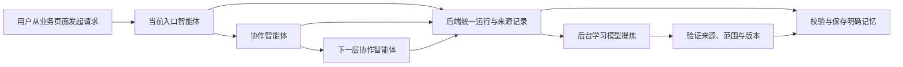

# 记忆与学习职责与运行规则

## 谁负责什么

| 组件 | 职责 | 模型 |
| --- | --- | --- |
| 主智能体、业务智能体 | 回答问题、完成业务；按授权查询记忆、提交明确记忆变更或学习请求 | 各自的业务模型 |
| 后端记忆服务 | 验证实际用户、项目、调用链及来源；合并候选、检查版本并事务保存 | 明确事实的保存和删除不调用额外模型 |
| 后端学习服务 | 收集有效材料，判断是否有可复用经验，验证后保存成果 | 在「记忆配置」明确指定的后台学习模型 |
| 对话压缩 | 为长对话整理当前上下文摘要 | 独立的对话压缩模型，未指定时使用当前对话模型 |
| 索引服务 | 建立向量索引，辅助文字检索 | 向量模型，与学习模型分开 |

“系统负责学习”指后台程序调用明确配置的模型，不是总控悄悄兼任学习助手，也没有新增一层管理智能体。本地向量模型不负责理解和提炼经验。

## 系统规则与配置位置

常规记忆范围由后端按固定职责、真实业务入口和实际调用链计算，不再人工分配每个智能体的读写抽屉或经验使用开关。公开／内部只控制平台可见性，不授予也不剥夺记忆能力。

全局「记忆配置」只保留六项：启用后台学习、后台学习模型、智能体业务交互、已确认业务事件、群聊消息、对话压缩模型。关闭新的学习不会关闭明确的记忆保存、已有记忆读取或对话压缩，也不会停止来源失效检查。

索引、常用个人资料加载、语义检索、返回数量、学习调度和压缩策略由代码中的统一规则维护，不再由普通配置页逐项开关。语义服务未就绪或超时时仍可使用文字检索；索引任务失败会重试，服务重启后继续处理。内部数量和时间限制属于运行保护，不是记忆总容量或金额预算。

启用后台学习前必须选择可用模型和至少一个来源；暂停时可保留模型与来源偏好，也可清空学习模型。对话压缩模型可以留空，含义是使用当前对话模型，不会改用学习模型或环境中的其他模型。

暂停后停止领取相应学习任务。已经发出的模型请求允许收尾，但停用期间不能提交新学习成果；任务回到等待状态，不按失败消耗重试次数，恢复后继续核验来源再处理。真正的来源撤销仍按撤销处理，恢复学习不会恢复其权限。

保存必须携带当前配置版本。其他管理员已保存时，页面保留当前草稿并展示差异，处理冲突后才能再次保存。已取消“恢复默认”，避免清空模型或重新开启原本关闭的来源。

主智能体和业务智能体均没有逐个配置记忆与学习的入口：外部能力页只保留协同智能体、技能、MCP、数据库交互，编辑窗口也不提供记忆选项。原有“跟随系统／排除交互学习／禁止长期留存”三选项已取消，配置契约不再包含 `memory_policy`。

用户可以在本次请求中明确要求“不记忆”或“不学习”。该要求沿业务运行及可验证的生成来源传递；正式业务事件和后台群聊消息还分别遵守全局来源开关、实际来源权限和消息受众限制。

协作中的记忆保存与学习共同遵守各节点的固定职责、原始来源和受众边界。结果返回上级不会扩大权限，重新调整团队上级关系也不能移除已参与节点的来源约束；协作前已即时保存的明确用户事实不追溯回滚。

三个记忆范围分别是跨项目的个人信息、个人在本项目中的私人信息、项目共享信息。下表仅是系统能力上限；最终访问还受当前用户、项目、群聊全部受众及资料权限限制。

| 当前运行场景 | 可读取范围 | 可提交写入范围 |
| --- | --- | --- |
| 首页总控、直接进入业务智能体 | 用户、用户＋项目、项目 | 三个范围；写项目仍须当前业务权限 |
| 普通受邀协作节点 | 用户＋项目、项目 | 继承入口及全部上级的职责、来源和用户本次限制；用户事实必须来自真实原始证据 |
| 任务助手及其下级 | 直接入口可读三个范围；受邀时排除用户级个人档案 | 用户、用户＋项目；草稿不能成为正式项目事实 |
| 知识库助手及其下级 | 直接入口可读三个范围；受邀时排除用户级个人档案 | 仅用户＋项目，并持续校验资料权限 |
| 项目初始化及整条协作链 | 仅项目 | 不写入，不从初始化草稿交互学习 |
| 群聊输出及其协作链 | 仅项目，且全部受众均可访问 | 仅项目，再与任务／知识库等职责限制取交集；无法满足时拒绝 |
| 首页派生的任务草稿 | 继承真实入口和本次排除要求 | 不把复制上下文当新用户陈述，不写交互记忆、不触发交互学习 |
| 管理端调试 | 按职责和来源计算，使用隔离的测试身份 | 不进入生产用户记忆或生产学习 |

## 一次业务如何经过多个智能体

入口身份来自后端保存的业务会话。受邀节点的直接上级和根会话来自真实团队成员关系，不由模型提示词决定。同一个智能体直接接待用户时是入口，被邀请时是协作节点。

各节点把结构化候选及原始来源直接提交给后端，不依靠总控逐层复述。协作候选只有在相应回复可靠保存、业务协作完成、各贡献节点权限仍有效时才能正式写入。失败、取消、来源变动或迟到请求不能继续落库。

入口对用户明确确认的事实可以立即保存；涉及协作依赖或知识资料来源的候选等待后端校验。工具返回 `pending` 只表示提交候选，不能答复“已经记住”。删除回执表示停止召回，审计历史保留。

相同来源、相同操作和内容的候选共享幂等结果。更改已有事实需要版本检查；不同表述的语义是否相同不由简单指纹保证，系统不会把有冲突的不同内容静默覆盖。

来源校验验证身份、原始记录、版本和可见范围，不等于独立证明内容的事实真伪。事实提取与经验提炼仍可能出现模型判断错误，因此保留来源、版本历史及撤回能力。

## 不同场景的边界

| 场景 | 记忆与学习规则 |
| --- | --- |
| 首页、公开业务智能体 | 当前入口承担业务上下文；被邀请节点独立提供证据，后端统一校验 |
| 知识库助手 | 直接查询外部知识库；资料相关记忆限制在个人项目范围，持续检查原资料权限；不把知识库答案原文复制为学习材料 |
| 任务编辑器、群内私有任务草稿 | 模型运行前保存真实用户／项目／会话绑定；生成草稿不等于正式任务发布或执行成功 |
| 项目初始化 | 仅初始化页面使用；不从草稿交互自动写入正式长期事实，确认后的业务事件由系统来源处理 |
| 群聊智能体交互 | 依据群内全部输出受众的共同权限，不直接写私人抽屉。学习只走后台群聊来源；关闭群聊学习不会改走普通交互学习。依赖知识库资料且只能写个人项目范围的交互候选会被拒绝，不转换成共享记忆 |
| 后台群聊学习 | 全体群可以产生项目共享成果；子群成果只分配到有权成员的个人项目范围，个人偏好只归发言者本人。不会因为某个发起者有权就把子群成果扩散到全项目 |
| 正式业务事件 | 初始化确认、计划发布、验收等由业务事务产生；发布只证明发布，验收才证明通过 |
| 管理端调试 | 独立测试身份与记忆范围，不借用生产用户身份，不进入生产学习 |

用户排除本次记忆或学习时，限制沿同一运行传递；正式业务来源必须保留可验证的生成与确认关系，不能靠“最近一次会话”猜测归属。

“不要学习，记住我的偏好”仍允许保存明确偏好，但不会把本次交互送入后台学习。“本次不要记忆”同时停止本次记忆使用、写入和学习。

从首页派生的任务草稿会沿用首页的真实来源限制。复制上下文用于生成任务，不作为新用户陈述写入交互记忆或触发交互学习；正式确认事件另行验证生成来源。原请求禁止记忆时，派生草稿也不读取记忆。依赖知识库资料的任务来源不进入项目共享业务学习。

用户立即确认任务时，如果相关模型运行尚未归集完成，业务学习等待后重查；正常发布和确认不需要等待学习服务。

## 学习成果何时生效

后台以一次有效业务阶段归集原始用户消息、真实工具结果或确认事件。邀请成功、消息发送成功、草稿生成，以及助手自称“任务完成”，均不证明业务已完成。

学习模型可以判断没有值得保留的内容。系统在调用模型前和保存成果前检查来源与范围；读取既有成果时也重新检查有效来源。资料撤权、群受众变化或业务来源撤回后，相关内容不能通过旧记忆继续泄露。

后台用于去重或冲突判断的已有记忆也需要即时复核，不能只等待定期失效扫描。模型返回后再次核对真正进入提示词的记录版本和权限；发生变化时取消该次成果保存。已有成果不作为新事实证据，新成果必须由本次有效来源独立支持。

全局暂停新学习不会自动抹掉用户或项目已经拥有的有效经验。排队任务执行前重新校验贡献节点及其真实上级的职责、来源和用户本次限制；已有成果继续按原来源及保存范围核验。普通用户明确保存的事实也不会因为删除原聊天而丢失。

## 开发数据清理与历史审计

前两阶段已经完成旧层级、人工读写范围及旧学习开关的转换，相关审计和验证记录保留。旧转换脚本和阶段性配置不再作为当前操作依据。

最新配置契约进一步删除逐智能体三选项及 `memory_policy` 字段，不把这些控制移入编辑窗口。已有开发数据的对应键由 `scripts/remove_agent_memory_policy.py` 显式清理：默认只预览，应用时仅删除该键，不修改全局学习设置、运行授权快照或已保存记忆。

2026-09-10 已对当前 11 个智能体执行清理并重启服务。实际管理接口确认全部配置不含人工记忆字段，全局学习模型和来源设置保留。结果记录为 `artifacts/agent-memory-policy-removal-result.json`、`artifacts/agent-memory-policy-removal-verification.json` 和 `artifacts/agent-memory-policy-removal-api-verification.json`。

本轮验证覆盖 155 个记忆与调用场景、18 个配置清理及初始化用例、26 个前端用例，相关回归及管理端构建通过；包含“不需要记忆／学习”在多级调用中的传递。浏览器工具连接异常，本轮未完成页面目视复核。

内部专家在初始化链中仍只读项目记忆；在其他获准业务场景中按该次职责、入口和来源规则工作。

后台学习已明确配置 DeepSeek V4 Flash。此次选择借用了现有已验证的模型配置，此后保存为独立配置，不随总控模型变化。两条原有记忆历史记录及其状态未改变（它们在 9 月 8 日已被删除）；没有缺乏来源而需要停用的旧学习成果。

## 记忆配置精简验收（2026-09-10）

已将全局配置从 60 字段收敛为 6 项产品选择，页面从 37 个控件缩减为 4 个开关和 2 个模型选择器。移除旧字段及重置接口，不保留旧字段别名；技术策略由内部运行代码维护。

实际配置版本由 3 升至 4，DeepSeek V4 Flash 学习模型、DeepSeek V4 Pro 压缩模型及现有开关均保留。转换前后 31 张记忆相关表的记录数与校验摘要一致。平台后端及 AgentScope 已重启，真实管理接口通过六字段、旧字段拒绝、版本必填和重置移除验证。

契约专测 40 项、显式转换专测 10 项、存储既有回归 99 项、暂停及学习组合 77 项、前端测试 39 项均通过，生产构建通过。主体运行回归 168 项通过后，唯一旧空队列断言已修正并纳入上述 77 项通过组合。索引重启、文本回退及并发压缩模型隔离 3 项验证通过。

浏览器控制工具连接失败，已通过实际 Vite 响应确认当前服务提供新界面代码；未完成页面截图和键盘目视验收。

## 第一阶段验证记录（历史）

以下结果记录该阶段的实现和数据状态，不代表最新逐智能体配置清理的执行状态。

- 真实管理端核对了模型选择、来源开关、三个记忆范围、两个智能体学习选项，以及调试权限不能切换。
- 真实管理端调试完成记忆新增及删除；测试记忆已停止召回。
- 使用真实后台学习配置，独立调用 DeepSeek V4 Flash 处理合成材料并返回预期 JSON；该连通测试未创建学习任务或记忆。
- 通过业务平台 HTTP 入口创建临时测试账号与项目，调用真实模型完成个人项目记忆保存和删除，确认使用真实业务身份，且“本次不要学习”未生成学习事件。临时业务账号、项目和会话已清理。
- 新的多级运行、幂等、事务回滚、取消、来源撤销与受众测试使用随机隔离 PostgreSQL schema。

最终验证汇总（2026-09-10）：

| 验证 | 结果 | 记录 |
| --- | --- | --- |
| 主体组合回归 | 311 项覆盖；首轮 310 项通过，旧知识库范围断言修正后所在文件 5 项全部通过 | `artifacts/memory-unified-final-tests.log` |
| 最终运行及来源组合 | 冻结文件后使用同一项目入口复验，68 项全部通过 | `artifacts/memory-final-source-runtime-recheck.log` |
| 业务来源、任务、群聊、项目聊天及事务 | 90 项全部通过 | `artifacts/memory-business-source-validation.md` |
| 前端构建 | 管理端、业务平台均通过 | `artifacts/memory-final-admin-build.log`、`artifacts/memory-unified-business-build.log` |
| 真实业务入口 | 最新服务保存、撤回及本次不学习全部通过；临时业务数据已清理 | `artifacts/memory-live-verification.json` |
| 独立学习模型 | 合成输入调用成功，无记忆或学习任务写入 | `artifacts/learning-model-connection.json` |
| 数据及配置 | 11 个智能体无旧层级／旧学习字段；独立模型及知识库写入范围正确，数据库版本 `fd73b916a204` | `artifacts/memory-configuration-final-verification.json` |
| 后端正常启动配置 | 不依赖额外加载环境变量，可读取真实运行及排除标记 | `artifacts/memory-backend-connection.json` |

主体测试可以用项目内嵌 Python 运行 `scripts/verify_unified_memory.py`；它为记忆集成测试使用随机隔离 schema，不清理应用表。

验收过程没有发布真实任务、发送群消息或修改工程资料。

## 第二阶段验证记录（历史）

业务入口实测使用临时账号和项目，真实模型完成用户＋项目记忆保存及撤回，“本次不要学习”没有产生学习事件；临时业务数据已清理。11 个智能体配置完成显式转换，原 7 条已删除的历史记录不变，新增的第 8 条为本次已撤回测试记录。

管理端反向代理接口已用正常管理登录验证：返回新规则、无旧人工权限字段，原独立学习模型保留；平台服务凭证仍不能读取管理配置。管理端编译构建通过。浏览器连接工具两次无法连接，本轮未完成页面目视复核，不以接口验证替代视觉验收。

| 验证 | 结果 | 记录 |
| --- | --- | --- |
| 第二阶段最终完整回归 | 冻结实现和测试后，493 项全部通过 | `artifacts/memory-system-policy-final-recheck.log` |
| 自动职责、多级与跨分支隐私、群聊边界 | 83 项通过 | `artifacts/memory-system-policy-collaboration-tests.log` |
| 后台已有记忆即时来源复核 | 9 项通过 | `artifacts/learning-context-authorization-tests.log` |
| 配置转换 | 11 个智能体转换成功；原运行授权快照与全局设置保留 | `artifacts/unified-memory-policy-migration-result.json` |
| 转换后数据复核 | 通过 | `artifacts/unified-memory-policy-final-verification.json` |
| 管理端实际接口 | 通过，服务／管理认证边界有效 | `artifacts/memory-policy-api-verification.json` |
| 真实业务保存、撤回与不学习 | 通过，临时业务数据已清理 | `artifacts/memory-live-verification.json` |

首轮完整回归的 7 项失败来自旧的协作测试数据和非法“总控受邀”预期：测试改用真实会话身份及团队成员关系，工具加载也复用固定入口检查，总控与初始化受邀时返回 403。另一个旧测试会因本地环境启用知识库而连接外部服务，已隔离其客户端调用。最终完整回归不依赖这些外部连接，全部通过；保留的 27 条提示来自现有依赖及接口弃用警告。
