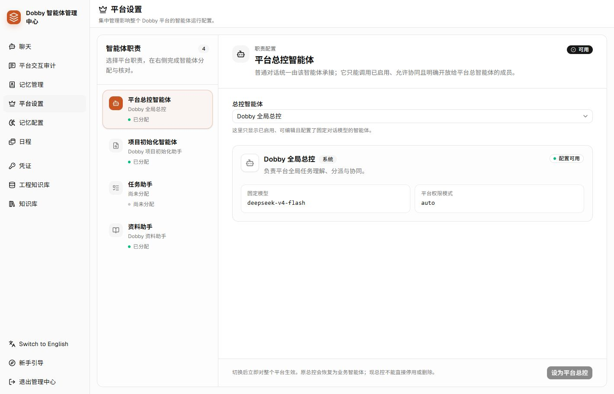
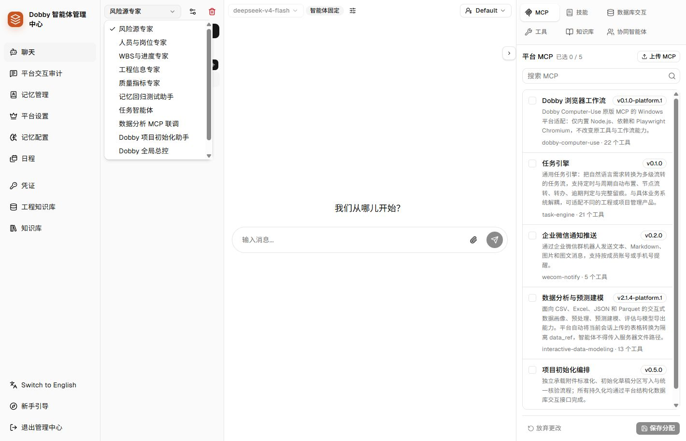

# 智能体管理端入口与职责调整讨论稿

> 2026-09-09 协作规则：以[智能体分工与协作规则](../操作说明/智能体分工与协作规则.md)为准。“允许总控调用”控制总控自动名单；“允许其他智能体邀请”控制其他智能体的候选列表，后者实际调用还需配置明确名单。两项独立权限及协作说明统一放在“编辑智能体 → 协作设置”，不得删除或合并。

> 2026-09-09 命名修订：原“业务工具”统一称为“业务智能体”。它与“平台主智能体”保持两个独立菜单；技能、MCP、数据库交互、系统工具属于智能体使用的能力。下文历史讨论中的“业务工具”指业务智能体。

日期：2026-09-08（2026-09-09 补充固定职责编辑规则）。状态：第 1 版方向的配置与调试改版已在本地真实管理端实施。本文第 1–8 节保留讨论与首轮落地记录，第 9 节为用户复核后的最新方案，覆盖前文关于职责绑定和能力弹窗的约定。原始 14 张图中的新增运行记录功能，按用户最终要求取消实施。

## 1. 文档依据与保留情况

- `README.md` 的「AgentScope 平台接入」区分智能体管理端和工程业务使用端，并定义总控、专项智能体、发布和调用授权的边界。
- `原型/工程管理智能体架构方案.md` 保留「Dobby 统一入口、业务主智能体、专项子智能体、确定性系统服务」的分层构想。其中五个业务主智能体和十九个子智能体属于设计建议，不代表当前部署数量。
- `docs/操作说明/智能体管理中心全局操作说明.html` 保留平台职责、业务智能体、内部协同成员的说明，但仍以聊天工作台为配置入口。
- `docs/知识库问答接入平台知识库助手.md` 记录现有四个固定平台职责中的知识库助手接入。
- README 引用的 `docs/Dobby总控与智能体协同架构设计.md`、`docs/Dobby总控与智能体协同验收记录.md` 在当前工作区不存在；本轮针对这两个路径查询本地 Git 历史也未找到结果。不能据此断言其他分支或备份没有保留。
- 本轮未找到把「平台主智能体作为首页、业务工具作为第二入口」完整定稿的现存文件，应以本次讨论重新明确。

## 2. 真实页面审查

### 步骤 1：进入平台设置，查看职责与配置

状态：职责已经分开，配置路径不完整。

- 优点：四个职责和实际分配对象可以同时看到；当前总控、初始化助手、知识库助手已分配，任务助手未分配。
- 问题：菜单名「平台设置」不能直接表达平台主智能体的入口；页面能选择对象，却没有就地编辑模型、能力和调试的完整路径。
- 信任问题：加载期间先渲染「尚未分配」，请求完成后才替换；请求失败在源码中被忽略，也可能被误读为未配置。应分别呈现加载、读取失败、未分配和已分配。
- 能力问题：职责绑定与业务可用性需要分别说明。资料查询已开启不等于实时项目数据库查询也已分配，更不等于已完成真实模型连通验证。

### 步骤 2：进入聊天，展开智能体选择

状态：配置和试聊可用，智能体组织方式混杂。

- 问题：专项专家、测试智能体、总控和初始化助手混在同一个下拉列表，名称不能可靠表达用途、所属职责和发布状态。
- 问题：聊天区占据主体，管理员却要在这里创建智能体、配置模型、分配工具；跨页来回操作容易漏掉职责绑定或能力分配。
- 可访问性风险：编辑和删除按钮仅有图标，当前可访问树中没有名称，源码也没有常规情况下的可访问标签。后续应补文字或明确标签、键盘焦点。
- 现有侧栏已带菜单文字，应保留。字体下限继续为 12px，正文优先 14px。

范围限制：本次审查覆盖桌面真实职责页与聊天入口、加载状态、源码关系；没有执行配置写入、业务任务、真实模型问答或完整键盘/屏幕阅读器测试，不宣称全面可访问性合规。

## 3. 建议的信息结构

| 顺序 | 菜单 | 范围 |
| --- | --- | --- |
| 1 | 平台主智能体 | 默认首页；Dobby 总控、项目初始化、任务助手、知识库助手的职责、配置和调试 |
| 2 | 业务工具 | 可独立使用或被主智能体调用的专项智能体；按业务能力浏览和管理 |
| 3 | 记忆与学习 | 记忆查看、来源、自动学习记录；记忆维护保留仅删除的已确认约定 |
| 基础配置分组 | 平台交互审计 | 保留已有审计功能；不新增本次图纸中的运行记录页 |
| — | 日程（已移除导航入口） | 管理中心聚焦智能体配置与调试；保留已有日程数据和后台定时能力 |
| 基础配置分组 | 模型与连接、外部知识库、系统配置 | 全局模型凭证、WeKnora 连接与项目绑定、学习全局策略等；按职责页面提供就近跳转 |

「业务工具」指专项智能体，不把底层 MCP 和数据库交互另列成同级业务入口。底层能力仍能在智能体详情中配置。

按后续讨论，隐藏当前未采用的 AgentScope 原生知识库导航、聊天知识库面板与默认挂载配置，停止为这些隐藏界面自动加载原生知识库列表；保留底层数据与能力，不删除历史对象。保留现有「工程知识库」承载的 WeKnora 连接、项目绑定、目录同步与资料授权，作为「外部知识库」配置入口，与原生知识库明确区分。

外部知识库仅由固定的知识库助手直接查询，不再作为普通智能体的可选权限。总控及其他智能体可在协作授权范围内调用知识库助手；查询前后继续校验当前用户、项目及资料范围。四个主智能体始终启用，不能停用、删除或清空职责。

平台主智能体是产品职责分类，不等于代码中的 management 层级。导航重组不得自动提升层级、记忆权限或工具权限，也不能按名字猜测归属。

## 4. 平台主智能体首页

沿用当前职责列表与右侧详情的结构，默认选中 Dobby 总控。四个职责通过简介说明责任，不在概况中重复显示业务入口或“知识库已授权”等权限状态。下表的业务入口仅用于说明架构对应关系，不作为页面字段。

| 职责 | 业务入口 | 负责什么 |
| --- | --- | --- |
| Dobby 总控 | 普通 Dobby 对话 | 理解需求、组织授权协同、汇总答复 |
| 项目初始化 | 工程配置中的初始化流程 | 编排专项解析、草稿汇总和核验，正式应用由平台流程负责 |
| 任务助手 | 首页与群聊的任务助手入口 | 任务需求分析和草稿生成，正式发布仍经过现有确认流程 |
| 知识库助手 | 工程资料中的项目资料问答 | 查阅授权资料，按已分配能力结合实时项目信息回答 |

每个职责的日常操作以「编辑智能体」「调试」为主，不再把「分配智能体」作为主要操作。「直接编辑」指在当前职责下直接编辑实际智能体，不再跳转聊天页面寻找对象；不是把所有表单常驻在详情页。主页面只放概况与能力摘要，编辑和能力配置分别使用独立弹窗，调试使用可放大的独立工作区。两类页面复用同一套编辑器，避免出现两份配置。

平台主智能体固定为上述四个职责，页面不提供「新增主智能体」或「删除职责」。尚未配置的固定职责显示「完成配置」，在本职责内建立或接入实际对象，不增加新的职责项。已有对象的替换仅作为次级维护能力，不进入日常流程。普通编辑保留原对象与配置，不重建已有智能体。MCP 等能力的分配操作仍保留，这与替换承担职责的智能体是两件事。

状态分开表达：

- 分配状态：未分配、已分配、修改未保存。
- 能力状态：模型已配置、资料查询已开启、项目查询未分配、任务引擎缺失等具体事实。
- 运行状态：未检测、检查通过、连接异常及最近检测时间；不能仅凭配置存在显示运行正常。
- 请求状态：加载中、读取失败与重试，不能显示成未分配；不因进入页面自动调用模型做昂贵健康检查。

## 5. 业务工具页面

「平台主智能体」和「业务工具」是侧栏中两个独立菜单、两个独立页面，不能合并成一个菜单、页面内切换标签或对象类型筛选器。前者第一位且为默认首页，后者第二位。

业务工具沿用主智能体的「全局侧栏—对象列表—对象详情」布局，不另做卡片广场。列表支持搜索、筛选和「新增业务工具」；详情、编辑弹窗、能力配置弹窗、调试方式与主智能体保持一致。新增复用编辑器的空白状态，创建完成后继续配置能力；不混入固定平台职责。思考、工作记录和调试历史保留。

已绑定平台职责的智能体在「平台主智能体」中管理，避免在业务列表重复当成普通工具。专项智能体按已发布、内部协作、未发布等状态筛选；测试对象应有明确标记，不按名称关键字自动认定或删除。专业子智能体允许被多个职责复用，发布状态与调用白名单继续独立控制。

用户在工程业务端使用「业务工具」，管理员在管理端管理「业务工具」，概念保持一致，动作和权限仍有区别。管理端调试历史与真实平台用户会话保持隔离；真实业务验证必须经真实业务页面和授权身份进行，独立模拟页面只能作为补充证据。

## 6. 建议的推进顺序

1. 先确认两个核心入口、四个职责及各自的编辑和调试范围。
2. 再设计主智能体首页与业务工具列表，使用当前真实对象说明状态，不创建新的测试页冒充产品。
3. 实施默认路由、导航和内容分流；保留旧链接跳转、已有对象 ID、模型配置、权限和会话。
4. 补齐职责内创建/绑定/编辑路径和明确的加载、失败、缺配置状态；更新操作手册与相关旧文档。
5. 在真实管理页面验证入口、职责、工具归属和配置保持；独立测试补充失败、空列表和跨职责冲突分支。

本轮没有执行上轮尚待明确授权的知识库助手数据库工具分配，也没有自动绑定任务助手。

## 7. 本轮确认的弹窗与功能覆盖

本轮用户要求整套页面图，包含进入、编辑、配置与调试，不只生成首页外观。最终实施范围聚焦配置能力与调试，取消新增运行记录页。适合弹窗的动作继续用弹窗，编辑器内部切换分组内容，不再靠滚动跳到一张超长表单。能力目录复用现有组件；资源详情、编辑和删除确认继续使用已有弹窗，关闭后返回能力目录并保留分配草稿。此处没有实施早期设想的弹窗内详情子视图。

| 现有能力 | 改版入口 | 保留与简化约定 |
| --- | --- | --- |
| 名称、系统提示词、用途描述 | 编辑智能体 → 基本信息 | 直接编辑当前对象；固定职责只读展示 |
| 模型策略、凭证、模型与专用参数 | 编辑智能体 → 模型与运行 | 常用字段直接显示，专用参数可折叠；固定模型限制保留 |
| 上下文比例、工具结果长度、压缩提示词和摘要模板 | 编辑智能体 → 模型与运行 → 上下文管理 | 保留所有字段，低频文本模板折叠 |
| ReAct 迭代、收尾、拒绝处理及中断参数 | 编辑智能体 → 模型与运行 → 运行策略 | 沿用现有值，不因隐藏字段而写回默认值 |
| 启用、发布/内部使用、分类、排序 | 编辑智能体 → 平台接入 | 按实际对象条件展示；固定职责不重复填写业务发布信息 |
| management/worker、权限模式 | 编辑智能体 → 平台接入 | 固定主智能体不展示角色或层级选择，保留既有底层值；业务工具仍可配置运行层级；权限模式可按需调整 |
| 允许总控调用、允许其他智能体邀请、协作说明 | 编辑智能体 → 协作设置 | 两个被调用权限分别控制总控名单和其他调用方的候选列表；与向外调用的明确名单分开配置 |
| 三个抽屉的读取与写入权限、学习采集/提炼/使用 | 编辑智能体 → 记忆与学习 | 用三行两列权限表呈现；自动学习不增加人工审核步骤；执行级限制保留 |
| 外部项目资料查询 | 编辑智能体 → 平台接入 | 保留项目知识库能力授权；连接和项目绑定仍在外部知识库菜单 |
| MCP 上传、按包分配、包详情和工具参数/展示信息、删除包 | 能力配置弹窗 → MCP | 当前源码按 MCP 包分配；不能把单工具勾选、手动连接编辑等未实现能力画成现有能力 |
| 技能创建、编辑、详情、版本/下载、删除、分配 | 能力配置弹窗 → 技能 | 常用分配在列表；资源管理放详情与更多操作；仍保留版本功能 |
| 数据库交互分配、定义详情/编辑/删除、创建、策略与表约束 | 能力配置弹窗 → 数据库交互 | 权限粒度保留；管理定义与授予智能体分开；不默认勾选未授权项 |
| 内置工具列表、说明、参数与展示信息 | 能力配置弹窗 → 工具 | 现有 ToolPanel 是查看当前工具能力，不能伪造任意内置工具新增/授权开关 |
| 调用范围与指定智能体白名单 | 能力配置弹窗 → 协同智能体 | 保留全部/指定/禁止调用的现有选项，候选对象须符合被邀请条件；统一编辑同一份 call_config |
| 原生 AgentScope 知识库面板及默认挂载字段 | 隐藏 | 不移除实际使用的外部知识库集成、历史对象或资料权限 |
| 调试、会话历史、思考与工作过程、结果 | 独立调试工作区 | 复用现有消息组件与会话接口，支持新建、改名、删除、最大化；不新增运行记录标签或管理页面 |
| 已有平台交互审计 | 基础配置 → 平台交互审计 | 仅保留原入口与功能，不扩展本次范围 |

提交规则：修改先保留在本弹窗草稿，明确保存后写入；切换分组不丢草稿。关闭有修改的弹窗时询问是否放弃，删除资源时使用简短确认弹窗。资源新增/删除不是当前智能体授权的同义词。读取失败保留重试，不显示成未配置；尚未配置不显示成连接故障。

设计图是交互示意，不是系统已授予权限或运行通过的证据。[完整图集](./智能体管理端整套界面-v1/index.html)与[逐图交互说明](./智能体管理端整套界面-v1/README.md)已保存。

## 8. 实施结果与验证边界

基线 `c726928a` 先提交并推送至 `zhiyuelinghang/eng-pm-agent` 的 `main`，随后进行此次改版。没有数据库结构改动或自动升级代码。

- 两个菜单分别对应 `/platform-agents` 与 `/business-tools`；首页进入平台主智能体。四个职责由实际绑定 ID 定位，不按名称、层级或发布状态猜测。旧平台设置地址跳转新入口，已有具体聊天地址继续有效。
- 编辑器复用原配置载荷，分为基本信息、模型与运行、平台接入、记忆与学习；保留隐藏字段。调用他人的范围统一在能力配置的协同智能体分类中编辑。
- 五类能力保留既有资源管理与权限接口；外部知识库入口保留，原生知识库导航、聊天面板及默认挂载编辑入口隐藏，不清除存量配置。
- 职责绑定与初始化核验 MCP 版本管理收在次级入口。初始化原绑定仍在，任务助手仍是未配置，未自动替换任何职责、提升权限或分配知识库助手数据库工具。
- 读取失败显示重试，不误显示为未配置。修复 MCP/技能目录尚未返回时清空分配草稿的问题；不在可用目录的已保存 MCP 分配保留并提示核对。
- 配置分组切换保留草稿，能力类别切换与关闭弹窗有未保存保护。保存期间避免关闭；保存失败保留错误与草稿。
- 在真实本地管理端创建一个未发布临时工具，验证编辑保存、MCP 分配、调试回复“连接正常”、会话历史和改名后删除该工具。业务工具数量回到验收前的 8 个，未使用独立 fixture 页面代替验收。
- 构建通过；4 项前端职责分类/状态测试与 61 项后端接入、权限、MCP 校验测试通过。`test-all.bat --keep-going` 因已有数据分析依赖缓存缺失在预检停止；结构检查报告两处未修改文件的行数超限。未宣称全项目测试全部通过。

桌面真实页面截图、设计差异、交互验证与限制见 [验收报告](../../design-qa.md)。

## 9. 用户复核后的修订：直接配置、页面 Tab、单层详情

用户指出主智能体职责已经固定，不需要“职责绑定”；能力应使用上方 Tab、下方列表，点击按钮打开详情，避免能力弹窗再套详情弹窗。本节取代第 7–8 节对应约定。

- 已配置主智能体直接编辑原对象，不显示选择、替换对象的入口。未配置的固定助手打开自身配置表单，填模型和工作指令，保存时由系统完成内部关联，不新增职责种类。已有 ID 与职责数据继续保留，不迁移数据库。
- 四类主智能体的首次配置和编辑均不展示「平台角色」「智能体层级」，也不显示前往平台设置切换角色的提示。编辑器统一按实际配置 ID 识别职责，旧聊天入口同样适用。底层角色与层级保持既有值，不能因界面简化而提升权限；业务工具的相关配置继续保留。
- 主智能体编辑中的「平台接入」调整为「高级设置」，不再填写发布、业务分类和显示顺序。所有主智能体均不展示启停开关；总控不展示允许自己调用自己的开关。「允许总控调用」「允许其他智能体邀请」及协作说明放在「编辑智能体 → 协作设置」，与主页面「协同智能体」中的向外调用名单分开保存。业务智能体同样使用该独立协作配置区。既有开关值不因入口调整而重置。
- 平台主智能体与业务工具共用页面内六个 Tab：MCP、技能、数据库交互、工具、协同智能体、记忆与学习。原有目录、上传、版本、查询策略、分配和保存功能保留。
- 资源列表提供明确的“查看详情”按钮，点击只打开资源详情这一层弹窗。MCP、技能和数据库详情最大宽度增至 1240 px，左侧目录加宽且名称可以换行；内置工具详情增至 1040 px。
- 初始化规则版本单独放到“项目初始化 → 初始化核验”，只管理核验包和版本，不显示智能体选择器，保存版本也不改写初始化智能体 ID。
- Tab 切换和菜单/对象切换均保护未保存草稿；浏览器离开提醒保留。固定助手首次配置的中断重试复用同一对象，发现该职责已被其他操作配置时阻止覆盖。
- 本轮在真实管理页验证 Tab、MCP 单层详情、目录名称、跨菜单草稿保护、初始化核验、固定助手直接配置表单；未保存原有权限或更换主智能体。新增 5 项固定配置失败与重试测试，连同原 4 项测试均通过，前端构建通过。
