# 智能体管理端整套界面设计

日期：2026-09-08。基于已选择的第 1 版「职责导航工作台」，本套共 14 张设计图。状态：设计评审，未实施。

[打开图集](./index.html) · [功能覆盖与源码核对](../智能体管理端入口与职责调整讨论稿.md#7-本轮确认的弹窗与功能覆盖)

## 已确认的方向

- 平台主智能体、业务工具是两个独立侧栏菜单与页面。前者排第一并作为首页，后者排第二。
- 两边共用列表、详情和编辑器布局。主智能体固定四个职责，不提供主动新增职责；业务工具可新增。
- 主页面看概况；编辑、能力配置用弹窗，调试用独立大工作区。直接编辑指就地编辑当前对象，不是把所有表单挤在主页面。
- 模型参数、上下文和 ReAct 等低频配置折叠；已有值与功能保留。弹窗分组切换内容，不再形成超长整页表单。
- MCP、技能、数据库交互、工具、协同智能体全部保留；仅隐藏未使用的原生知识库界面，外部知识库能力与权限继续保留。

## 图纸索引

| 图号 | 界面 | 形式 |
| --- | --- | --- |
| 01 | [平台主智能体](./01-平台主智能体.png) | 页面 |
| 02 | [业务工具](./02-业务工具.png) | 页面 |
| 03 | [编辑智能体—基本信息](./03-编辑智能体-基本信息.png) | 弹窗 |
| 04 | [编辑智能体—模型与运行](./04-编辑智能体-模型与运行.png) | 弹窗 |
| 05 | [编辑智能体—平台接入](./05-编辑智能体-平台接入.png) | 弹窗 |
| 06 | [编辑智能体—记忆与学习](./06-编辑智能体-记忆与学习.png) | 弹窗 |
| 07 | [能力配置—MCP](./07-能力配置-MCP.png) | 弹窗 |
| 08 | [能力配置—技能](./08-能力配置-技能.png) | 弹窗 |
| 09 | [能力配置—数据库交互](./09-能力配置-数据库交互.png) | 弹窗 |
| 10 | [能力配置—工具](./10-能力配置-工具.png) | 弹窗 |
| 11 | [能力配置—协同智能体](./11-能力配置-协同智能体.png) | 弹窗 |
| 12 | [新增业务工具](./12-新增业务工具.png) | 弹窗 |
| 13 | [智能体调试](./13-智能体调试.png) | 独立工作区 |
| 14 | [运行记录](./14-运行记录.png) | 详情标签 |

## 按步骤查看

### 01 平台主智能体

默认首页。四个固定职责，无新增职责按钮。编辑当前职责对应的实际智能体。

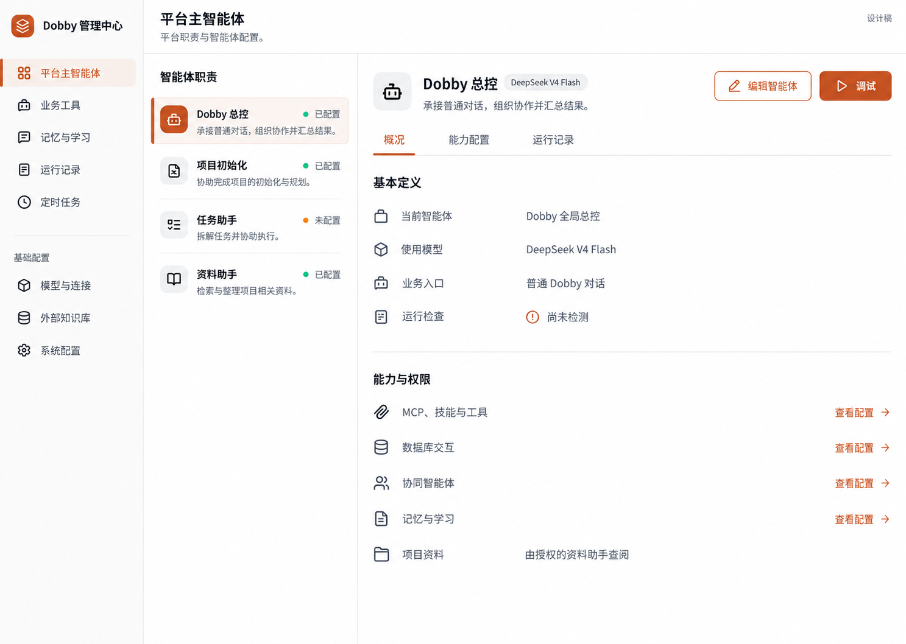

### 02 业务工具

独立菜单、独立页面，复用主智能体的列表与详情布局，增加搜索、筛选和新增业务工具。

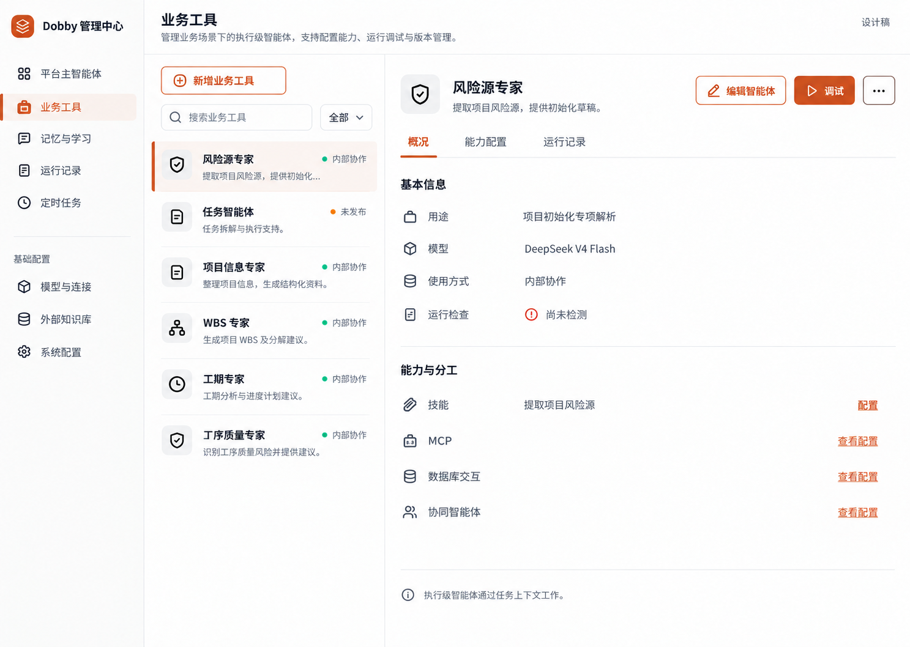

### 03 编辑智能体—基本信息

在本职责内直接编辑名称、用途和提示词。分组切换内容；不把整份配置拼成长表单。

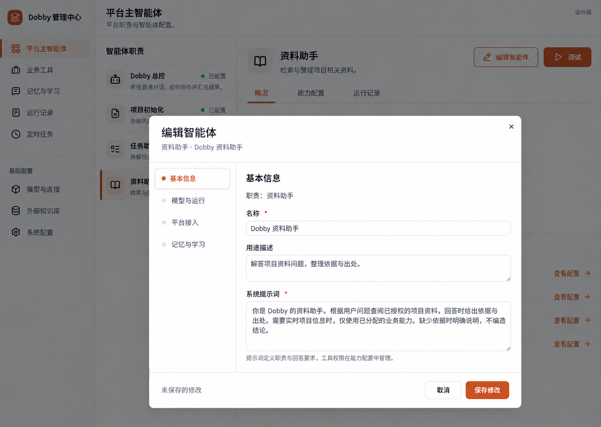

### 04 编辑智能体—模型与运行

常用模型选择直接显示；模型参数、上下文模板和 ReAct 细节折叠。折叠或隐藏字段必须保留已有值。

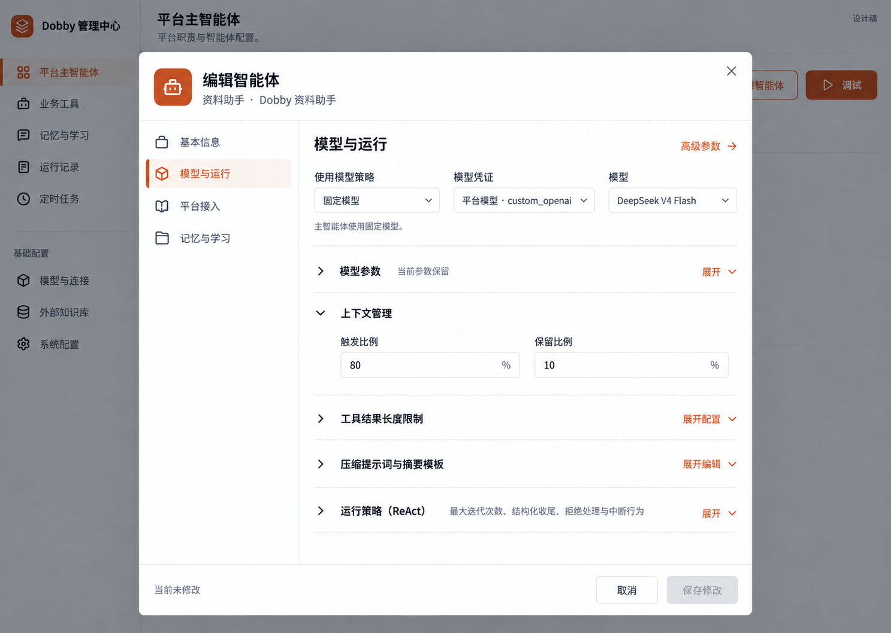

### 05 编辑智能体—平台接入

启用、对外使用方式、总控调用、邀请说明和外部资料查询权限；层级、权限模式、分类与排序按需展开。业务对象显示发布设置；固定职责按职责约束展示。

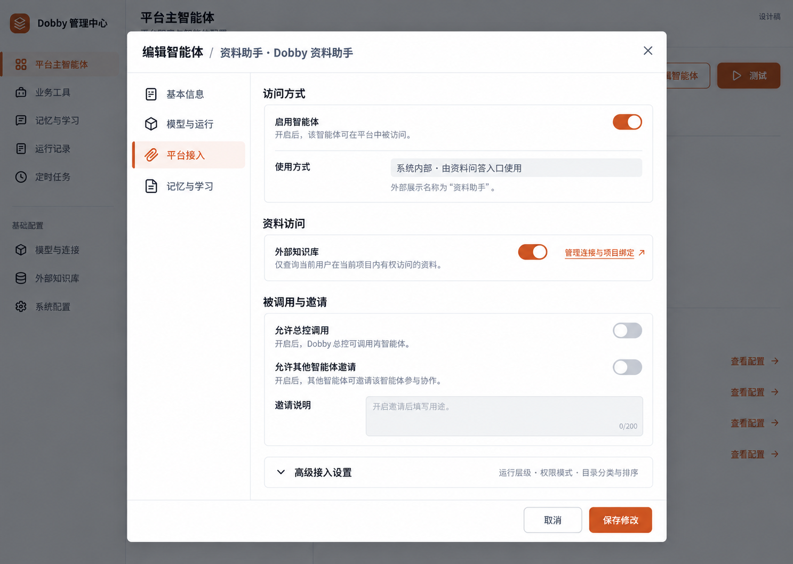

### 06 编辑智能体—记忆与学习

三个抽屉独立读写权限，自动学习的记录、提炼和使用开关。管理员配置能力，成果自动处理，不新增人工审核。

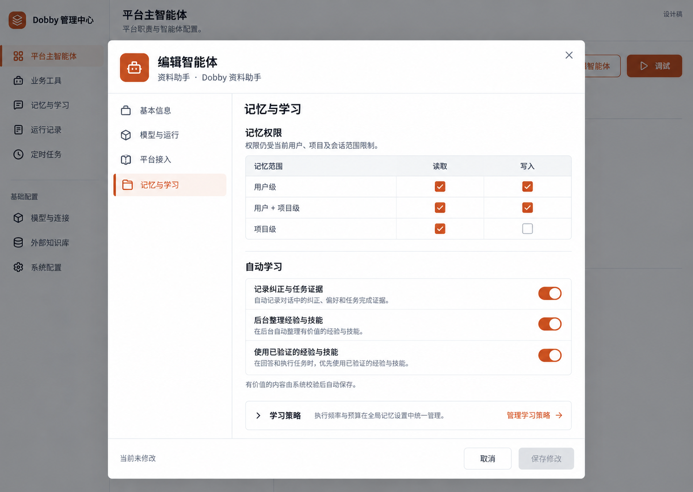

### 07 能力配置—MCP

按 MCP 包分配；保留上传、包详情、包内工具参数与展示信息、删除入口。图中按包授权，不设计单工具勾选权限。

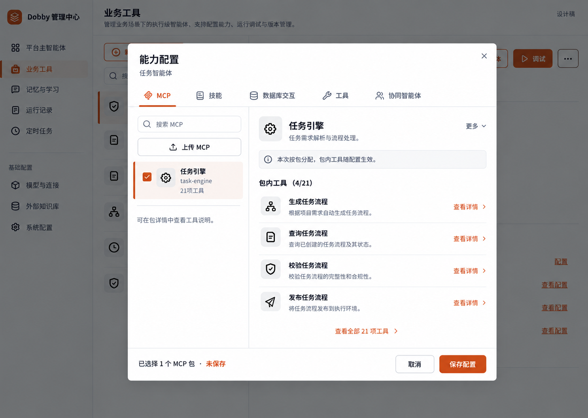

### 08 能力配置—技能

技能分配、创建、编辑、内容预览、历史版本、下载和删除均保留。打开详情或编辑时复用当前弹窗子视图，返回不丢分配草稿。

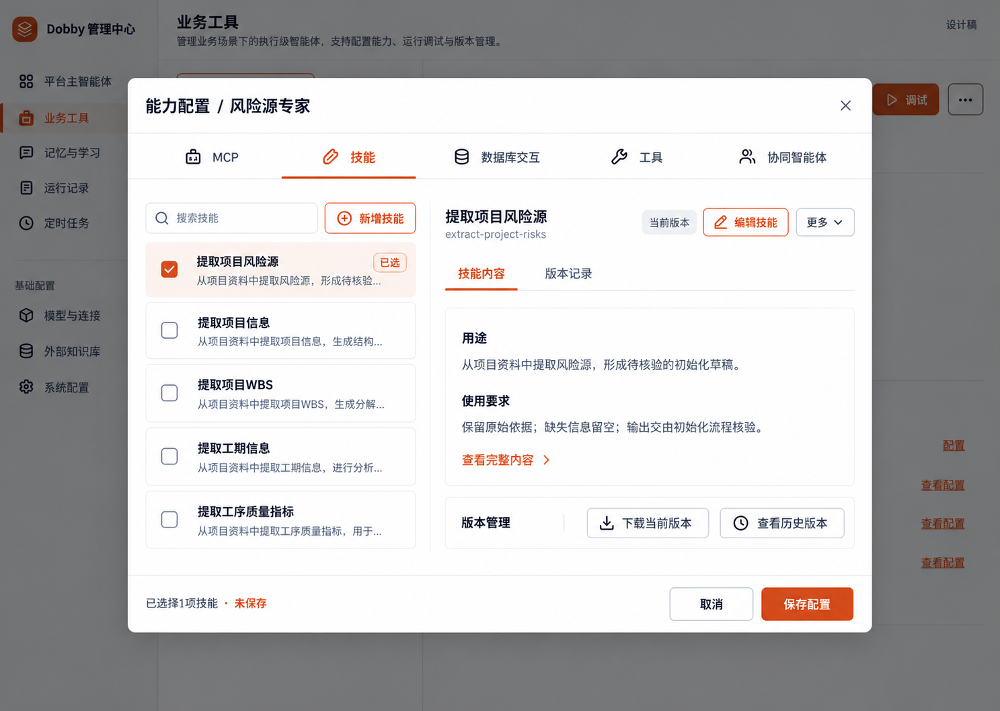

### 09 能力配置—数据库交互

交互定义与智能体分配分开。保留新增交互、策略管理、定义编辑、字段/查询约束及删除；图中资料助手仍未分配数据库权限。

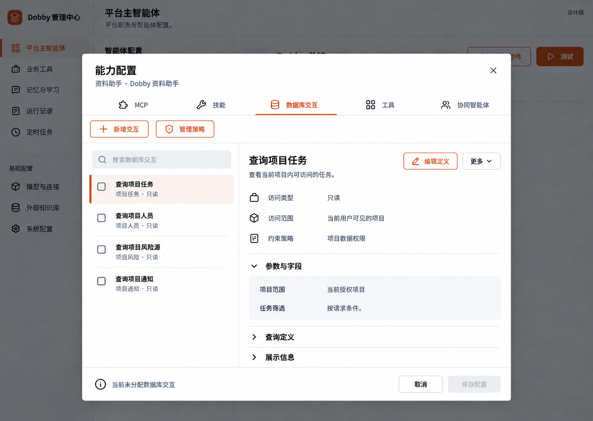

### 10 能力配置—工具

查看现有工具说明、参数与展示信息。当前面板只供查看，不意味着工具本身只能读取数据；实现文案应写“此面板仅供查看”。

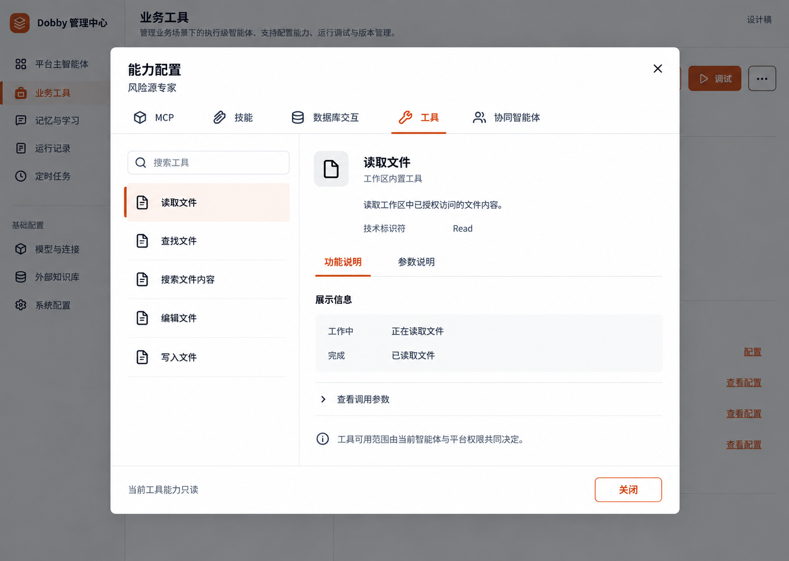

### 11 能力配置—协同智能体

编辑该智能体主动调用他人的范围与白名单；与“允许别人邀请我”分别保存独立字段，统一入口避免重复配置。

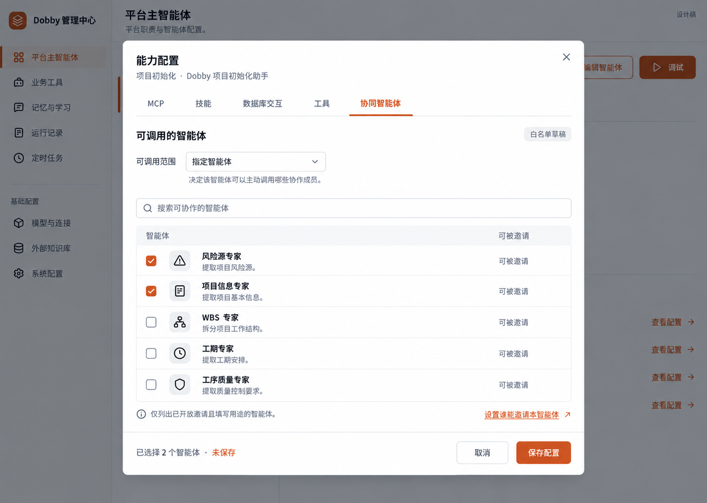

### 12 新增业务工具

仅业务工具页面可打开。复用编辑器的空白状态，必填项未完成时不能创建；新建后继续配置能力。

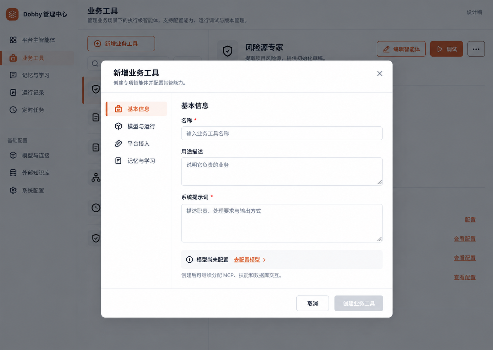

### 13 智能体调试

大弹窗可最大化，独立会话列表，保留附件、思考折叠项、工作记录、结果和输入框。按需打开管理端技术详情，不把整个编辑表单挤在旁边。

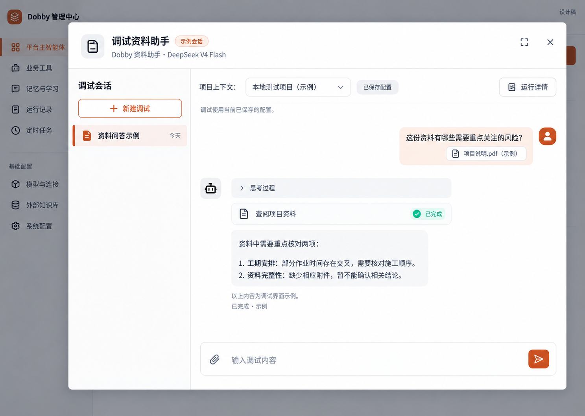

### 14 运行记录

区分管理端调试与业务会话，支持来源、状态与日期筛选、运行详情和失败信息；数据是设计示例。

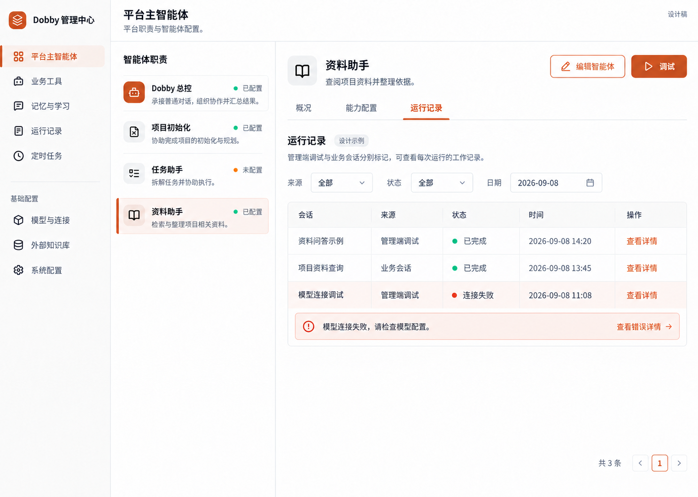

## 落地时统一处理

1. 这套图覆盖主要工作流程；资源删除确认、放弃修改确认、加载失败与无权限状态使用共用组件，完整行为以功能覆盖表为准。未展开的参数和更多菜单并不代表删除功能。
2. 新增/编辑共用一套表单；四个分组独立切换但保留同一份草稿。关闭有修改时提示放弃或继续编辑。表单保存与能力授权保存均须明确提交，不因翻页、切换菜单自动保存。
3. MCP 当前按包分配，工具说明和展示元数据从包中读取；内置工具页仅供查看。资料助手的数据库权限在本套设计中保持未分配。
4. 模型图中的上下文 80%/10% 来自当前 schema 默认值，仅用于示意；实现要读取对象已有值，不能据图重置。卡片状态和调试结果都是设计示例。
5. 所有弹窗统一页头、页脚、间距、图标、焦点管理和滚动规则；图中的像素与图标细小差异在组件实现时统一。正文 14–16px，任何界面文字不小于 12px。
6. 固定职责的初始化只补齐现有职责位，不创建新职责；已有智能体 ID、模型、工具权限、历史会话不能因页面重组而丢失。
7. 图集只是设计文件，不是独立测试页面，也不是本地真实系统验证结果。后续验证使用真实管理页面。

## 生成记录

使用内置 Image Gen，以用户选中的第 1 版和真实能力/编辑截图为依据。最终图已复制到项目；中间不合格版本未纳入本图集。逐图生成提示词保存于 [生成提示词.json](./生成提示词.json)。
