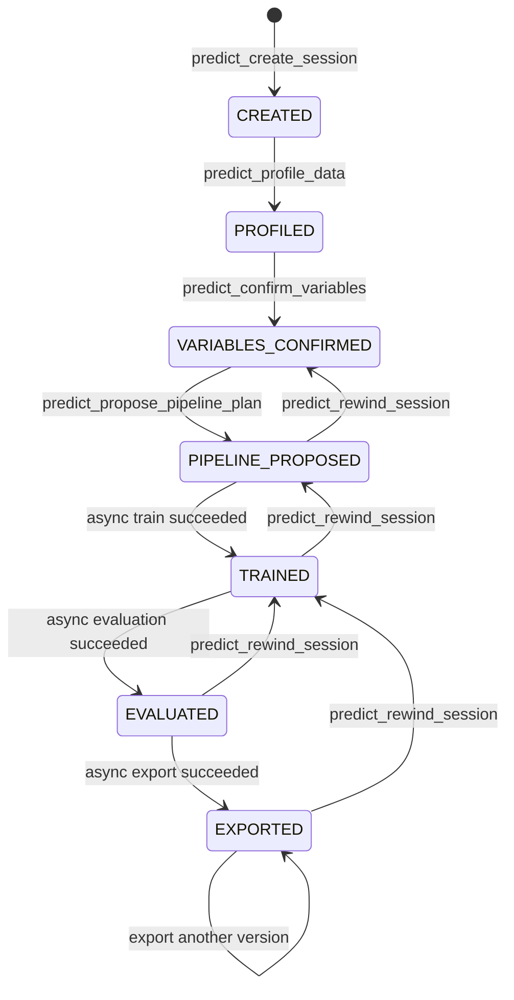

# Interactive Data Modeling MCP

命名空间：`predict`

版本：`2.1.4`

启动 Prompt：`predict.build_model`

面向结构化表格数据的数据分析、预处理、预测建模、测试集评估和模型导出 MCP Server。所有公开工具使用统一返回信封；需要用户决策时返回结构化 `options`，长时间操作返回异步 `job_id`。

## 能力

- CSV、TSV、Excel、JSON/JSONL、Parquet 数据读取与画像
- 数据自适应的预处理、模型、划分和调参推荐
- 在同一决策点同步提供推荐方案和全部备选项
- XGBoost、Random Forest、SVM、线性/逻辑回归、LSTM、1D-CNN、MLP
- 随机、顺序和真实 KFold；默认、网格、随机、贝叶斯调参
- 回归、分类、时序指标和图表
- 版本化模型包、预处理器、配置和独立推理脚本导出
- 持久化会话、显式状态机、回退、TTL 和容量清理

## 可信度保证

- 先划分原始数据，再只在训练分区拟合填充值、编码器、KNN Imputer 和缩放器
- 验证集、测试集和新数据只执行 transform；测试集不参与模型或参数选择
- KFold 每折重新拟合预处理器，并保留独立测试集
- 时序任务稳定排序，拒绝随机划分和非因果窗口
- 推荐方案绑定数据指纹，原始数据变化后拒绝过期方案
- MCP 训练和导出预测器复用相同预处理运行时代码

## 标准项目结构

```text
shield-prediction-mcp/
├── manifest.json
├── prompts/
│   └── build_model.md
├── src/shield_prediction_mcp/
│   ├── server.py
│   ├── tools/
│   ├── session/
│   ├── validation/
│   ├── engine/
│   └── schemas/
└── tests/
    ├── test_engine/
    └── test_contract/
```

公开依赖方向为：`tools → session/validation → engine`。真实计算实现全部位于 `engine/`，状态和存储位于 `session/`，编排位于 `tools/`；包根部的旧模块仅为 v1 Python API 兼容转发，不参与内部反向调用。

## 工具清单

| 工具 | 类别 | 前置状态 | 结果 |
|---|---|---|---|
| `predict_check_health` | 只读 | 无 | 服务和模型能力 |
| `predict_create_session` | 阶段 | 无 | `CREATED` |
| `predict_profile_data` | 阶段 | `CREATED` | `PROFILED` + 变量选项 |
| `predict_confirm_variables` | 阶段 | `PROFILED` | `VARIABLES_CONFIRMED` |
| `predict_propose_pipeline_plan` | 阶段 | `VARIABLES_CONFIRMED` | `PIPELINE_PROPOSED` + 完整方案选项 |
| `predict_confirm_pipeline_plan` | 阶段/异步 | `PIPELINE_PROPOSED` | `running`，完成后 `TRAINED` |
| `predict_evaluate_models` | 阶段/异步 | `TRAINED` | `running`，完成后 `EVALUATED` |
| `predict_export_model` | 阶段/异步 | `EVALUATED` | `running`，完成后 `EXPORTED` |
| `predict_get_job_status` | 只读 | 全局 `job_id` 存在 | 任务进度和结果 |
| `predict_get_status` | 只读 | 会话存在 | 状态、配置、缺失决策和任务 |
| `predict_rewind_session` | 阶段 | 目标早于当前状态 | 回退到指定状态 |
| `predict_list_sessions` | 只读 | 无 | 未过期会话列表 |

旧的无前缀工具不再注册到 MCP，Agent 只能调用 `predict_*` 工具。

## 状态机



内部仍能读取 v1.6.0 的小写 `stage` 会话文件，但所有公开响应只使用大写 `state`。

## 统一返回信封

```json
{
  "status": "ok | needs_input | running | error",
  "session_id": "predict_sess_...",
  "state": "PIPELINE_PROPOSED",
  "data": {},
  "options": {},
  "needs_user_decision": [],
  "next_tool": "predict_confirm_pipeline_plan",
  "message": "...",
  "error": null
}
```

候选项统一使用：

```json
{
  "type": "single_select | multi_select | free_text | confirm",
  "candidates": [
    {"value": "...", "label": "...", "reason": "..."}
  ]
}
```

当 `status=needs_input` 时，Agent 必须呈现全部候选及理由并等待用户，不得代替用户决策。推荐的预处理、模型和训练配置仍在同一轮对话中呈现和确认。

## 异步任务

训练、测试集评估和模型导出立即返回：

```json
{
  "status": "running",
  "data": {"job_id": "predict_job_...", "job_status": "running", "progress": 0.0},
  "next_tool": "predict_get_job_status"
}
```

调用 `predict_get_job_status(job_id)` 轮询。统一信封的外层 `status` 仍为 `running/ok/error`，`data.job_status` 明确返回 `running/succeeded/failed`。训练、评估和导出运行在独立工作进程中；超时或运行时容量超限时由监控器主动终止进程，不依赖 Agent 轮询。

## 错误语义

标准错误码包括：

- `UNKNOWN_SESSION`
- `WRONG_STATE`
- `INVALID_INPUT`
- `VALIDATION_FAILED`
- `RESOURCE_LIMIT`
- `JOB_FAILED`
- `INTERNAL_ERROR`
- `DEPENDENCY_UNAVAILABLE`

可恢复问题优先返回 `status=needs_input`，并提供 `error.recoverable=true` 与可执行的 `suggestion`；内部异常不会透传堆栈。

## 安全和资源配置

| 环境变量 | 默认值 | 说明 |
|---|---:|---|
| `PREDICT_ALLOWED_DATA_ROOTS` | 用户目录、临时目录、当前目录 | 允许读取的数据根目录，多个路径用系统路径分隔符分开 |
| `PREDICT_ALLOWED_OUTPUT_ROOTS` | runtime、用户目录、临时目录 | 允许写入的输出根目录 |
| `PREDICT_MAX_FILE_BYTES` | 2 GiB | 单数据文件上限 |
| `PREDICT_MAX_RUNTIME_BYTES` | 20 GiB | 会话存储总容量上限 |
| `PREDICT_MAX_DATA_ROWS` | 1,000,000 | 最大数据行数 |
| `PREDICT_MAX_DATA_COLUMNS` | 2,000 | 最大字段数 |
| `PREDICT_SESSION_TTL_SECONDS` | 604,800 | 会话 TTL |
| `PREDICT_MAX_SESSIONS` | 100 | 最大保留会话数 |
| `PREDICT_MAX_CONCURRENT_JOBS` | 2 | 全局异步工作进程数 |
| `PREDICT_MAX_QUEUED_JOBS` | 16 | 等待或运行中的全局任务上限 |
| `PREDICT_JOB_TIMEOUT_SECONDS` | 3,600 | 单个异步任务最长运行时间 |
| `PREDICT_CLEANUP_INTERVAL_SECONDS` | 60 | 独立 TTL 清理器运行间隔 |
| `PREDICT_MCP_WORKDIR` | 项目 `runtime` | 会话持久化根目录 |
| `PREDICT_MCP_LOG_LEVEL` | `INFO` | 标准错误日志级别 |

旧的 `DATA_MODELING_MCP_WORKDIR` 和 `SHIELD_MCP_WORKDIR` 仅用于读取既有部署配置，新部署应使用 `PREDICT_MCP_WORKDIR`。

密钥不写入源码或响应。公开状态和产物 Resource 只返回白名单元数据，不返回运行目录、会话目录、原始数据路径或产物存储路径；底层异常不拼接真实路径，错误边界检测到 Windows、UNC、POSIX 或 file URI 绝对路径后会脱敏其后的全部消息内容，避免合法标点及换行造成残留泄露。
数据中的字段名、样例值及任何“指令样”文本均标记为不可信数据，不作为 Agent 或 Server 指令执行。

## 安装与启动

```powershell
py -3.12 -m venv .venv
.\.venv\Scripts\python.exe -m pip install --upgrade pip
.\.venv\Scripts\python.exe -m pip install -e ".[full]"
.\run_server.ps1
```

STDIO 模式下标准输出由 MCP JSON-RPC 使用，日志仅写标准错误。

## MCP 客户端配置

使用 `mcp-config.example.json` 或 `codex-config.example.toml` 配置启动命令，保存后重启客户端。启动后调用 `predict_check_health`，应返回 `version=2.1.4`、`contract_version=2`、`workflow_version=6`。

## 独立客户端

```powershell
& '.\.venv\Scripts\python.exe' '.\standalone_cli.py' --data 'C:\data\sample.xlsx'
```

独立客户端同样只通过 MCP 协议调用 `predict_*` 工具，并自动轮询异步任务。

## 测试

```powershell
.\.venv\Scripts\python.exe -m pytest
```

- `tests/test_engine/`：纯计算边界与算法回归
- `tests/test_contract/`：统一信封、命名空间、选项、错误、状态机和目录结构
- 其余测试：数据可信度、推荐流程、训练、评估、导出和独立推理回归
