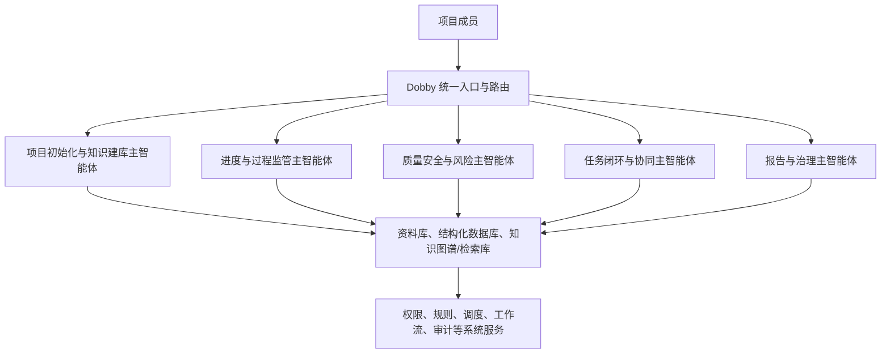

# 工程管理智能体系统架构方案

## 1. 修正后的总体结论

原型中的“数据分析、安全隐患、趋势预测、风险诊断、报告撰写、报告审核”是六类**专业能力入口**，不能直接等同于系统完整的智能体架构。

真实项目建议采用：

- **5 个业务主智能体**：分别拥有一段完整业务生命周期、状态与审批责任。
- **19 个子智能体**：执行识别、抽取、分析、生成、核验等细粒度工作。
- **Dobby 统一入口**：面向用户的会话与路由层，不单独承担全部项目业务判断。
- **确定性系统服务**：资料存储、权限、状态机、消息发送、版本与审计不能交给模型自由决定。

如果把 Dobby 也按“主智能体”计数，则系统为 **6 主 + 19 子**；在架构分层上，建议将其视为“协调入口”，业务主智能体仍为 5 个。



## 2. Dobby 的正确定位

Dobby 是用户看得到的“项目小管家”，职责包括：

1. 识别用户意图，例如“新建项目”“导入资料”“查本周逾期任务”“发起隐患整改”。
2. 确定当前项目、WBS、角色权限与可用数据范围。
3. 将请求派给对应主智能体，并汇总结果、来源与待确认事项。
4. 触发审批页面或工作流，而不是直接替用户完成高风险业务动作。

Dobby 不应自行完成文件批量入库、资料版本判定、任务关闭、验收批准或报告正式发布。

## 3. 五个业务主智能体与十九个子智能体

| 主智能体 | 生命周期职责 | 子智能体 |
|---|---|---|
| 1. 项目初始化与知识建库 | 新建项目、批量资料接收、数据建模、入库审核、项目知识底座建设 | 6 个 |
| 2. 进度与过程监管 | WBS、计划、日报、会议纪要、现场动态、进度偏差 | 3 个 |
| 3. 质量安全与风险 | 质量验收、安全隐患、监测预警、风险诊断 | 4 个 |
| 4. 任务闭环与协同 | 派单、催办、整改反馈、复核、升级、归档 | 3 个 |
| 5. 报告与治理 | 报告生成、事实核验、审批发布、审计留痕 | 3 个 |

### 3.1 项目初始化与知识建库主智能体（6 个子智能体）

这是新建项目时首先启动的主智能体。它处理“用户一次性上传一堆文件”的真实场景，是整个系统的数据地基。

| 子智能体 | 输入 | 输出 | 人工确认点 |
|---|---|---|---|
| 文件接收与解析 | PDF、Word、Excel、扫描件、图片、压缩包 | 文件清单、指纹、OCR 文本、表格结构、解析状态 | 解析失败或加密文件处理 |
| 文件分类与目录归档 | 文件名、正文、来源、项目资料目录规则 | 推荐目录、资料类型、保管期限、密级建议 | 目录与密级调整 |
| 实体与字段抽取 | 已解析内容 | 单位、人员、合同工期、金额、WBS、工序、风险、质量指标、日期等字段 | 不确定字段确认 |
| WBS - 工序 - 资料关联 | WBS、进度计划、质量指标表、风险清单、资料目录 | 每道工序的验收资料、质量控制点、风险源和前后置关系 | 无法匹配或一对多冲突 |
| 版本、重复与冲突核验 | 文件哈希、编号、日期、内容、既有资料 | 重复清单、版本链、过期提示、工期/单位/人员冲突 | 选择正式版本、处理冲突 |
| 入库审核与知识构建 | 前五项结果、管理员确认 | 已归档资料、待确认队列、缺失资料清单、检索索引、知识关联 | 最终入库和关键资料确认 |

### 3.2 进度与过程监管主智能体（3 个子智能体）

| 子智能体 | 职责 |
|---|---|
| WBS 与计划分析 | 解析总进度、周月计划、里程碑、前后置关系，计算计划与实际偏差。 |
| 过程信息抽取 | 从日报、会议纪要、企业微信项目群、现场记录中提取完成、延期、待验收、待协调等事实。 |
| 过程事件识别 | 将动态信息转化为标准事件，并关联 WBS、工序、责任人、来源和时间。 |

### 3.3 质量安全与风险主智能体（4 个子智能体）

| 子智能体 | 职责 | 边界 |
|---|---|---|
| 安全隐患识别 | 分析巡检记录、照片、整改反馈，给出隐患类型和建议。 | 不能代替现场安全确认或停工决定。 |
| 质量验收核查 | 对照工序、规范、质量控制指标和验收资料，识别缺项与异常。 | 不能自行判定工程验收合格。 |
| 监测趋势预警 | 根据监测数据、阈值、施工窗口和历史数据给出趋势与置信度。 | 预测不是监测结论，必须标注时效与置信度。 |
| 风险诊断 | 串联风险源、工序、资料、监测和任务状态，形成风险链和处置建议。 | 不能自行批准开工、转序、验收或复工。 |

### 3.4 任务闭环与协同主智能体（3 个子智能体）

| 子智能体 | 职责 |
|---|---|
| 任务生成与流程设计 | 将问题或事件转化为任务草稿，明确责任人、时限、步骤、证据要求与审批路径。 |
| 催办与协同 | 依据任务规则进行提醒、转办、升级，并通过企业微信/OA 等渠道发送。 |
| 证据核验与闭环 | 核对照片、记录、报告和复核意见是否满足关闭条件，提交人工复核。 |

### 3.5 报告与治理主智能体（3 个子智能体）

| 子智能体 | 职责0 |
|---|---|
| 报告撰写 | 生成周报、月报、专项检查报告、整改闭环清单等草稿。 |
| 数据与引用核验 | 校验数字、任务状态、来源引用、缺失证据和表述一致性。 |
| 发布与审计 | 管理报告版本、审批记录、发布范围、模型输出留痕和可追溯审计。 |

## 4. 新建项目：批量资料入库的完整流程

用户新建项目并上传工程描述、合同、图纸、WBS、人员名单、风险清单、质量指标表、方案、规范等资料后，流程应为：

1. 项目管理员创建项目空间，配置建设、施工、监理、设计等单位与角色权限。
2. 文件接收与解析子智能体生成原始文件清单，并对文件进行哈希去重、格式识别、OCR 和表格解析。
3. 文件分类与目录归档子智能体给出目录建议，例如：项目总览、合同图纸与方案、进度计划、质量安全、监测检测、会议过程、问题整改、验收移交、影像原始数据、AI 整理成果。
4. 实体与字段抽取子智能体从资料中形成项目主数据，包括工期、合同额、单位、人员角色、WBS、工序、风险源和质量控制指标。
5. WBS - 工序 - 资料关联子智能体建立“工序 - 质量验收项 - 风险源 - 所需资料 - 责任角色”的关系。
6. 版本、重复与冲突核验子智能体输出同名版本、重复文件、缺失关键资料、工期冲突、人员角色冲突等清单。
7. 入库审核与知识构建子智能体生成待管理员确认的入库报告；确认后写入资料库、结构化数据库和检索/知识关联库。
8. 项目初始化完成后，才启动日常的进度监管、质量安全风险、任务闭环和报告治理流程。

新建项目的标准产物应为：

```text
项目空间
├─ 已归档文件与版本关系
├─ 项目组织与职责表
├─ WBS 与工序主数据
├─ 风险源与质量控制指标
├─ 工序所需资料与验收条件
├─ 待补资料、冲突与待确认清单
├─ 面向问答与分析的检索索引
└─ 可追溯的项目知识关联
```

## 5. 必须由系统服务承担的职责

以下功能不是“让 AI 自由发挥”的任务，必须由确定性系统服务承担：

- **资料与版本服务**：对象存储、文件权限、OCR 结果、版本链、下载和原文件保全。
- **工作流服务**：任务状态机、派发、转办、催办、升级、审批、复核和关闭。
- **规则与调度服务**：风险阈值、验收清单、定时任务、提醒频率、异常升级规则。
- **身份与审计服务**：单点登录、项目和角色数据隔离、操作日志、模型输出留痕。
- **集成服务**：企业微信、OA/文件库、监测平台、巡检系统、项目管理系统的对接与失败重试。

## 6. 人工审批边界

| 动作等级 | 可处理事项 |
|---|---|
| 可自动执行 | 文件分类建议、检索摘要、资料缺失提醒、任务草稿、报告草稿、低风险信息汇总。 |
| 需人工确认 | 正式入库、任务派发、责任人和时限调整、风险等级确认、资料归档结论、对外消息。 |
| 必须人工决策 | 停工/复工、开工与验收确认、重大风险处置、合同或签证意见、正式报告签发。 |

## 7. 建议的一期建设范围

一期不要一开始就做全量系统集成和复杂预测。建议首先验收一个完整闭环：

> 原始资料进入 → AI 识别问题 → 人工确认派单 → 责任人反馈 → 人工复核 → 证据归档 → 周报引用

建议的优先场景：资料缺失、隐患整改，或关键工序验收条件核查。

一期验收标准：

1. 每个 AI 结论都能回查至原始资料和具体位置。
2. 每个任务都可追溯责任人、时限、审批、反馈和闭环证据。
3. 主动提醒只在规则命中且来源充分时触发。
4. 周报中的数字、任务和风险结论可回查至真实项目数据。
